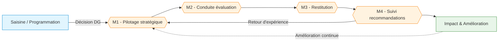

# 🏛️ Charte de l'Évaluateur public

> **Référence** : `CEV-001`
> **Niveau** : 🥈 Argent
> **Type** : Charte fondatrice
> **Version** : 1.0
> **Date de création** : 01/08/2026
> **Dernière mise à jour** : 01/08/2026
> **Validée par** : Direction Générale

---

## 🃏 FLASH CARD — Résumé 30s

> **Objet** : Définir le cadre de référence, les missions, les principes et l'architecture documentaire de l'Évaluateur public, instance indépendante d'évaluation des politiques, dispositifs et procédures.
> **Acteurs clés** : Directeur de l'évaluation · Évaluateurs publics · Comité de pilotage · Directions évaluées · DG validatrice
> **Périmètre** : Ensemble des politiques publiques, dispositifs RH, procédures qualité et organisations internes
> **Déclencheur** : Décision DG ou saisine d'une direction sur un objet évaluable
> **Livrable principal** : Rapports d'évaluation avec recommandations et plan d'impact
> **Risque majeur** : Indépendance compromise ou recommandations non suivies d'effet
> **Indicateur cible** : 100% des évaluations programmées réalisées dans les délais

---

## 📍 CRAIE — Localisation

| Axe | Valeur |
|-----|--------|
| **Contexte** | L'organisation doit évaluer systématiquement ses politiques, dispositifs et procédures pour garantir leur efficacité, leur pertinence et leur conformité. L'Évaluateur public est l'instance indépendante qui conduit ces évaluations. |
| **Référentiel** | DOX v6.0 · Qualité ISO 19011 · Règlement interne d'évaluation |
| **Acteurs** | DG · Directeur évaluation · Évaluateurs publics · Comité pilotage · Directions métiers · Contrôle de gestion |
| **Intitulé** | Charte de l'Évaluateur public — Cadre fondateur |
| **Étapes** | 1. Programmation → 2. Conduite → 3. Restitution → 4. Suivi → 5. Amélioration |

### Chaîne de localisation

```
Direction Générale › Évaluateur public › Missions › M1-M5 › Processus › P1-P17
```

**Filière** : Évaluation / Qualité / Contrôle interne

### Processus amont et aval

| Direction | Flux |
|-----------|------|
| **Amont** | Décision stratégique DG ou saisine direction (besoin d'évaluation) |
| **Charte** | CEV-001 — Cadre fondateur de l'Évaluateur public |
| **Aval** | Procédures opérationnelles P1→P17 déclinées en BDD 1 Procédures |

---

## 🔄 Macro-logigramme de l'Évaluateur public



### Légende

| Couleur | Signification |
|---------|---------------|
| 🔵 Bleu | Entrée / Déclencheur |
| 🟠 Orange | Missions de l'Évaluateur |
| 🟢 Vert | Sortie / Impact |

---

## 👥 RACI — Gouvernance de l'Évaluateur public

### Acteurs

| # | Rôle | Direction/Service | Rôle dans le dispositif |
|---|------|-------------------|------------------------|
| 1 | 🔰 Directeur de l'évaluation | Évaluateur public | Anime la fonction évaluation, valide les notes de cadrage et les rapports |
| 2 | 👤 Évaluateur public | Évaluateur public | Conduit les évaluations, rédige les rapports, propose les recommandations |
| 3 | 🏛️ Comité de pilotage | DG + directions concernées | Valide le programme annuel, suit les évaluations, approuve les livrables |
| 4 | 📋 Direction évaluée | Direction métier | Facilite l'accès aux données, participe aux entretiens, reçoit les recommandations |
| 5 | 📊 Contrôle de gestion | DG | Fournit les données de performance, assure la cohérence budgétaire |
| 6 | ✅ Direction Générale | DG | Valide la charte, nomme le directeur, approuve le programme annuel |

### Matrice RACI

| Phase / Activité | Directeur évaluation | Évaluateur public | Comité pilotage | Direction évaluée | Contrôle gestion | DG |
|-----------------|:---:|:---:|:---:|:---:|:---:|:---:|
| Programmation annuelle | R | C | A | C | C | A |
| Conduite d'une évaluation | A | R | C | C | I | I |
| Rédaction du rapport | A | R | C | C | I | I |
| Restitution et contradiction | R | R | A | C | I | A |
| Suivi des recommandations | A | R | C | R | C | A |
| Amélioration continue | R | C | A | I | I | A |

> **R** = Réalise · **A** = Approuve · **C** = Consulté · **I** = Informé

---

## 📝 Les 5 missions et 17 processus

L'Évaluateur public articule son action autour de **5 missions** déclinées en **17 processus** :

### M1 — Pilotage stratégique et programmation

| Processus | Description |
|-----------|-------------|
| **P1** Élaboration du programme annuel d'évaluation | Définir les priorités d'évaluation sur l'année, en cohérence avec les objectifs DG |
| **P2** Traitement d'une saisine | Instruire une demande d'évaluation émanant d'une direction ou de la DG |
| **P3** Instruction et cadrage préalable | Analyser la faisabilité, les enjeux et les ressources nécessaires |

### M2 — Conduite d'une évaluation

| Processus | Description |
|-----------|-------------|
| **P4** Note de cadrage d'évaluation | Formaliser le périmètre, les questions évaluatives, la méthodologie et le calendrier |
| **P5** Installation du comité de pilotage | Constituer l'instance de suivi avec les parties prenantes concernées |
| **P6** Lancement de la consultation | Lancer les appels d'offres et sélectionner les prestataires si nécessaire |
| **P7** Collecte et analyse des données | Mener les investigations quantitatives et qualitatives |
| **P8** Réunions techniques et entretiens | Conduire les échanges avec les acteurs clés du périmètre évalué |
| **P9** Élaboration des conclusions et recommandations | Synthétiser les constats et formuler des recommandations actionnables |
| **P10** Assurance qualité et revue interne | Contrôler la robustesse méthodologique et la fiabilité des données |

### M3 — Restitution et valorisation

| Processus | Description |
|-----------|-------------|
| **P11** Rédaction et validation du rapport | Produire le rapport d'évaluation conforme au template et le faire valider |
| **P12** Phase contradictoire | Soumettre le rapport aux directions évaluées pour observations |
| **P13** Restitution et communication | Présenter les résultats et assurer la diffusion auprès des parties prenantes |

### M4 — Suivi des recommandations et impact

| Processus | Description |
|-----------|-------------|
| **P14** Suivi des recommandations | Assurer le suivi de la mise en œuvre des recommandations par les directions |
| **P15** Évaluation d'impact à N+1 | Mesurer l'impact effectif des recommandations à un an |

### M5 — Fonctionnement transverse et amélioration continue

| Processus | Description |
|-----------|-------------|
| **P16** Gestion documentaire et des référentiels | Tenir à jour l'architecture documentaire et les BDD canoniques |
| **P17** Veille méthodologique et amélioration continue | Surveiller les bonnes pratiques et faire évoluer le dispositif |

---

## 🏗️ Architecture documentaire — 3 niveaux

L'Évaluateur public s'appuie sur une architecture documentaire à 3 niveaux progressive :

```
Niveau 1 — Charte / Cadre de référence
└── CEV-001 Charte de l'Évaluateur public (présent document)

Niveau 2 — Processus (macro-processus)
└── 5 missions (M1→M5), 17 processus (P1→P17)

Niveau 3 — Procédures et modes opératoires
└── Procédures détaillées dans BDD 1 Procédures
    ├── P1 Programme annuel d'évaluation
    ├── P2 Traitement d'une saisine
    ├── P4 Note de cadrage
    ├── P7 Collecte et analyse des données
    ├── P11 Rédaction et validation du rapport
    └── P15 Évaluation d'impact à N+1
```

### Évolution par niveaux DOX

Chaque procédure de l'Évaluateur public suit la progression DOX v6.0 :

| Niveau | Couverture | Finalité |
|--------|:----------:|----------|
| 🥉 Bronze | 11 | Cadrage minimal |
| 🥈 **Argent** | **14** | **Complète et exploitable** |
| 🥇 Or | 17 | Professionnelle stabilisée |
| 💎 Platine | 23 | Audit-ready |
| 💎 Ultra | 31 | Critique contrôlée |
| 🔮 Mythique | 31+9 | Décisionnelle avancée |
| 👹 Akuma | ∞ | Auto-évolution |

---

## ⚠️ Risques identifiés

| # | Code | Risque | Description | Impact | Probabilité |
|---|------|--------|-------------|--------|:-----------:|
| 1 | R1 | Indépendance compromise | Pression hiérarchique ou conflit d'intérêt sur une évaluation | Critique | 2/5 |
| 2 | R2 | Recommandations non suivies | Absence d'effet des évaluations faute d'engagement des directions | Majeur | 3/5 |
| 3 | R3 | Sous-charge capacitaires | Manque d'évaluateurs ou de compétences pour conduire le programme | Majeur | 3/5 |
| 4 | R4 | Données indisponibles | Refus d'accès ou qualité insuffisante des données des directions | Majeur | 2/5 |

### Criticité

| Risque | Niveau | Action requise |
|--------|--------|----------------|
| R1 | Élevée (10) | Garantir l'indépendance statutaire, rattachement direct DG |
| R2 | Moyenne (6) | Formaliser l'engagement des directions via le comité de pilotage |
| R3 | Moyenne (6) | Plan de formation continue et recrutement d'évaluateurs |
| R4 | Moyenne (4) | Convention d'accès aux données avec chaque direction |

> **Échelle** : Impact (1-5) × Probabilité (1-5) → **Criticité** : Faible (1-4) · Moyenne (5-9) · Élevée (10-16) · Critique (17-25)

---

## ✅ Principes fondamentaux de l'évaluation

L'Évaluateur public s'engage sur **7 principes** :

1. **🔒 Indépendance** — L'évaluateur agit en toute impartialité, sans conflit d'intérêt avec les directions évaluées
2. **📊 Objectivité** — Les constats sont fondés sur des données vérifiables et des méthodes explicites
3. **🔍 Transparence** — La méthodologie, les sources et les limites sont documentées et accessibles
4. **🤝 Participation** — Les parties prenantes sont consultées et associées au processus
5. **💡 Utilité** — Les évaluations produisent des recommandations actionnables et priorisées
6. **🔄 Amélioration continue** — Le dispositif lui-même est évalué et fait l'objet de retours d'expérience
7. **📜 Conformité** — Les évaluations respectent le référentiel DOX v6.0 et les normes professionnelles

---

## 📄 Documents de support et d'enregistrement

| Type | Document | Source |
|------|----------|--------|
| Support | Plan de déploiement de l'Évaluateur public | plan_evaluateur.md |
| Support | Référentiel DOX v6.0 — Doctrine PROC | Doctrine PROC |
| Support | CGSS 118 ULTRA — Golden Example | BDD 1 Procédures |
| Support | Règlement intérieur de l'Évaluateur public | Document interne |
| Enregistrement | Programme annuel d'évaluation | BDD 1 Procédures / P1 |
| Enregistrement | Rapports d'évaluation validés | GED / BDD 3 |
| Enregistrement | Suivi des recommandations | BDD 4 Actions |

---

## 🛠️ Cycle de vie de la charte

| Champ | Valeur |
|-------|--------|
| **Validée par** | Direction Générale |
| **Date d'effet** | 01/08/2026 |
| **Périodicité de revue** | Annuelle |
| **Prochaine revue** | 01/08/2027 |
| **Révision** | Version 1.0 |
| **Statut** | ✅ Approuvée — En vigueur |

---

## 🔗 Références normatives

| Texte | Référence |
|-------|-----------|
| DOX v6.0 — Doctrine PROC | DOX Core |
| ISO 19011 — Lignes directrices pour l'audit | Norme ISO |
| Règlement intérieur de l'Évaluateur public | Document interne |
| Plan de déploiement de l'Évaluateur public | plan_evaluateur.md |
| BDD 1 Procédures — Base canonique | Notion |

---

## 🔮 Prochaines évolutions

Cette charte servira de socle pour :

1. **Procédure P1** → Programme annuel d'évaluation (Niveau Or)
2. **Procédure P2** → Traitement d'une saisine d'évaluation (Niveau Argent)
3. **Procédure P4** → Note de cadrage d'évaluation (Niveau Platine)
4. **Procédure P7** → Collecte et analyse des données (Niveau Ultra)
5. **Procédure P11** → Rédaction et validation du rapport (Niveau Platine)
6. **Procédure P15** → Évaluation d'impact à N+1 (Niveau Ultra)

---

## ✅ Checklist Argent — Charte

- [x] FLASH CARD complète (objet, acteurs, délai, livrable, risque, indicateur)
- [x] Localisation CRAIE avec amont/aval
- [x] Macro-logigramme Mermaid (missions enchaînées)
- [x] RACI (6 acteurs, 6 phases couvertes)
- [x] Les 5 missions détaillées avec leurs 17 processus
- [x] Architecture documentaire à 3 niveaux
- [x] Risques (min 4 avec impact + probabilité + criticité)
- [x] Principes fondamentaux (7 principes énoncés)
- [x] Cycle de vie et prochaine revue
- [x] Références normatives

---

> **Généré par Hermes Agent — PROC v1.0**  
> **DOX v6.0 — Niveau Argent**  
> **Prochaine évolution suggérée** : `/proc upgrade --niveau or`  
> **Next Phase 3 tasks** : 3.2 Procédure de saisine → 3.3 Note de cadrage → ...
