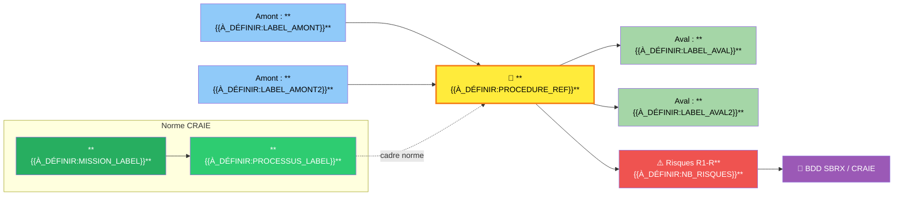
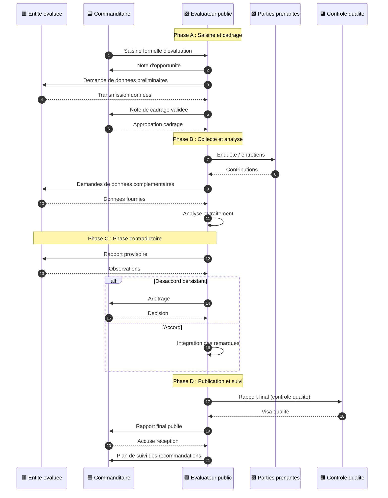
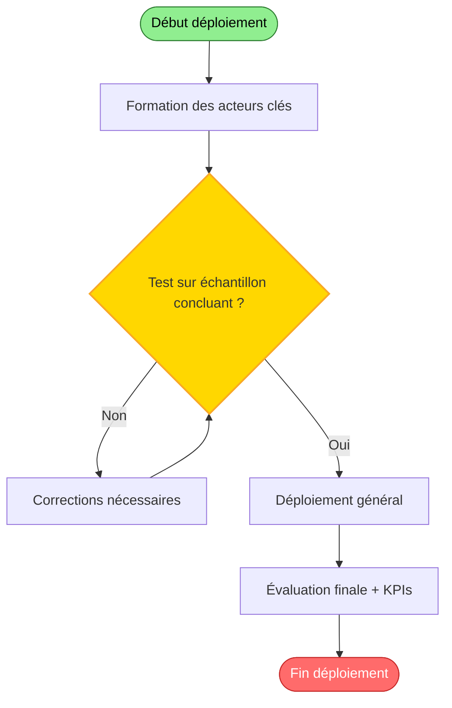
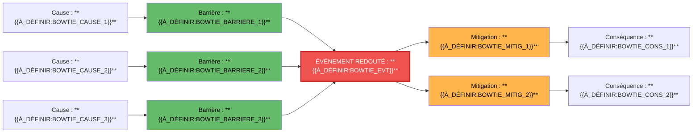
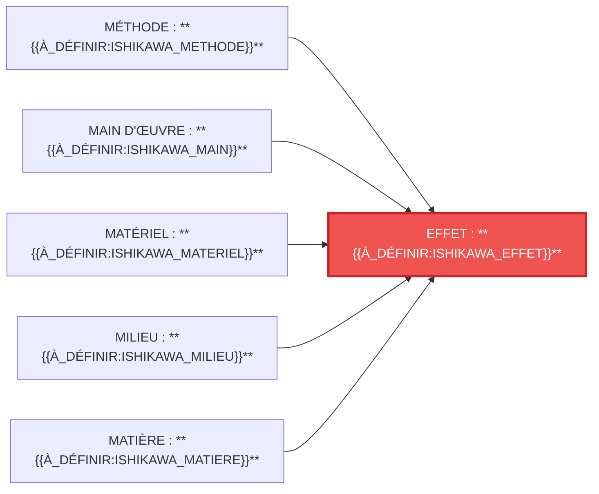
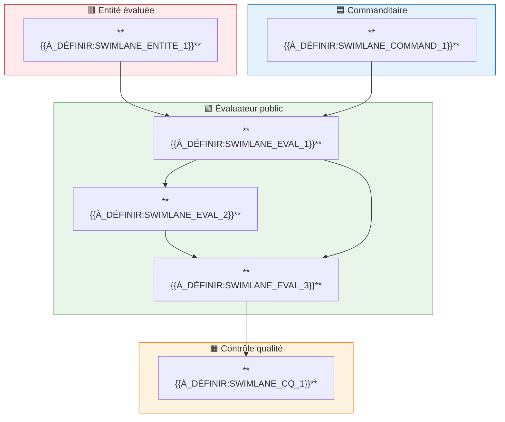

# 🔮 **Procédure de saisine d'évaluation**

| Champ | Valeur |
|-------|--------|
| **Référence** | CEV-P02 |
| **Niveau** | 🔮 Mythique |
| **Périmètre** | À définir |
| **Type RH** | À définir |
| **Version** | 1.0 |


# 🔮 **{{À_DÉFINIR:PROCEDURE_TITLE}}**

> **Référence** : `**{{À_DÉFINIR:PROCEDURE_REF}}**`
> **Niveau** : 🔮 Mythique
> **Type** : **{{À_DÉFINIR:TYPE_PROCEDURE}}**
> **Version** : 1.0
> **Date de création** : **{{À_DÉFINIR:DATE_CREATION}}**
> **Dernière mise à jour** : **{{À_DÉFINIR:DATE_REVUE}}**
> **Validée par** : **{{À_DÉFINIR:VALIDATEUR}}**

---

## 🃏 FLASH CARD — Résumé exécutif (30 secondes)

> **Objet** : Définir le circuit standardisé de traitement d'une demande d'évaluation (saisine) émanant de la Direction Générale ou d'une direction métier, depuis la réception jusqu'à la décision de lancement ou de refus motivé.
> **Acteurs clés** : Agent instructeur, Responsable hiérarchique, Service RH
> **Déclencheur** : **{{À_DÉFINIR:DECLENCHEUR}}**
> **Délai pivot** : **{{À_DÉFINIR:DELAI_PIVOT}}**
> **Livrable principal** : **{{À_DÉFINIR:LIVRABLE_PRINCIPAL}}**
> **Risque majeur** : **{{À_DÉFINIR:RISQUE_MAJEUR}}**
> **Indicateur cible** : Délai < 15 jours · Complétude > 95%

> **Localisation CRAIE** : Garantir la continuité et la qualité des actes de gestion RH › **{{À_DÉFINIR:PROCESSUS_FILIERE}}**

---

## 📍 0. LOCALISATION CRAIE — Position dans le processus métier

### Tableau de localisation

| Axe | Valeur |
|-----|--------|
| **Contexte** | **{{À_DÉFINIR:CONTEXTE_CRAIE}}** |
| **Référentiel** | DOX v6.0 · Charte de l'Évaluateur public CEV-001 · **{{À_DÉFINIR:REFERENTIELS_CRAIE}}** |
| **Acteurs** | **{{À_DÉFINIR:ACTEURS_CRAIE}}** |
| **Intitulé** | **{{À_DÉFINIR:PROCEDURE_REF}}** — **{{À_DÉFINIR:TITRE_COURT}}** |
| **Étapes** | **{{À_DÉFINIR:ETAPES_SYNOPTIQUE}}** |

### Chaîne de localisation

```
Garantir la continuité et la qualité des actes de gestion RH › Gestion administrative › **{{À_DÉFINIR:PROCEDURE_REF}}** › **{{À_DÉFINIR:ACTEUR_PILOTE}}**
```

**Filière** : **{{À_DÉFINIR:FILIERE}}**

### Processus amont et aval

| Direction | Flux |
|-----------|------|
| **Amont** | **{{À_DÉFINIR:PROCES_AMONT}}** → |
| **Procédure** | ****{{À_DÉFINIR:PROCEDURE_REF}}** — **{{À_DÉFINIR:TITRE_COURT}}**** |
| **Aval** | → **{{À_DÉFINIR:PROCES_AVAL}}** |

### Carte CRAIE (flowchart)



---

## 1. OBJET

**{{À_DÉFINIR:OBJET_DETAILLE}}**

**Objectif opérationnel** : **{{À_DÉFINIR:OBJECTIF_OPERATIONNEL}}**

---

## 2. CHAMP D'APPLICATION

### 2.1 Périmètre d'application

- **Services concernés** : **{{À_DÉFINIR:SERVICES_CONCERNES}}**
- **Territoire** : **{{À_DÉFINIR:TERRITOIRE}}**
- **Périmètre fonctionnel** : **{{À_DÉFINIR:PERIMETRE_FONCTIONNEL}}**

### 2.2 Inclusions

**{{À_DÉFINIR:LISTE_INCLUSIONS}}**

### 2.3 Exclusions

> ⛔ **{{À_DÉFINIR:LISTE_EXCLUSIONS}}**

---

## 3. DÉFINITIONS & GLOSSAIRE

### 3.1 Définitions Principales

| Terme | Définition |
|-------|------------|
| **{{À_DÉFINIR:TERME_1}}** | **{{À_DÉFINIR:DEFINITION_1}}** |
| **{{À_DÉFINIR:TERME_2}}** | **{{À_DÉFINIR:DEFINITION_2}}** |
| **{{À_DÉFINIR:TERME_3}}** | **{{À_DÉFINIR:DEFINITION_3}}** |

### 3.2 Acronymes

| Sigle | Signification |
|-------|---------------|
| **{{À_DÉFINIR:SIGLE_1}}** | **{{À_DÉFINIR:SIGNIFICATION_1}}** |
| **{{À_DÉFINIR:SIGLE_2}}** | **{{À_DÉFINIR:SIGNIFICATION_2}}** |

---

## 4. DOCUMENTS DE RÉFÉRENCE

> Vérification StatutFPT (ex‑CDG27) obligatoire — Cadre juridique validé avant publication

### 4.1 Textes Législatifs

| Texte | Référence | Articles |
|-------|-----------|----------|
| **{{À_DÉFINIR:TEXTE_LEG1}}** | **{{À_DÉFINIR:REF_LEG1}}** | **{{À_DÉFINIR:ARTICLES_LEG1}}** |

### 4.2 Textes Réglementaires

| Texte | Référence | Articles |
|-------|-----------|----------|
| **{{À_DÉFINIR:TEXTE_REG1}}** | **{{À_DÉFINIR:REF_REG1}}** | **{{À_DÉFINIR:ARTICLES_REG1}}** |

### 4.3 Documents Internes

- **{{À_DÉFINIR:DOC_INTERNE_1}}**
- **{{À_DÉFINIR:DOC_INTERNE_2}}**

---

## 5. ACTEURS RESPONSABLES

### 5.1 Acteurs de la procédure

| # | Rôle | Direction/Service | Rôle dans la procédure |
|:--|------|-------------------|------------------------|
| 1 | 🟥 **Entité évaluée** | Direction métier concernée | Objet de l'évaluation — fournit les données, participe au contradictoire, met en œuvre les recommandations |
| 2 | 🟦 **Commanditaire** | DG / Direction demandeuse | Porteur de la saisine — valide le cadrage, approuve les livrables, décide des suites |
| 3 | 🟩 **Évaluateur public** | Évaluation | Pilote de la procédure — conduit l'analyse, rédige les rapports, anime le contradictoire |
| 4 | 🟪 **Parties prenantes** | Usagers / Public / Experts | Consultés — participent aux enquêtes, auditions, ateliers |
| 5 | 🟧 **Contrôle qualité** | Qualité / Audit | Garant de la conformité — vérifie la complétude, audite les dossiers |
| 6 | 🟫 **Directeur de l'évaluation** | Direction évaluation | Supervise — valide les livrables majeurs, arbitre les désaccords |

### 5.2 Matrice RACI Complète

| Phase / Activité | Entité évaluée | Commanditaire | Évaluateur public | Parties prenantes | Contrôle qualité | Directeur évaluation |
|------------------|:---:|:---:|:---:|:---:|:---:|:---:|
| **{{À_DÉFINIR:PHASE_1_RACI}}** | **{{À_DÉFINIR:R_1_1}}** | **{{À_DÉFINIR:R_1_2}}** | **{{À_DÉFINIR:R_1_3}}** | **{{À_DÉFINIR:R_1_4}}** | **{{À_DÉFINIR:R_1_5}}** | **{{À_DÉFINIR:R_1_6}}** |
| **{{À_DÉFINIR:PHASE_2_RACI}}** | **{{À_DÉFINIR:R_2_1}}** | **{{À_DÉFINIR:R_2_2}}** | **{{À_DÉFINIR:R_2_3}}** | **{{À_DÉFINIR:R_2_4}}** | **{{À_DÉFINIR:R_2_5}}** | **{{À_DÉFINIR:R_2_6}}** |
| **{{À_DÉFINIR:PHASE_3_RACI}}** | **{{À_DÉFINIR:R_3_1}}** | **{{À_DÉFINIR:R_3_2}}** | **{{À_DÉFINIR:R_3_3}}** | **{{À_DÉFINIR:R_3_4}}** | **{{À_DÉFINIR:R_3_5}}** | **{{À_DÉFINIR:R_3_6}}** |
| **{{À_DÉFINIR:PHASE_4_RACI}}** | **{{À_DÉFINIR:R_4_1}}** | **{{À_DÉFINIR:R_4_2}}** | **{{À_DÉFINIR:R_4_3}}** | **{{À_DÉFINIR:R_4_4}}** | **{{À_DÉFINIR:R_4_5}}** | **{{À_DÉFINIR:R_4_6}}** |

> **R** = Réalise · **A** = Approuve · **C** = Consulté · **I** = Informé

### 5.3 Détail par Acteur

<details>
<summary>5.3.1 🟥 Entité évaluée</summary>

- **Rôle** : Objet et acteur de l'évaluation
- **Responsabilités** :
  - Met à disposition les données et documents nécessaires
  - Participe aux échanges contradictoires
  - Produit le plan d'action post-recommandations
- **Délais** : Selon les échéances définies dans la note de cadrage

</details>

<details>
<summary>5.3.2 🟦 Commanditaire</summary>

- **Rôle** : Décideur et financeur de l'évaluation
- **Responsabilités** :
  - Formalise la saisine
  - Valide le cadrage et le rapport final
  - Décide des suites de l'évaluation
- **Délais** : Selon les échéances définies dans la note de cadrage

</details>

<details>
<summary>5.3.3 🟩 Évaluateur public</summary>

- **Rôle** : Pilote méthodologique et rédacteur
- **Responsabilités** :
  - Conduit la collecte et l'analyse des données
  - Rédige les rapports (cadrage, provisoire, final)
  - Anime les ateliers et auditions
  - Garantit la qualité méthodologique
- **Délais** : Selon le calendrier de la note de cadrage

</details>

<details>
<summary>5.3.4 🟪 Parties prenantes</summary>

- **Rôle** : Contributrices à l'analyse
- **Responsabilités** :
  - Participent aux enquêtes et entretiens
  - Formulent un avis sur le rapport provisoire
- **Délais** : Selon le calendrier de consultation

</details>

### 5.4 Points d'attention — Réformes et évolutions

> **{{À_DÉFINIR:REFORMES_ACTEURS}}**

---

## 6. PROCÉDURE — ÉTAPES

### 6.0 Vue par acteur — sequenceDiagram *(exigence autorité de contrôle)*



### 6.1 Synoptique express et navigation par phase

🟦 **PHASE A** : Saisine et Cadrage → **{{À_DÉFINIR:PHASE_A_ETAPES}}**
🟧 **PHASE B** : Collecte et Analyse → **{{À_DÉFINIR:PHASE_B_ETAPES}}**
🟪 **PHASE C** : Phase Contradictoire → **{{À_DÉFINIR:PHASE_C_ETAPES}}**
🟩 **PHASE D** : Publication et Suivi → **{{À_DÉFINIR:PHASE_D_ETAPES}}**

### 6.2 Détail des Étapes

<details>
<summary>Étape 1 : Réception et enregistrement de la saisine</summary>

| Champ | Valeur |
|-------|--------|
| **Acteur** | Évaluateur public |
| **Durée** | 2 jours ouvrés |
| **Actions** | Réceptionner la demande d'évaluation, vérifier la complétude du dossier (objet, périmètre, contexte, enjeux, contact référent), enregistrer dans le registre des saisines avec un numéro unique (SAI-AAAAMM-NNN). Si incomplet, demander complément à la direction demandeuse (délai suspendu). |
| **Documents** | Registre des saisines (BDD 1 Procédures / table Saisines) · Formulaire de saisine type CEV-F01 · Accusé de réception |
| **⚠️ Points de vigilance** | **Règles appliquées** : G2 (suspension délai), G5 (délai 15 jours), G1 (enregistrement 2 jours) |

</details>

<details>
<summary>Étape 2 : Instruction préalable et analyse de faisabilité</summary>

| Champ | Valeur |
|-------|--------|
| **Acteur** | Évaluateur public (sous supervision du Directeur de l'évaluation) |
| **Durée** | 8 jours ouvrés |
| **Actions** | Analyser la demande : clarification de l'objet, identification des parties prenantes, évaluation des ressources nécessaires (volume, compétences, budget), risques prévisibles, conflits d'intérêt potentiels. Rédiger une note d'opportunité synthétique (CEV-F02). |
| **Documents** | Template Note d'opportunité CEV-F02 · Grille d'analyse de faisabilité · Référentiel des charges évaluatives |
| **⚠️ Points de vigilance** | **Règles appliquées** : G2 (suspension délai), G5 (délai 15 jours), G1 (enregistrement 2 jours) |

</details>

<details>
<summary>Étape 3 : Décision et motivation</summary>

| Champ | Valeur |
|-------|--------|
| **Acteur** | Directeur de l'évaluation (décision) · Comité de pilotage (validation) |
| **Durée** | 5 jours ouvrés (incluant la tenue du Comité) |
| **Actions** | Soumettre la note d'opportunité au Comité de pilotage. Le Comité statue : acceptation (avec ou sans réserves), demande de reformulation, ou refus motivé. La décision est formalisée par le Directeur de l'évaluation dans le template CEV-F03. |
| **Documents** | Template Décision de saisine CEV-F03 · Note d'opportunité CEV-F02 · Registre des décisions du Comité de pilotage |
| **⚠️ Points de vigilance** | **Règles appliquées** : G2 (suspension délai), G5 (délai 15 jours), G1 (enregistrement 2 jours) |

</details>

<details>
<summary>Étape 4 : Notification et programmation</summary>

| Champ | Valeur |
|-------|--------|
| **Acteur** | Directeur de l'évaluation |
| **Durée** | 2 jours ouvrés |
| **Actions** | Notifier la décision à la direction demandeuse (acceptation ou refus motivé). En cas d'acceptation, inscrire l'évaluation dans le programme en cours et transmettre le dossier à l'étape P3. En cas de refus, archiver la décision motivée dans la GED. |
| **Documents** | Registre des saisines (mise à jour statut) · Programme annuel d'évaluation (BDD) · Messagerie institutionnelle · GED Évaluateur |
| **⚠️ Points de vigilance** | **Règles appliquées** : G2 (suspension délai), G5 (délai 15 jours), G1 (enregistrement 2 jours) |

</details>

<details>
<summary>Étape 5 : Non applicable</summary>

| Champ | Valeur |
|-------|--------|
| **Acteur** | — |
| **Durée** | — |
| **Actions** | — |
| **Documents** | — |
| **⚠️ Points de vigilance** | — |

</details>

<details>
<summary>Étape 6 : Non applicable</summary>

| Champ | Valeur |
|-------|--------|
| **Acteur** | — |
| **Durée** | — |
| **Actions** | — |
| **Documents** | — |
| **⚠️ Points de vigilance** | — |

</details>

<!-- Ajouter étapes 7 à N selon la procédure -->

### 6.3 Logigramme (flowchart)

```mermaid
flowchart TB
    A([**{{À_DÉFINIR:DECLENCHEUR}}**]) --> B{{Étape 1 : **{{À_DÉFINIR:ETAPE_1_COURT}}**}}
    B --> C{{Étape 2 : **{{À_DÉFINIR:ETAPE_2_COURT}}**}}
    C --> D{{Étape 3 : **{{À_DÉFINIR:ETAPE_3_COURT}}**}}
    D --> E{Décision ?}
    E -->|Oui| F{{Étape 4 : **{{À_DÉFINIR:ETAPE_4_COURT}}**}}
    E -->|Non| G[Traitement alternatif]
    G --> F
    F --> H{{Étape 5 : **{{À_DÉFINIR:ETAPE_5_COURT}}**}}
    H --> I([**{{À_DÉFINIR:LIVRABLE_FINAL}}**])

    style A fill:#90EE90,stroke:#2e7d32,color:#000
    style I fill:#FF6B6B,stroke:#c62828,color:#fff
    style E fill:#FFD700,stroke:#f9a825,stroke-width:2px
    style B fill:#fff3e0,stroke:#f57c00
    style C fill:#fff3e0,stroke:#f57c00
    style D fill:#fff3e0,stroke:#f57c00
    style F fill:#fff3e0,stroke:#f57c00
    style G fill:#f3e5f5,stroke:#7b1fa2
    style H fill:#fff3e0,stroke:#f57c00
```

---

## 7. RÈGLES DE GESTION

| Règle | Énoncé |
|:-----:|--------|
| G1 | **{{À_DÉFINIR:REGLE_G1}}** |
| G2 | **{{À_DÉFINIR:REGLE_G2}}** |
| G3 | **{{À_DÉFINIR:REGLE_G3}}** |
| G4 | **{{À_DÉFINIR:REGLE_G4}}** |
| G5 | **{{À_DÉFINIR:REGLE_G5}}** |
| G6 | **{{À_DÉFINIR:REGLE_G6}}** |
| G7 | **{{À_DÉFINIR:REGLE_G7}}** |
| G8 | **{{À_DÉFINIR:REGLE_G8}}** |
| G9 | **{{À_DÉFINIR:REGLE_G9}}** |
| G10 | **{{À_DÉFINIR:REGLE_G10}}** |

---

## 8. CONSIGNES OPÉRATIONNELLES

| Consigne | Description |
|:--------:|-------------|
| C1 | **{{À_DÉFINIR:CONSIGNE_C1}}** |
| C2 | **{{À_DÉFINIR:CONSIGNE_C2}}** |
| C3 | **{{À_DÉFINIR:CONSIGNE_C3}}** |
| C4 | **{{À_DÉFINIR:CONSIGNE_C4}}** |
| C5 | **{{À_DÉFINIR:CONSIGNE_C5}}** |

---

## 9. ANALYSE DES RISQUES (SBRX)

### 9.1 Tableau des risques

| # | Code | Risque | Description | Impact | Probabilité | Criticité |
|:--|:----:|--------|-------------|:------:|:-----------:|:---------:|
| 1 | R1 | **{{À_DÉFINIR:RISQUE_1_TITRE}}** | **{{À_DÉFINIR:RISQUE_1_DESC}}** | **{{À_DÉFINIR:RISQUE_1_IMPACT}}** | **{{À_DÉFINIR:RISQUE_1_PROBA}}** | **{{À_DÉFINIR:RISQUE_1_CRIT}}** |
| 2 | R2 | **{{À_DÉFINIR:RISQUE_2_TITRE}}** | **{{À_DÉFINIR:RISQUE_2_DESC}}** | **{{À_DÉFINIR:RISQUE_2_IMPACT}}** | **{{À_DÉFINIR:RISQUE_2_PROBA}}** | **{{À_DÉFINIR:RISQUE_2_CRIT}}** |
| 3 | R3 | **{{À_DÉFINIR:RISQUE_3_TITRE}}** | **{{À_DÉFINIR:RISQUE_3_DESC}}** | **{{À_DÉFINIR:RISQUE_3_IMPACT}}** | **{{À_DÉFINIR:RISQUE_3_PROBA}}** | **{{À_DÉFINIR:RISQUE_3_CRIT}}** |
| 4 | R4 | **{{À_DÉFINIR:RISQUE_4_TITRE}}** | **{{À_DÉFINIR:RISQUE_4_DESC}}** | **{{À_DÉFINIR:RISQUE_4_IMPACT}}** | **{{À_DÉFINIR:RISQUE_4_PROBA}}** | **{{À_DÉFINIR:RISQUE_4_CRIT}}** |
| 5 | R5 | **{{À_DÉFINIR:RISQUE_5_TITRE}}** | **{{À_DÉFINIR:RISQUE_5_DESC}}** | **{{À_DÉFINIR:RISQUE_5_IMPACT}}** | **{{À_DÉFINIR:RISQUE_5_PROBA}}** | **{{À_DÉFINIR:RISQUE_5_CRIT}}** |

> **Échelle** : Impact (1-5) × Probabilité (1-5) → **Criticité** : Faible (1-4) · Moyenne (5-9) · Élevée (10-16) · Critique (17-25)

### 9.2 Matrice de criticité

| Risque | Niveau | Action requise |
|--------|--------|----------------|
| R1 | **{{À_DÉFINIR:RISQUE_1_NIVEAU}}** | **{{À_DÉFINIR:RISQUE_1_ACTION}}** |
| R2 | **{{À_DÉFINIR:RISQUE_2_NIVEAU}}** | **{{À_DÉFINIR:RISQUE_2_ACTION}}** |
| R3 | **{{À_DÉFINIR:RISQUE_3_NIVEAU}}** | **{{À_DÉFINIR:RISQUE_3_ACTION}}** |
| R4 | **{{À_DÉFINIR:RISQUE_4_NIVEAU}}** | **{{À_DÉFINIR:RISQUE_4_ACTION}}** |
| R5 | **{{À_DÉFINIR:RISQUE_5_NIVEAU}}** | **{{À_DÉFINIR:RISQUE_5_ACTION}}** |

### 9.3 Matrice de couverture Risque ↔ Consigne ↔ Règle

| Risque | Consigne associée | Règle associée |
|:------:|:-----------------:|:--------------:|
| R1 | C{{N}} | G{{N}} |
| R2 | C{{N}} | G{{N}} |
| R3 | C{{N}} | G{{N}} |
| R4 | C{{N}} | G{{N}} |
| R5 | C{{N}} | G{{N}} |

---

## 10. DOCUMENTS SUPPORT

### 10.1 Documents Sources (DS)

| Code | Document | Description | Provenance |
|:----:|----------|-------------|------------|
| DS1 | **{{À_DÉFINIR:DS_1_TITRE}}** | **{{À_DÉFINIR:DS_1_DESC}}** | **{{À_DÉFINIR:DS_1_SOURCE}}** |
| DS2 | **{{À_DÉFINIR:DS_2_TITRE}}** | **{{À_DÉFINIR:DS_2_DESC}}** | **{{À_DÉFINIR:DS_2_SOURCE}}** |
| DS3 | **{{À_DÉFINIR:DS_3_TITRE}}** | **{{À_DÉFINIR:DS_3_DESC}}** | **{{À_DÉFINIR:DS_3_SOURCE}}** |

### 10.2 Documents d'Exploitation (DE)

| Code | Document | Description | Utilisation |
|:----:|----------|-------------|-------------|
| DE1 | **{{À_DÉFINIR:DE_1_TITRE}}** | **{{À_DÉFINIR:DE_1_DESC}}** | **{{À_DÉFINIR:DE_1_USAGE}}** |
| DE2 | **{{À_DÉFINIR:DE_2_TITRE}}** | **{{À_DÉFINIR:DE_2_DESC}}** | **{{À_DÉFINIR:DE_2_USAGE}}** |
| DE3 | **{{À_DÉFINIR:DE_3_TITRE}}** | **{{À_DÉFINIR:DE_3_DESC}}** | **{{À_DÉFINIR:DE_3_USAGE}}** |

> **Archivage** : Documents DS archivés 5 ans (données administratives) ou 10 ans (données financières).

### 10.3 Modèles de courrier / formulaires

- Courrier « **{{À_DÉFINIR:MODELE_COURRIER_1}}** »
- Formulaire « **{{À_DÉFINIR:MODELE_FORMULAIRE_1}}** »
- Template « **{{À_DÉFINIR:MODELE_TEMPLATE_1}}** »

---

## 13. CAS PRATIQUES & FAQ

### 13.1 Cas Pratiques

<details>
<summary>Cas n°1 — **{{À_DÉFINIR:CAS_1_TITRE}}**</summary>

- **Situation** : **{{À_DÉFINIR:CAS_1_SITUATION}}**
- **Réponse** : **{{À_DÉFINIR:CAS_1_REPONSE}}**
- **Règles appliquées** : G{{N}}, G{{N}}

</details>

<details>
<summary>Cas n°2 — **{{À_DÉFINIR:CAS_2_TITRE}}**</summary>

- **Situation** : **{{À_DÉFINIR:CAS_2_SITUATION}}**
- **Réponse** : **{{À_DÉFINIR:CAS_2_REPONSE}}**
- **Règles appliquées** : G{{N}}, G{{N}}

</details>

### 13.2 FAQ

<details>
<summary>Q1 — **{{À_DÉFINIR:FAQ_1_QUESTION}}**</summary>

**Réponse** : **{{À_DÉFINIR:FAQ_1_REPONSE}}**
</details>

<details>
<summary>Q2 — **{{À_DÉFINIR:FAQ_2_QUESTION}}**</summary>

**Réponse** : **{{À_DÉFINIR:FAQ_2_REPONSE}}**
</details>

---

## 14. POINTS DE CONTRÔLE & AUDIT TRAIL

### 14.1 Checkpoints

| Gate | Point de contrôle | Responsable | Délai | Critère de passage |
|:----:|-------------------|:-----------:|:-----:|--------------------|
| CP1 | **{{À_DÉFINIR:CHECKPOINT_1_TITRE}}** | **{{À_DÉFINIR:CHECKPOINT_1_RESP}}** | **{{À_DÉFINIR:CHECKPOINT_1_DELAI}}** | **{{À_DÉFINIR:CHECKPOINT_1_CRITERE}}** |
| CP2 | **{{À_DÉFINIR:CHECKPOINT_2_TITRE}}** | **{{À_DÉFINIR:CHECKPOINT_2_RESP}}** | **{{À_DÉFINIR:CHECKPOINT_2_DELAI}}** | **{{À_DÉFINIR:CHECKPOINT_2_CRITERE}}** |
| CP3 | **{{À_DÉFINIR:CHECKPOINT_3_TITRE}}** | **{{À_DÉFINIR:CHECKPOINT_3_RESP}}** | **{{À_DÉFINIR:CHECKPOINT_3_DELAI}}** | **{{À_DÉFINIR:CHECKPOINT_3_CRITERE}}** |
| CP4 | **{{À_DÉFINIR:CHECKPOINT_4_TITRE}}** | **{{À_DÉFINIR:CHECKPOINT_4_RESP}}** | **{{À_DÉFINIR:CHECKPOINT_4_DELAI}}** | **{{À_DÉFINIR:CHECKPOINT_4_CRITERE}}** |

### 14.2 Audit Trail

**Éléments tracés** :

- **{{À_DÉFINIR:TRACE_1}}**
- **{{À_DÉFINIR:TRACE_2}}**
- **{{À_DÉFINIR:TRACE_3}}**
- **{{À_DÉFINIR:TRACE_4}}**
- **{{À_DÉFINIR:TRACE_5}}**

**Durée de conservation** :

- Documents administratifs : 5 ans
- Documents financiers : 10 ans
- Logs système : 3 ans

### 14.3 Indicateurs de Conformité

| Indicateur | Cible | Fréquence | Seuil d'alerte |
|------------|:-----:|:---------:|:--------------:|
| **{{À_DÉFINIR:INDIC_CONF_1}}** | **{{À_DÉFINIR:INDIC_CONF_1_CIBLE}}** | **{{À_DÉFINIR:INDIC_CONF_1_FREQ}}** | **{{À_DÉFINIR:INDIC_CONF_1_ALERTE}}** |
| **{{À_DÉFINIR:INDIC_CONF_2}}** | **{{À_DÉFINIR:INDIC_CONF_2_CIBLE}}** | **{{À_DÉFINIR:INDIC_CONF_2_FREQ}}** | **{{À_DÉFINIR:INDIC_CONF_2_ALERTE}}** |

---

## 15. FORMATION & SUPPORT

### 15.1 Programme de Formation

> Durée totale : **{{À_DÉFINIR:FORMATION_DUREE}}**

| Module | Durée | Public | Contenu |
|--------|:-----:|--------|---------|
| **{{À_DÉFINIR:MODULE_1_TITRE}}** | **{{À_DÉFINIR:MODULE_1_DUREE}}** | **{{À_DÉFINIR:MODULE_1_PUBLIC}}** | **{{À_DÉFINIR:MODULE_1_CONTENU}}** |
| **{{À_DÉFINIR:MODULE_2_TITRE}}** | **{{À_DÉFINIR:MODULE_2_DUREE}}** | **{{À_DÉFINIR:MODULE_2_PUBLIC}}** | **{{À_DÉFINIR:MODULE_2_CONTENU}}** |

### 15.2 Contacts Support

| Rôle | Contact |
|------|---------|
| Référent méthodologique | **{{À_DÉFINIR:CONTACT_METHODO}}** |
| Support technique (SI) | **{{À_DÉFINIR:CONTACT_SI}}** |
| Pilote de la procédure | **{{À_DÉFINIR:CONTACT_PILOTE}}** |

---

## 16. PILOTAGE & KPIs

### 16.1 Tableau de Bord

| Indicateur | Cible | Mesure | Fréquence | Seuil d'alerte |
|------------|:-----:|--------|:---------:|:--------------:|
| **{{À_DÉFINIR:KPI_1_TITRE}}** | **{{À_DÉFINIR:KPI_1_CIBLE}}** | **{{À_DÉFINIR:KPI_1_MESURE}}** | **{{À_DÉFINIR:KPI_1_FREQ}}** | **{{À_DÉFINIR:KPI_1_ALERTE}}** |
| **{{À_DÉFINIR:KPI_2_TITRE}}** | **{{À_DÉFINIR:KPI_2_CIBLE}}** | **{{À_DÉFINIR:KPI_2_MESURE}}** | **{{À_DÉFINIR:KPI_2_FREQ}}** | **{{À_DÉFINIR:KPI_2_ALERTE}}** |
| **{{À_DÉFINIR:KPI_3_TITRE}}** | **{{À_DÉFINIR:KPI_3_CIBLE}}** | **{{À_DÉFINIR:KPI_3_MESURE}}** | **{{À_DÉFINIR:KPI_3_FREQ}}** | **{{À_DÉFINIR:KPI_3_ALERTE}}** |
| **{{À_DÉFINIR:KPI_4_TITRE}}** | **{{À_DÉFINIR:KPI_4_CIBLE}}** | **{{À_DÉFINIR:KPI_4_MESURE}}** | **{{À_DÉFINIR:KPI_4_FREQ}}** | **{{À_DÉFINIR:KPI_4_ALERTE}}** |
| **{{À_DÉFINIR:KPI_5_TITRE}}** | **{{À_DÉFINIR:KPI_5_CIBLE}}** | **{{À_DÉFINIR:KPI_5_MESURE}}** | **{{À_DÉFINIR:KPI_5_FREQ}}** | **{{À_DÉFINIR:KPI_5_ALERTE}}** |

### 16.2 Système d'Alertes

- 🔴 **Alerte critique** : **{{À_DÉFINIR:ALERTE_CRITIQUE}}**
- 🔴 **Alerte critique** : **{{À_DÉFINIR:ALERTE_CRITIQUE_2}}**
- 🟡 **Alerte modérée** : **{{À_DÉFINIR:ALERTE_MODEREE}}**
- 🟢 **Information** : **{{À_DÉFINIR:ALERTE_INFO}}**

### 16.3 Boucle PDCA

| Phase | Action | Fréquence |
|:-----:|--------|:---------:|
| **Plan** | **{{À_DÉFINIR:PDCA_PLAN}}** | **{{À_DÉFINIR:PDCA_PLAN_FREQ}}** |
| **Do** | **{{À_DÉFINIR:PDCA_DO}}** | **{{À_DÉFINIR:PDCA_DO_FREQ}}** |
| **Check** | **{{À_DÉFINIR:PDCA_CHECK}}** | **{{À_DÉFINIR:PDCA_CHECK_FREQ}}** |
| **Act** | **{{À_DÉFINIR:PDCA_ACT}}** | **{{À_DÉFINIR:PDCA_ACT_FREQ}}** |

### 16.4 Actions d'Amélioration Identifiées

| # | Action | Responsable | Échéance | Statut |
|:--|--------|:-----------:|:--------:|:------:|
| 1 | **{{À_DÉFINIR:AMELIO_1_TITRE}}** | **{{À_DÉFINIR:AMELIO_1_RESP}}** | **{{À_DÉFINIR:AMELIO_1_ECHEANCE}}** | **{{À_DÉFINIR:AMELIO_1_STATUT}}** |
| 2 | **{{À_DÉFINIR:AMELIO_2_TITRE}}** | **{{À_DÉFINIR:AMELIO_2_RESP}}** | **{{À_DÉFINIR:AMELIO_2_ECHEANCE}}** | **{{À_DÉFINIR:AMELIO_2_STATUT}}** |

### 16.5 Alignement OKR / Performance

> Rattachement stratégique — les indicateurs §16 alimentent les objectifs de performance du service d'évaluation.

| Objectif stratégique | KPI associé | Cible |
|---------------------|:-----------:|:-----:|
| **{{À_DÉFINIR:OKR_1_OBJECTIF}}** | **{{À_DÉFINIR:OKR_1_KPI}}** | **{{À_DÉFINIR:OKR_1_CIBLE}}** |
| **{{À_DÉFINIR:OKR_2_OBJECTIF}}** | **{{À_DÉFINIR:OKR_2_KPI}}** | **{{À_DÉFINIR:OKR_2_CIBLE}}** |

---

## 17. RAPPORT GROUPE DE LECTURE

### 17.1 Composition du Groupe de Lecture

| Rôle | Nom / Fonction |
|------|----------------|
| Président | **{{À_DÉFINIR:GL_PRESIDENT}}** |
| Expert métier | **{{À_DÉFINIR:GL_EXPERT_METIER}}** |
| Expert juridique | **{{À_DÉFINIR:GL_EXPERT_JURIDIQUE}}** |
| Représentant entité évaluée | **{{À_DÉFINIR:GL_REPRESENTANT}}** |

### 17.2 Analyse Multi-Dimensionnelle

<details>
<summary>Cohérence technique/fonctionnelle</summary>

- **Points forts** : **{{À_DÉFINIR:GL_COHERENCE_FORTS}}**
- **Améliorations proposées** : **{{À_DÉFINIR:GL_COHERENCE_AMELIO}}**
</details>

<details>
<summary>Conformité réglementaire</summary>

- **Points forts** : **{{À_DÉFINIR:GL_CONFORMITE_FORTS}}**
- **Améliorations proposées** : **{{À_DÉFINIR:GL_CONFORMITE_AMELIO}}**
</details>

<details>
<summary>Adéquation aux besoins métiers</summary>

- **Points forts** : **{{À_DÉFINIR:GL_BESOINS_FORTS}}**
- **Améliorations proposées** : **{{À_DÉFINIR:GL_BESOINS_AMELIO}}**
</details>

### 17.3 Avis du Groupe de Lecture

- **Avis** : **{{À_DÉFINIR:GL_AVIS}}**
- **Date de revue** : **{{À_DÉFINIR:GL_DATE_REVUE}}**
- **Prochaine revue** : **{{À_DÉFINIR:GL_PROCHAINE_REVUE}}**

---

## 18. MISE EN ŒUVRE, DÉPLOIEMENT & PLAN DE COMMUNICATION

### 18.1 Phases de déploiement

| Phase | Action | Durée | Responsable |
|:-----:|--------|:-----:|:-----------:|
| 1 | **{{À_DÉFINIR:DEPLOIEMENT_PHASE_1}}** | **{{À_DÉFINIR:DEPLOIEMENT_PHASE_1_DUREE}}** | **{{À_DÉFINIR:DEPLOIEMENT_PHASE_1_RESP}}** |
| 2 | **{{À_DÉFINIR:DEPLOIEMENT_PHASE_2}}** | **{{À_DÉFINIR:DEPLOIEMENT_PHASE_2_DUREE}}** | **{{À_DÉFINIR:DEPLOIEMENT_PHASE_2_RESP}}** |
| 3 | **{{À_DÉFINIR:DEPLOIEMENT_PHASE_3}}** | **{{À_DÉFINIR:DEPLOIEMENT_PHASE_3_DUREE}}** | **{{À_DÉFINIR:DEPLOIEMENT_PHASE_3_RESP}}** |
| 4 | **{{À_DÉFINIR:DEPLOIEMENT_PHASE_4}}** | **{{À_DÉFINIR:DEPLOIEMENT_PHASE_4_DUREE}}** | **{{À_DÉFINIR:DEPLOIEMENT_PHASE_4_RESP}}** |

### 18.2 Plan de communication

| Cible | Message | Canal | Échéance |
|-------|---------|:-----:|:--------:|
| **{{À_DÉFINIR:COMM_CBLE_1}}** | **{{À_DÉFINIR:COMM_MSG_1}}** | **{{À_DÉFINIR:COMM_CANAL_1}}** | **{{À_DÉFINIR:COMM_ECHEANCE_1}}** |
| **{{À_DÉFINIR:COMM_CBLE_2}}** | **{{À_DÉFINIR:COMM_MSG_2}}** | **{{À_DÉFINIR:COMM_CANAL_2}}** | **{{À_DÉFINIR:COMM_ECHEANCE_2}}** |

### 18.3 Planning de déploiement & communication (Gantt)

```mermaid
gantt
    title Planning de Déploiement — **{{À_DÉFINIR:PROCEDURE_REF}}**
    dateFormat YYYY-MM-DD
    section Formation
    **{{À_DÉFINIR:GANTT_FORMATION_1}}** :**{{À_DÉFINIR:GANTT_FORMATION_1_DEBUT}}**, **{{À_DÉFINIR:GANTT_FORMATION_1_DUREE}}**
    **{{À_DÉFINIR:GANTT_FORMATION_2}}** :**{{À_DÉFINIR:GANTT_FORMATION_2_DEBUT}}**, **{{À_DÉFINIR:GANTT_FORMATION_2_DUREE}}**
    Jalon fin formation :milestone, **{{À_DÉFINIR:GANTT_FORMATION_JALON}}**
    section Test
    **{{À_DÉFINIR:GANTT_TEST_1}}** :**{{À_DÉFINIR:GANTT_TEST_1_DEBUT}}**, **{{À_DÉFINIR:GANTT_TEST_1_DUREE}}**
    **{{À_DÉFINIR:GANTT_TEST_2}}** :**{{À_DÉFINIR:GANTT_TEST_2_DEBUT}}**, **{{À_DÉFINIR:GANTT_TEST_2_DUREE}}**
    Jalon fin test :milestone, **{{À_DÉFINIR:GANTT_TEST_JALON}}**
    section Déploiement
    **{{À_DÉFINIR:GANTT_DEPLOIEMENT_1}}** :**{{À_DÉFINIR:GANTT_DEPLOIEMENT_1_DEBUT}}**, **{{À_DÉFINIR:GANTT_DEPLOIEMENT_1_DUREE}}**
    **{{À_DÉFINIR:GANTT_DEPLOIEMENT_2}}** :**{{À_DÉFINIR:GANTT_DEPLOIEMENT_2_DEBUT}}**, **{{À_DÉFINIR:GANTT_DEPLOIEMENT_2_DUREE}}**
    section Évaluation
    **{{À_DÉFINIR:GANTT_EVAL_1}}** :**{{À_DÉFINIR:GANTT_EVAL_1_DEBUT}}**, **{{À_DÉFINIR:GANTT_EVAL_1_DUREE}}**
    Jalon validation finale :milestone, **{{À_DÉFINIR:GANTT_EVAL_JALON}}**
```

### 18.4 Ressources & budget prévisionnel

- **Ressources humaines** : **{{À_DÉFINIR:RESSOURCES_HUMAINES}}**
- **Ressources matérielles** : **{{À_DÉFINIR:RESSOURCES_MATERIELLES}}**
- **Budget prévisionnel** :
  - Formation : [XX] k€
  - Communication : [XX] k€
  - Support technique : [XX] k€

### 18.5 Suivi de la mise en œuvre



---

## 19. CONTINUITÉ DE SERVICE & PCA

### 19.1 Scénarios d'indisponibilité

| Scénario | Impact | Procédure dégradée | RTO | RPO |
|:--------:|:------:|:------------------:|:---:|:---:|
| **{{À_DÉFINIR:PCA_SCENARIO_1}}** | **{{À_DÉFINIR:PCA_IMPACT_1}}** | **{{À_DÉFINIR:PCA_DEGRADE_1}}** | **{{À_DÉFINIR:PCA_RTO_1}}** | **{{À_DÉFINIR:PCA_RPO_1}}** |
| **{{À_DÉFINIR:PCA_SCENARIO_2}}** | **{{À_DÉFINIR:PCA_IMPACT_2}}** | **{{À_DÉFINIR:PCA_DEGRADE_2}}** | **{{À_DÉFINIR:PCA_RTO_2}}** | **{{À_DÉFINIR:PCA_RPO_2}}** |

### 19.2 Plan de reprise

- **RTO (délai de reprise visé)** : ≤ **{{À_DÉFINIR:PCA_RTO}}** pour la reprise des activités critiques
- **RPO (perte de données maximale tolérée)** : ≤ **{{À_DÉFINIR:PCA_RPO}}**
- **Mode dégradé** : **{{À_DÉFINIR:PCA_MODE_DEGRADE}}**
- **Reprise** : **{{À_DÉFINIR:PCA_REPRISE}}**

### 19.3 Protocole d'urgence

<details>
<summary>🚨 Protocole d'urgence — **{{À_DÉFINIR:PCA_URGENCE_TITRE}}**</summary>

| Champ | Valeur |
|-------|--------|
| **Déclencheur** | **{{À_DÉFINIR:PCA_URGENCE_DECLENCHEUR}}** |
| **Délai de réaction** | **{{À_DÉFINIR:PCA_URGENCE_DELAI}}** |
| **Actions immédiates** | **{{À_DÉFINIR:PCA_URGENCE_ACTIONS}}** |
| **Escalade** | **{{À_DÉFINIR:PCA_URGENCE_ESCALADE}}** |
| **Responsable** | **{{À_DÉFINIR:PCA_URGENCE_RESPONSABLE}}** |

</details>

---

## 20. PROTECTION DES DONNÉES (RGPD)

### 20.1 Base légale & finalité

- **Finalité** : **{{À_DÉFINIR:RGPD_FINALITE}}**
- **Base légale** : **{{À_DÉFINIR:RGPD_BASE_LEGALE}}**
- **Responsable de traitement** : **{{À_DÉFINIR:RGPD_RESPONSABLE}}**

### 20.2 Données traitées & durées de conservation

| Catégorie de données | Données collectées | Durée de conservation |
|----------------------|--------------------|:---------------------:|
| **{{À_DÉFINIR:RGPD_CAT_1}}** | **{{À_DÉFINIR:RGPD_DONNEES_1}}** | **{{À_DÉFINIR:RGPD_DUREE_1}}** |
| **{{À_DÉFINIR:RGPD_CAT_2}}** | **{{À_DÉFINIR:RGPD_DONNEES_2}}** | **{{À_DÉFINIR:RGPD_DUREE_2}}** |

### 20.3 Droits des personnes & sécurité

- **Droits** : accès, rectification, limitation ; exercice auprès du DPO
- **Minimisation** : seules les données nécessaires à l'évaluation sont collectées
- **Sécurité** : accès restreint aux habilités, chiffrement des transferts, traçabilité
- **Registre** : ce traitement figure au registre des activités de traitement

---

## 21. CONFORMITÉ & RÉFÉRENTIELS NORMATIFS

### 21.1 Matrice de conformité

| Référentiel | Critère | Statut | Échéance |
|-------------|---------|:------:|:--------:|
| ISO 9001 (Qualité) | **{{À_DÉFINIR:NORME_ISO9001_CRITERE}}** | 🟡 | **{{À_DÉFINIR:NORME_ISO9001_ECHEANCE}}** |
| ISO 31000 (Risques) | **{{À_DÉFINIR:NORME_ISO31000_CRITERE}}** | 🟡 | **{{À_DÉFINIR:NORME_ISO31000_ECHEANCE}}** |
| RGPD | **{{À_DÉFINIR:NORME_RGPD_CRITERE}}** | 🟢 | **{{À_DÉFINIR:NORME_RGPD_ECHEANCE}}** |
| Charte Évaluateur public | **{{À_DÉFINIR:NORME_CHARTE_CRITERE}}** | 🟢 | **{{À_DÉFINIR:NORME_CHARTE_ECHEANCE}}** |

> **Légende** : 🟢 Conforme | 🟡 Partiel | 🔴 Non conforme | 🔵 Non applicable

### 21.2 Plan d'action conformité

| # | Écart | Action corrective | Responsable | Échéance |
|:--|:-----|:-----------------:|:-----------:|:--------:|
| 1 | **{{À_DÉFINIR:ECART_1}}** | Réceptionner la demande d'évaluation, vérifier la complétude du dossier (objet, périmètre, contexte, enjeux, contact référent), enregistrer dans le registre des saisines avec un numéro unique (SAI-AAAAMM-NNN). Si incomplet, demander complément à la direction demandeuse (délai suspendu). | Instruire, suivre, alerter | **{{À_DÉFINIR:ECHEANCE_1}}** |
| 2 | **{{À_DÉFINIR:ECART_2}}** | Analyser la demande : clarification de l'objet, identification des parties prenantes, évaluation des ressources nécessaires (volume, compétences, budget), risques prévisibles, conflits d'intérêt potentiels. Rédiger une note d'opportunité synthétique (CEV-F02). | Valider, arbitrer, superviser | **{{À_DÉFINIR:ECHEANCE_2}}** |

---

## 22. ASSURANCE QUALITÉ & MAINTENANCE

### 22.1 Porte Qualité (Quality Gate — 7 critères)

> Règle de franchissement : le passage en Validation « 2-Production » est conditionné à la validation des 7 critères.

| Gate | Critère | Statut | Poids |
|:----:|---------|:------:|:-----:|
| G1 | Titre et référence conformes | ❌ | 3 |
| G2 | FLASH CARD complète (objet, acteurs, délais, risques, indicateur) | ❌ | 5 |
| G3 | Localisation CRAIE explicite (Mission › Processus) | ❌ | 4 |
| G4 | Logigramme + sequenceDiagram Mermaid | ❌ | 5 |
| G5 | RACI complet (≥ 6 acteurs, R/A/C/I) | ❌ | 4 |
| G6 | Étapes détaillées (action, acteur, délai, livrable, outil, condition) | ❌ | 5 |
| G7 | Risques (≥ 5 documentés avec code, impact, probabilité, criticité) | ❌ | 5 |
| G7B | Documents support + enregistrement listés | ❌ | 3 |
| G8 | Consignes (C) + Règles (G) présentes | ❌ | 4 |
| G9 | Cas pratiques / FAQ | ❌ | 3 |
| G10 | Tableau de bord KPIs (≥ 5 indicateurs) | ❌ | 4 |
| G11 | Scorecard MYTHIQUE présente | ❌ | 3 |
| G12 | Section §23 Visualisation avancée (M1→M9) | ❌ | 5 |
| G13 | Audit trail et points de contrôle | ❌ | 3 |
| G14 | Dernière revue renseignée | ❌ | 3 |
| G15 | Périodicité définie | ❌ | 2 |
| G16 | Prochaine revue cohérente | ❌ | 2 |
| | **Score QG total** | **0/62** | **62** |

### 22.2 Anti-obsolescence (VERSION-CHECK)

| Élément versionné | Version | Dernière vérification | Échéance vérification |
|-------------------|:-------:|:---------------------:|:---------------------:|
| **{{À_DÉFINIR:VERSION_CHECK_1_NOM}}** | **{{À_DÉFINIR:VERSION_CHECK_1_VERSION}}** | **{{À_DÉFINIR:VERSION_CHECK_1_DERNIERE}}** | **{{À_DÉFINIR:VERSION_CHECK_1_ECHEANCE}}** |
| **{{À_DÉFINIR:VERSION_CHECK_2_NOM}}** | **{{À_DÉFINIR:VERSION_CHECK_2_VERSION}}** | **{{À_DÉFINIR:VERSION_CHECK_2_DERNIERE}}** | **{{À_DÉFINIR:VERSION_CHECK_2_ECHEANCE}}** |

> 💡 **Règle** : toute référence dont la date dépasse l'échéance de vérification déclenche une revue documentaire (§16.3 PDCA).

---

## 23. VISUALISATION AVANCÉE & INTELLIGENCE DÉCISIONNELLE

> Niveau 🔮 MYTHIQUE — couche de visualisation avancée (au-dessus d'ULTRA). Les 9 briques M1→M9 sont issues de la 🧰 Bibliothèque de composants de référence.

### 23.1 🎀 M1 — Nœud papillon (Bow-tie) *— Risques critiques*



### 23.2 🐟 M2 — Ishikawa (causes-effet, 5M)



### 23.3 🕸️ M3 — Radar de criticité (RB → RN → RC)

| Risque | Risque Brut (RB) | Risque Net (RN) | Risque Cible (RC) |
|:------:|:----------------:|:----------------:|:-----------------:|
| R1 | **{{À_DÉFINIR:RB_1}}** | **{{À_DÉFINIR:RN_1}}** | **{{À_DÉFINIR:RC_1}}** |
| R2 | **{{À_DÉFINIR:RB_2}}** | **{{À_DÉFINIR:RN_2}}** | **{{À_DÉFINIR:RC_2}}** |
| R3 | **{{À_DÉFINIR:RB_3}}** | **{{À_DÉFINIR:RN_3}}** | **{{À_DÉFINIR:RC_3}}** |
| R4 | **{{À_DÉFINIR:RB_4}}** | **{{À_DÉFINIR:RN_4}}** | **{{À_DÉFINIR:RC_4}}** |
| R5 | **{{À_DÉFINIR:RB_5}}** | **{{À_DÉFINIR:RN_5}}** | **{{À_DÉFINIR:RC_5}}** |

> 🟥 Brut → 🟧 Net → 🟩 Cible. Vue native depuis SBRX.

### 23.4 🏊 M4 — BPMN : couloirs d'acteurs (swimlanes)



### 23.5 🧾 M5 — SIPOC

| S — Suppliers | I — Inputs | P — Process | O — Outputs | C — Customers |
|:-------------:|:----------:|:-----------:|:-----------:|:-------------:|
| **{{À_DÉFINIR:SIPOC_S_1}}** | **{{À_DÉFINIR:SIPOC_I_1}}** | **{{À_DÉFINIR:SIPOC_P_1}}** | **{{À_DÉFINIR:SIPOC_O_1}}** | **{{À_DÉFINIR:SIPOC_C_1}}** |
| **{{À_DÉFINIR:SIPOC_S_2}}** | **{{À_DÉFINIR:SIPOC_I_2}}** | ↳ **{{À_DÉFINIR:SIPOC_P_2}}** | **{{À_DÉFINIR:SIPOC_O_2}}** | **{{À_DÉFINIR:SIPOC_C_2}}** |
| **{{À_DÉFINIR:SIPOC_S_3}}** | **{{À_DÉFINIR:SIPOC_I_3}}** | ↳ **{{À_DÉFINIR:SIPOC_P_3}}** | **{{À_DÉFINIR:SIPOC_O_3}}** | **{{À_DÉFINIR:SIPOC_C_3}}** |

### 23.6 🌊 M6 — Sankey : flux & déperdition

```mermaid
sankey-beta
**{{À_DÉFINIR:SANKEY_DATA}}**
```

### 23.7 ⏱️ M7 — Timeline : délais pivots

```mermaid
timeline
    title Délais clés — **{{À_DÉFINIR:PROCEDURE_REF}}**
    **{{À_DÉFINIR:TIMELINE_ITEM_1}}** : **{{À_DÉFINIR:TIMELINE_DESC_1}}**
    **{{À_DÉFINIR:TIMELINE_ITEM_2}}** : **{{À_DÉFINIR:TIMELINE_DESC_2}}**
    **{{À_DÉFINIR:TIMELINE_ITEM_3}}** : **{{À_DÉFINIR:TIMELINE_DESC_3}}**
    **{{À_DÉFINIR:TIMELINE_ITEM_4}}** : **{{À_DÉFINIR:TIMELINE_DESC_4}}**
    **{{À_DÉFINIR:TIMELINE_ITEM_5}}** : **{{À_DÉFINIR:TIMELINE_DESC_5}}**
```

### 23.8 🎛️ M8 — Cockpit KPI (jauges)

| KPI | Cible | Réel | Tendance | Jauge |
|:---:|:-----:|:----:|:--------:|:-----:|
| **{{À_DÉFINIR:COCKPIT_KPI_1}}** | **{{À_DÉFINIR:COCKPIT_CIBLE_1}}** | **{{À_DÉFINIR:COCKPIT_REEL_1}}** | **{{À_DÉFINIR:COCKPIT_TREND_1}}** | 🟢/🟡/🔴 |
| **{{À_DÉFINIR:COCKPIT_KPI_2}}** | **{{À_DÉFINIR:COCKPIT_CIBLE_2}}** | **{{À_DÉFINIR:COCKPIT_REEL_2}}** | **{{À_DÉFINIR:COCKPIT_TREND_2}}** | 🟢/🟡/🔴 |
| **{{À_DÉFINIR:COCKPIT_KPI_3}}** | **{{À_DÉFINIR:COCKPIT_CIBLE_3}}** | **{{À_DÉFINIR:COCKPIT_REEL_3}}** | **{{À_DÉFINIR:COCKPIT_TREND_3}}** | 🟢/🟡/🔴 |

### 23.9 🌡️ M9 — Heatmap RACI

| Phase | Entité évaluée | Commanditaire | Évaluateur public | Parties prenantes | Contrôle qualité | Directeur évaluation |
|-------|:---:|:---:|:---:|:---:|:---:|:---:|
| **{{À_DÉFINIR:HEATMAP_PHASE_1}}** | **{{À_DÉFINIR:HEATMAP_C1}}** | **{{À_DÉFINIR:HEATMAP_C2}}** | **{{À_DÉFINIR:HEATMAP_C3}}** | **{{À_DÉFINIR:HEATMAP_C4}}** | **{{À_DÉFINIR:HEATMAP_C5}}** | **{{À_DÉFINIR:HEATMAP_C6}}** |
| **{{À_DÉFINIR:HEATMAP_PHASE_2}}** | **{{À_DÉFINIR:HEATMAP_C1}}** | **{{À_DÉFINIR:HEATMAP_C2}}** | **{{À_DÉFINIR:HEATMAP_C3}}** | **{{À_DÉFINIR:HEATMAP_C4}}** | **{{À_DÉFINIR:HEATMAP_C5}}** | **{{À_DÉFINIR:HEATMAP_C6}}** |
| **{{À_DÉFINIR:HEATMAP_PHASE_3}}** | **{{À_DÉFINIR:HEATMAP_C1}}** | **{{À_DÉFINIR:HEATMAP_C2}}** | **{{À_DÉFINIR:HEATMAP_C3}}** | **{{À_DÉFINIR:HEATMAP_C4}}** | **{{À_DÉFINIR:HEATMAP_C5}}** | **{{À_DÉFINIR:HEATMAP_C6}}** |

> 🟥 R/A (max) · 🟧 R · 🟨 C · ⬜ I

> Ces 9 briques sont des gabarits — à remplir avec les données réelles de la procédure.

---

## 24. HISTORIQUE DES VERSIONS

> **Traçabilité des modifications** — Format : ✨ Ajout · 📝 Modif · 🗑️ Suppression · 🐛 Correction · 🚀 Refonte

**Version 1.0** — 🔮 MYTHIQUE (**{{À_DÉFINIR:DATE_CREATION}}**) — **{{À_DÉFINIR:AUTEUR}}**

- ✨ Création : passage au standard MYTHIQUE complet, dérivé de l'architecture CGSS-118
- ✨ Ajout : §0 Localisation CRAIE, §6.0 SequenceDiagram, §7 Règles, §8 Consignes
- ✨ Ajout : §13 Cas pratiques & FAQ, §14 Audit trail, §15 Formation
- ✨ Ajout : §16 KPIs & PDCA, §18 Déploiement & Gantt, §19 PCA
- ✨ Ajout : §20 RGPD, §21 Conformité, §22 Quality Gate
- ✨ Ajout : §23 Visualisation avancée (M1→M9 — Bow-tie, Ishikawa, Radar, Swimlane, SIPOC, Sankey, Timeline, Cockpit, Heatmap)
- ✨ Ajout : Scorecard MYTHIQUE, Matrice de couverture documentaire

---

## 25. SCORECARD MYTHIQUE

> 🎮 SCORECARD MYTHIQUE — Notation par dimension (7 critères pondérés)

### Grille d'évaluation

| Dimension | Pondération | Score /100 | Commentaire |
|:---------:|:-----------:|:----------:|-------------|
| 📋 **Cadrage & Structure** | 18% | — | Sections 1-5 : objet, champ, définitions, acteurs |
| ⚖️ **Conformité & Réglementation** | 17% | — | Sections 4, 20, 21 : documents, RGPD, normes |
| ⚠️ **Risques & Maîtrise** | 18% | — | Sections 7-9, 14 : règles, consignes, risques, audit |
| 🔄 **Pilotage & Performance** | 12% | — | Sections 16, 22 : KPIs, PDCA, Quality Gate |
| 🔗 **Déploiement & Continuité** | 12% | — | Sections 18, 19 : déploiement, PCA, protocole urgence |
| 🎨 **Pédagogie & Opérationnalité** | 8% | — | Sections 6, 10, 13 : séquence, étapes, cas pratiques |
| 🔮 **Visualisation & Excellence** | 15% | — | Section 23 : M1→M9, scorecard, historique |
| | **Total** | **/100** | |

### Seuils trophée

| Trophée | Score |
|:-------:|:----:|
| 💎 Chef-d'œuvre | ≥ 90 |
| 🥇 Or | 75-89 |
| 🥈 Argent | 60-74 |
| 🥉 Bronze | < 60 |

### Verdict

> **Score :** 0/100 — 🔮 En cours de rédaction
> **Recommandation :** Compléter les sections marquées `**{{À_DÉFINIR:VARIABLE}}**` et valider les Quality Gates §22 avant mise en Production.

---

## 26. MATRICE DE COUVERTURE DOCUMENTAIRE PAR NIVEAU

| Section | ARGENT | OR | PLATINE | ULTRA | **MYTHIQUE** |
|---------|:------:|:--:|:-------:|:-----:|:------------:|
| §0 CRAIE | ✅ | ✅ | ✅ | ✅ | **✅** |
| §1 Objet | ✅ | ✅ | ✅ | ✅ | **✅** |
| §2 Champ d'application | ✅ | ✅ | ✅ | ✅ | **✅** |
| §3 Définitions & Glossaire | ✅ | ✅ | ✅ | ✅ | **✅** |
| §4 Documents de référence | ✅ | ✅ | ✅ | ✅ | **✅** |
| §5 Acteurs & RACI | ✅ | ✅ | ✅ | ✅ | **✅** |
| §6.0 SequenceDiagram | ❌ | ❌ | ✅ | ✅ | **✅** |
| §6.1 Synoptique express | ❌ | ❌ | ✅ | ✅ | **✅** |
| §6.2 Étapes détaillées | ✅ | ✅ | ✅ | ✅ | **✅** |
| §7 Règles de gestion (G) | ❌ | ❌ | ✅ | ✅ | **✅** |
| §8 Consignes (C) | ❌ | ❌ | ✅ | ✅ | **✅** |
| §9 Analyse des risques | ❌ | ✅ | ✅ | ✅ | **✅** |
| §10 Documents support | ❌ | ✅ | ✅ | ✅ | **✅** |
| §13 Cas pratiques & FAQ | ❌ | ❌ | ✅ | ✅ | **✅** |
| §14 Audit trail | ❌ | ❌ | ❌ | ✅ | **✅** |
| §15 Formation & Support | ❌ | ❌ | ❌ | ✅ | **✅** |
| §16 KPIs & PDCA | ❌ | ❌ | ✅ | ✅ | **✅** |
| §17 Groupe de lecture | ❌ | ❌ | ❌ | ✅ | **✅** |
| §18 Déploiement & Communication | ❌ | ❌ | ❌ | ✅ | **✅** |
| §19 PCA & Continuité | ❌ | ❌ | ❌ | ❌ | **✅** |
| §20 RGPD | ❌ | ❌ | ❌ | ❌ | **✅** |
| §21 Conformité normative | ❌ | ❌ | ❌ | ❌ | **✅** |
| §22 Quality Gate | ❌ | ❌ | ✅ | ✅ | **✅** |
| §23 Visualisation M1→M9 | ❌ | ❌ | ❌ | ❌ | **✅** |
| Scorecard | ❌ | ✅ | ✅ | ✅ | **✅** |
| Matrice couverture | ❌ | ❌ | ❌ | ❌ | **✅** |
| **Score total** | **8/26** | **11/26** | **17/26** | **20/26** | **26/26** |

---

> **Généré par Hermes Agent — PROC v1.0**
> **DOX v6.0 — Niveau 🔮 MYTHIQUE**
> **Modèle : CGSS-118 — Attestation de Salaires CGSS (PROC-MYTHIQUE-118)**
> **Prochaine étape** : Remplacer toutes les `**{{À_DÉFINIR:VARIABLE}}**` par le contenu spécifique à la procédure


<!-- LINKED_VIEW:risques -->


<!-- LINKED_VIEW:documents -->


<!-- LINKED_VIEW:mesures_pmri -->


<!-- LINKED_VIEW:faq -->

---

*Document généré automatiquement par le Pipeline Hermes PROC — RENDER v2.0*
*Contrat : CEV-P02 | Niveau : Mythique | 2026-08-03T04:42:52Z*
