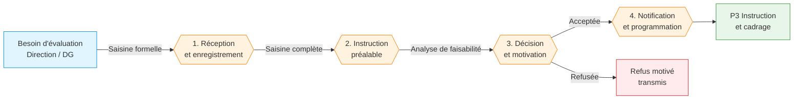

# 🚀 Procédure de saisine d'évaluation

> **Référence** : `CEV-P02`
> **Niveau** : 🥈 Argent
> **Type** : Procédure de pilotage — Saisine
> **Version** : 1.0
> **Date de création** : 01/08/2026
> **Dernière mise à jour** : 01/08/2026
> **Validée par** : Directeur de l'évaluation

---

## 🃏 FLASH CARD — Résumé 30s

> **Objet** : Définir le circuit de traitement d'une demande d'évaluation (saisine) émanant de la Direction Générale ou d'une direction métier, de la réception jusqu'à la décision de lancement ou de refus motivé.
> **Acteurs clés** : Direction demandeuse · Directeur de l'évaluation · Comité de pilotage · Évaluateur public
> **Délai pivot** : 15 jours ouvrés entre réception de la saisine et décision motivée
> **Déclencheur** : Réception d'une demande d'évaluation formelle (courrier, courriel, formulaire de saisine)
> **Livrable principal** : Décision de saisine motivée (acceptation + Note d'opportunité, ou refus argumenté)
> **Risque majeur** : Saisine non traitée dans les délais ou décision insuffisamment motivée
> **Indicateur cible** : 100% des saisines traitées sous 15 jours ouvrés

---

## 📍 CRAIE — Localisation

| Axe | Valeur |
|-----|--------|
| **Contexte** | Une direction ou la DG exprime un besoin d'évaluation sur un objet (politique, dispositif, procédure, organisation). Ce besoin doit être formalisé, instruit et tranché selon un circuit standardisé garantissant égalité de traitement et traçabilité. |
| **Référentiel** | DOX v6.0 · Charte de l'Évaluateur public CEV-001 · Règlement intérieur d'évaluation |
| **Acteurs** | DG · Direction demandeuse · Directeur évaluation · Comité pilotage · Évaluateur public · Contrôle de gestion |
| **Intitulé** | CEV-P02 — Traitement d'une saisine d'évaluation |
| **Étapes** | 1. Réception et enregistrement → 2. Instruction préalable → 3. Décision et motivation → 4. Notification et programmation |

### Chaîne de localisation

```
M1 › Pilotage stratégique › P2 › Traitement d'une saisine › Évaluateur public
```

**Filière** : Évaluation / Pilotage / Qualité

### Processus amont et aval

| Direction | Flux |
|-----------|------|
| **Amont** | Besoin d'évaluation identifié par une direction ou la DG (direction demandeuse) |
| **Procédure** | CEV-P02 — Traitement d'une saisine d'évaluation |
| **Aval** | Instruction et cadrage préalable P3, ou Programmation annuelle P1 (si saisine reçue hors cycle) |

---

## 🔄 Logigramme Mermaid



### Légende

| Couleur | Signification |
|---------|---------------|
| 🔵 Bleu | Amont / Déclencheur |
| 🟠 Orange | Étapes de la procédure |
| 🔴 Rouge | Refus / Sortie négative |
| 🟢 Vert | Aval / Sortie positive |

---

## 👥 RACI — Matrice des responsabilités

### Acteurs

| # | Rôle | Direction/Service | Rôle dans la procédure |
|---|------|-------------------|----------------------|
| 1 | 📋 Direction demandeuse | Direction métier | Formule la demande d'évaluation, fournit le contexte et les enjeux |
| 2 | 🔰 Directeur de l'évaluation | Évaluateur public | Instruit la saisine, propose une décision motivée au Comité |
| 3 | 👤 Évaluateur public | Évaluateur public | Analyse la faisabilité, prépare la note d'opportunité |
| 4 | 🏛️ Comité de pilotage | DG + directions concernées | Valide ou refuse la saisine, arbitre les priorités |

### Matrice RACI

| Phase / Activité | Direction demandeuse | Directeur évaluation | Évaluateur public | Comité pilotage |
|-----------------|:---:|:---:|:---:|:---:|
| Saisine et enregistrement | R | A | C | I |
| Instruction et faisabilité | C | A | R | I |
| Décision motivée | I | R | C | A |
| Notification et programmation | I | R | C | A |

> **R** = Réalise · **A** = Approuve · **C** = Consulté · **I** = Informé

---

## 📝 Étapes détaillées

### Étape 1 : Réception et enregistrement de la saisine

| Champ | Valeur |
|-------|--------|
| **Action** | Réceptionner la demande d'évaluation, vérifier la complétude du dossier (objet, périmètre, contexte, enjeux, contact référent), enregistrer dans le registre des saisines avec un numéro unique (SAI-AAAAMM-NNN). |
| **Acteur** | Évaluateur public |
| **Délai** | 2 jours ouvrés |
| **Livrable** | Saisine enregistrée dans le registre avec accusé de réception transmis à la direction demandeuse |
| **Outil** | Registre des saisines (BDD 1 Procédures / table Saisines) · Formulaire de saisine type |
| **Condition de passage** | Dossier complet — si incomplet, demande de complément à la direction demandeuse (délai suspendu) |

### Étape 2 : Instruction préalable et analyse de faisabilité

| Champ | Valeur |
|-------|--------|
| **Action** | Analyser la demande : clarification de l'objet, identification des parties prenantes, évaluation des ressources nécessaires (volume, compétences, budget), risques prévisibles, conflits d'intérêt potentiels. Rédiger une note d'opportunité synthétique. |
| **Acteur** | Évaluateur public (sous supervision du Directeur de l'évaluation) |
| **Délai** | 8 jours ouvrés |
| **Livrable** | Note d'opportunité incluant : objet, enjeux, faisabilité, estimation charge/coût, risques, proposition de suite (acceptation/refus/reformulation) |
| **Outil** | Template Note d'opportunité · Grille d'analyse de faisabilité · Référentiel des charges évaluatives |
| **Condition de passage** | Note d'opportunité validée par le Directeur de l'évaluation |

### Étape 3 : Décision et motivation

| Champ | Valeur |
|-------|--------|
| **Action** | Soumettre la note d'opportunité au Comité de pilotage. Le Comité statue : acceptation (avec ou sans réserves), demande de reformulation, ou refus motivé. La décision est formalisée par le Directeur de l'évaluation. |
| **Acteur** | Directeur de l'évaluation (décision) · Comité de pilotage (validation) |
| **Délai** | 5 jours ouvrés (incluant la tenue du Comité) |
| **Livrable** | Décision de saisine motivée signée par le Directeur de l'évaluation et visée par le Président du Comité |
| **Outil** | Template Décision de saisine · Registre des décisions du Comité de pilotage |
| **Condition de passage** | Décision formalisée et signée |

### Étape 4 : Notification et programmation

| Champ | Valeur |
|-------|--------|
| **Action** | Notifier la décision à la direction demandeuse (acceptation ou refus motivé). En cas d'acceptation, inscrire l'évaluation dans le programme en cours et transmettre le dossier à l'étape P3 Instruction et cadrage préalable. En cas de refus, archiver la décision motivée. |
| **Acteur** | Directeur de l'évaluation |
| **Délai** | 2 jours ouvrés |
| **Livrable** | Notification transmise à la direction demandeuse · Si acceptation : dossier transmis à P3 + mise à jour du programme annuel |
| **Outil** | Registre des saisines (mise à jour statut) · Programme annuel d'évaluation (BDD) · Messagerie institutionnelle |
| **Condition de passage** | Notification délivrée et accusé de réception de la direction demandeuse |

---

## ⚠️ Risques identifiés

| # | Code | Risque | Description | Impact | Probabilité |
|---|------|--------|-------------|--------|:-----------:|
| 1 | R1 | Saisine non traitée dans les délais | Absence de traitement dans les 15 jours ouvrés par manque de capacité ou priorisation | Majeur | 3/5 |
| 2 | R2 | Décision insuffisamment motivée | Refus ou acceptation sans justification solide, exposant à un recours ou à un conflit | Majeur | 2/5 |
| 3 | R3 | Saisine incomplète récurrente | Directions demandeuses ne fournissant pas les éléments requis, allongeant le cycle | Mineur | 4/5 |
| 4 | R4 | Conflit d'intérêt non détecté | Évaluateur désigné ayant un lien avec l'objet de la saisine, compromettant l'indépendance | Critique | 2/5 |

### Criticité

| Risque | Niveau | Action requise |
|--------|--------|----------------|
| R1 | Moyenne (6) | Capacité de traitement dimensionnée, alerte automatique à J+10 |
| R2 | Moyenne (4) | Template décision avec rubriques obligatoires, validation contradictoire |
| R3 | Moyenne (4) | Sensibilisation des directions, formulaire de saisine avec champs obligatoires |
| R4 | Élevée (10) | Déclaration d'intérêt obligatoire dans la note d'opportunité, vérification par le Directeur |

> **Échelle** : Impact (1-5) × Probabilité (1-5) → **Criticité** : Faible (1-4) · Moyenne (5-9) · Élevée (10-16) · Critique (17-25)

---

## 📄 Documents de référence

Documents support et d'enregistrement associés à la procédure :

| Type | Document | Référence | Emplacement |
|------|----------|-----------|-------------|
| Support | Formulaire de saisine d'évaluation | CEV-F01 | BDD 1 Procédures / Outils |
| Support | Template Note d'opportunité | CEV-F02 | BDD 1 Procédures / Outils |
| Support | Template Décision de saisine | CEV-F03 | BDD 1 Procédures / Outils |
| Support | Registre des saisines | CEV-R01 | BDD 1 Procédures / Registres |
| Enregistrement | Saisine traitée (dossier complet) | N/A | GED Évaluateur / Saisines |
| Enregistrement | Programme annuel d'évaluation | CEV-P01 | BDD 1 Procédures / P1 |

---

## 📋 Informations générales

| Champ | Valeur |
|-------|--------|
| **Périmètre** | Toute demande d'évaluation émanant de la DG ou d'une direction métier |
| **Directions concernées** | DG · Toutes directions métiers |
| **Services concernés** | Évaluateur public · Secrétariat du Comité de pilotage |
| **Date d'effet** | 01/08/2026 |
| **Validité** | Jusqu'à prochaine revue |
| **Révision** | Version 1.0 |

---

## 🔗 Références normatives

| Texte | Référence |
|-------|-----------|
| Charte de l'Évaluateur public — CEV-001 | Niveau Argent, 01/08/2026 |
| DOX v6.0 — Doctrine PROC | DOX Core |
| Règlement intérieur de l'Évaluateur public | Document interne DG |
| ISO 19011 — Lignes directrices pour l'audit | Norme ISO |
| Procédure P1 — Programme annuel d'évaluation | CEV-P01 |
| Procédure P3 — Instruction et cadrage préalable | CEV-P03 |

---

## ✅ Checklist Argent

- [x] FLASH CARD complète (objet, acteurs, délai, livrable, risque, indicateur)
- [x] Localisation CRAIE avec amont/aval
- [x] Logigramme Mermaid (amont → procédure → aval, avec branche refus)
- [x] RACI (4 acteurs, 4 phases couvertes)
- [x] Étapes détaillées (4 étapes avec action, acteur, délai, livrable, outil, condition)
- [x] Risques (4 risques avec impact + probabilité + criticité)
- [x] Documents de référence (support + enregistrement)

---

> **Généré par Hermes Agent — PROC v1.0**  
> **DOX v6.0 — Niveau Argent**  
> **Prochaine évolution suggérée** : `/proc upgrade --niveau or`  
> **Mission** : M1 Pilotage stratégique · **Processus** : P2 Traitement d'une saisine
