# 🚀 Note de cadrage d'évaluation

> **Référence** : `CEV-P04`
> **Niveau** : 🥇 Or
> **Type** : Procédure de conception — Cadrage d'évaluation
> **Version** : 1.0
> **Date de création** : 01/08/2026
> **Dernière mise à jour** : 01/08/2026
> **Validée par** : Directeur de l'évaluation

---

## 🃏 FLASH CARD — Résumé 30s

> **Objet** : Formaliser le périmètre, les questions évaluatives, la méthodologie, le calendrier et les ressources d'une évaluation dans une note de cadrage validée, socle contractuel de toute la mission d'évaluation.
> **Acteurs clés** : Évaluateur public · Directeur de l'évaluation · Direction évaluée · Comité de pilotage · Experts métier
> **Délai pivot** : 20 jours ouvrés entre la réception du dossier P3 et la validation de la note de cadrage
> **Déclencheur** : Transmission du dossier d'instruction par le processus P3 (Instruction et cadrage préalable) après décision favorable de saisine
> **Livrable principal** : Note de cadrage d'évaluation validée par le Comité de pilotage, incluant périmètre, questions évaluatives, méthodologie, calendrier et budget
> **Risque majeur** : Note de cadrage trop vague ou non validée, compromettant la qualité et la crédibilité de l'évaluation
> **Indicateur cible** : 100% des notes de cadrage validées dans les 20 jours ouvrés, score QG ≥ 70%

---

## 📍 CRAIE — Localisation

| Axe | Valeur |
|-----|--------|
| **Contexte** | Après qu'une saisine a été acceptée (P2) et instruite (P3), l'évaluation entre dans sa phase de conception. La note de cadrage est le document fondateur de l'évaluation : il fixe le contrat entre l'Évaluateur public, la direction évaluée et le Comité de pilotage sur ce qui sera évalué, comment, par qui, et dans quels délais. |
| **Référentiel** | DOX v6.0 · Charte de l'Évaluateur public CEV-001 · Procédure P2 Saisine · Procédure P3 Instruction préalable · Guide méthodologique d'évaluation |
| **Acteurs** | DG · Direction évaluée · Directeur évaluation · Évaluateur public · Comité pilotage · Experts métier · Contrôle de gestion |
| **Intitulé** | CEV-P04 — Note de cadrage d'évaluation |
| **Étapes** | 1. Recueil préparatoire → 2. Questions évaluatives → 3. Conception méthodologique → 4. Planification ressources/calendrier → 5. Rédaction et validation |

### Chaîne de localisation

```
M2 › Conduite d'une évaluation › P4 › Note de cadrage › Évaluateur public
```

**Filière** : Évaluation / Conception / Pilotage

### Processus amont et aval

| Direction | Flux |
|-----------|------|
| **Amont** | P2 Saisine acceptée → P3 Instruction et cadrage préalable (dossier transmis) |
| **Procédure** | CEV-P04 — Note de cadrage d'évaluation |
| **Aval** | P5 Installation du comité de pilotage · P6 Lancement consultation · P7 Collecte et analyse des données |

---

## 🔄 Logigramme Mermaid

```mermaid
flowchart LR
    A[Dossier P3 transmis<br/>Décision de saisine] -->|Dossier complet| B{{1. Recueil préparatoire<br/>et analyse}}
    B -->|Documentation collectée| C{{2. Définition des<br/>questions évaluatives}}
    C -->|Questions validées| D{{3. Conception<br/>méthodologique}}
    D -->|Méthode choisie| E{{4. Planification<br/>ressources et calendrier}}
    E -->|Budget et planning| F{{5. Rédaction<br/>et validation}}
    F -->|Comité valide| G[Note de cadrage<br/>approuvée]
    F -->|Comité demande révision| H[Révisions<br/>et nouvelle soumission]
    H -->|Note corrigée| F

    style A fill:#e1f5fe,stroke:#0288d1
    style B fill:#fff3e0,stroke:#f57c00
    style C fill:#fff3e0,stroke:#f57c00
    style D fill:#fff3e0,stroke:#f57c00
    style E fill:#fff3e0,stroke:#f57c00
    style F fill:#fff3e0,stroke:#f57c00
    style G fill:#e8f5e9,stroke:#388e3c
    style H fill:#ffebee,stroke:#c62828
```



### Légende

| Couleur | Signification |
|---------|---------------|
| 🔵 Bleu | Amont / Déclencheur |
| 🟠 Orange | Étapes de la procédure |
| 🟢 Vert | Aval / Sortie positive |
| 🔴 Rouge | Révision / Boucle de correction |

---

## 👥 RACI — Matrice des responsabilités

### Acteurs

| # | Rôle | Direction/Service | Rôle dans la procédure |
|---|------|-------------------|------------------------|
| 1 | 👤 Évaluateur public | Évaluateur public | Conduit le recueil, définit les questions évaluatives, conçoit la méthodologie, rédige la note de cadrage |
| 2 | 🔰 Directeur de l'évaluation | Évaluateur public | Valide la qualité technique de la note, propose au Comité, arbitre les arbitrages méthodologiques |
| 3 | 📋 Direction évaluée | Direction métier | Fournit la documentation, valide le périmètre et le calendrier, désigne les référents |
| 4 | 🏛️ Comité de pilotage | DG + directions concernées | Approuve la note de cadrage, valide les ressources allouées, suit le déroulement |
| 5 | 👨‍🔬 Experts métier | Directions métier / externes | Contribuent à la définition des questions et à la faisabilité technique |
| 6 | 📊 Contrôle de gestion | DG | Fournit les données de performance et la trajectoire budgétaire |

### Matrice RACI

| Phase / Activité | Évaluateur public | Directeur évaluation | Direction évaluée | Comité pilotage | Experts métier | Contrôle gestion |
|-----------------|:---:|:---:|:---:|:---:|:---:|:---:|
| Recueil préparatoire | R | A | C | I | C | C |
| Questions évaluatives | R | A | C | I | C | I |
| Conception méthodologique | R | A | C | I | C | I |
| Planification ressources | C | A | C | A | I | R |
| Rédaction de la note | R | A | C | I | I | I |
| Validation et approbation | C | R | C | A | I | I |

> **R** = Réalise · **A** = Approuve · **C** = Consulté · **I** = Informé

---

## 📝 Étapes détaillées

### Étape 1 : Recueil préparatoire et analyse documentaire

| Champ | Valeur |
|-------|--------|
| **Action** | Réceptionner le dossier transmis par P3 (décision de saisine, note d'opportunité, premiers éléments de contexte). Réunir la documentation disponible : textes fondateurs, rapports antérieurs, données statistiques, organigramme, procédures existantes. Conduire un premier entretien exploratoire avec la direction évaluée pour cadrer les attentes, les contraintes et les enjeux politiques. Identifier les parties prenantes clés et les sources de données disponibles. Cartographier les risques prévisibles de l'évaluation et les conflits d'intérêt potentiels. |
| **Acteur** | Évaluateur public (réalise) · Directeur de l'évaluation (supervise) · Direction évaluée (consultée, fournit documents) |
| **Délai** | 5 jours ouvrés |
| **Livrable** | Dossier documentaire constitué et classé · Compte rendu d'entretien exploratoire · Première cartographie des parties prenantes et des risques |
| **Outil** | Template Compte rendu d'entretien · Grille de recueil documentaire · Registre des parties prenantes · BDD GED (documents liés) |
| **Condition de passage** | Dossier documentaire complet et compte rendu d'entretien validé par le Directeur de l'évaluation |

### Étape 2 : Définition des questions évaluatives

| Champ | Valeur |
|-------|--------|
| **Action** | Formuler les questions évaluatives qui structureront l'ensemble de l'évaluation. Distinguer : (a) les questions descriptives (quoi, combien, qui) — (b) les questions causales (pourquoi, quels effets) — (c) les questions normatives (conformité à quoi, écarts avec la cible). Valider chaque question selon les critères SMART-É : Spécifique, Mesurable, Acceptable par les parties, Réaliste dans le calendrier, Temporellement bornée, et Évaluable (données accessibles). Limiter le nombre de questions à 3-5 principales pour garantir la profondeur d'analyse. Soumettre les questions au Directeur de l'évaluation pour validation technique, puis à la direction évaluée pour avis. |
| **Acteur** | Évaluateur public (réalise) · Directeur de l'évaluation (valide) · Direction évaluée (consultée) · Experts métier (contribuent) |
| **Délai** | 4 jours ouvrés |
| **Livrable** | Liste des questions évaluatives validées (3-5 questions principales, avec sous-questions le cas échéant) · Grille de critères SMART-É renseignée |
| **Outil** | Template Questions évaluatives · Grille SMART-É · Guide méthodologique d'évaluation |
| **Condition de passage** | Questions évaluatives validées par le Directeur de l'évaluation et acceptées par la direction évaluée |

### Étape 3 : Conception méthodologique

| Champ | Valeur |
|-------|--------|
| **Action** | Concevoir la stratégie méthodologique adaptée à chaque question évaluative. Sélectionner les méthodes de collecte (quantitatives : enquêtes, analyses statistiques, indicateurs — qualitatives : entretiens semi-directifs, groupes de travail, observations, études de cas — mixtes). Définir l'échantillonnage, les sources de données, les outils de collecte (guides d'entretien, questionnaires, grilles d'observation). Préciser les méthodes d'analyse (analyse de contenu, analyse statistique, analyse comparative, théorie du changement). Anticiper les limites et biais potentiels de chaque méthode et les stratégies de mitigation. Documenter les choix dans une note méthodologique annexée à la note de cadrage. |
| **Acteur** | Évaluateur public (réalise, avec l'appui des experts métier si besoin) · Directeur de l'évaluation (valide la robustesse) |
| **Délai** | 5 jours ouvrés |
| **Livrable** | Note méthodologique détaillée incluant : méthodes de collecte, échantillonnage, outils, méthodes d'analyse, limites et biais identifiés |
| **Outil** | Guide méthodologique d'évaluation · Templates guides d'entretien et questionnaires · Référentiel des méthodes qualitatives/quantitatives |
| **Condition de passage** | Note méthodologique validée par le Directeur de l'évaluation — si méthode complexe, avis complémentaire d'un expert externe |

### Étape 4 : Planification des ressources et du calendrier

| Champ | Valeur |
|-------|--------|
| **Action** | Établir le plan de charge détaillé de l'évaluation : volume de jours/homme par phase, compétences nécessaires (évaluateur, statisticien, expert métier, enquêteur), budget prévisionnel (frais de déplacement, prestations externes, outils). Construire le calendrier prévisionnel avec jalons clés : début de la collecte, réunions techniques, restitution intermédiaire, remise du rapport. Identifier les dépendances critiques (disponibilité des données, planning des directions, périodes de fermeture). Proposer une répartition des rôles entre l'équipe d'évaluation et les interlocuteurs de la direction évaluée. Présenter le budget et le calendrier à la direction évaluée pour concertation. |
| **Acteur** | Évaluateur public (propose) · Directeur de l'évaluation (valide) · Direction évaluée (consultée sur disponibilités) · Contrôle de gestion (établit le budget) · Comité de pilotage (approuve les ressources) |
| **Délai** | 3 jours ouvrés |
| **Livrable** | Plan de charge · Budget prévisionnel · Calendrier avec jalons · Tableau des affectations |
| **Outil** | Template Plan de charge · Template Budget prévisionnel · Outil de planification (Gantt) · Référentiel des charges évaluatives |
| **Condition de passage** | Budget et calendrier concertés avec la direction évaluée, validés par le Directeur de l'évaluation |

### Étape 5 : Rédaction et validation de la note de cadrage

| Champ | Valeur |
|-------|--------|
| **Action** | Rédiger la note de cadrage complète selon le template standardisé. La note doit inclure : (1) Contexte et objet de l'évaluation — (2) Périmètre (champ, période, population cible, limites) — (3) Questions évaluatives — (4) Méthodologie détaillée — (5) Calendrier et jalons — (6) Ressources et budget — (7) Parties prenantes et gouvernance — (8) Risques et mesures de mitigation — (9) Livrables attendus. Soumettre la version pré-validée au Directeur de l'évaluation pour relecture et correction. Transmettre la version finalisée au Comité de pilotage pour approbation formelle. En cas de demande de révision, ajuster et représenter la note dans un délai maximal de 5 jours ouvrés. Une fois approuvée, diffuser la note à l'ensemble des parties prenantes et l'archiver dans la GED. |
| **Acteur** | Évaluateur public (rédige) · Directeur de l'évaluation (pré-valide, présente au Comité) · Comité de pilotage (approuve) |
| **Délai** | 3 jours ouvrés (rédaction) + 3 jours ouvrés (validation Comité) + 2 jours ouvrés (diffusion et archivage) |
| **Livrable** | Note de cadrage d'évaluation validée et diffusée · Compte rendu de décision du Comité · Note de cadrage archivée dans la GED |
| **Outil** | Template Note de cadrage CEV-F04 · Registre des notes de cadrage · GED Évaluateur · Messagerie institutionnelle |
| **Condition de passage** | Note de cadrage approuvée par le Comité de pilotage et diffusée à toutes les parties prenantes |

### Boucle de révision

En cas de demande de révision par le Comité de pilotage, le circuit suivant s'applique :

| Champ | Valeur |
|-------|--------|
| **Action** | Analyser les demandes de révision, les classer (modifications rédactionnelles / ajouts de contenu / changements de périmètre). Pour les modifications mineures, procéder directement. Pour les changements de périmètre ou de questions évaluatives, réévaluer l'impact sur le budget et le calendrier. Soumettre la version révisée dans un délai de 5 jours ouvrés maximum. |
| **Acteur** | Évaluateur public (modifie) · Directeur de l'évaluation (valide les révisions) · Comité de pilotage (valide la version finale) |
| **Délai** | 5 jours ouvrés maximum |
| **Livrable** | Note de cadrage révisée · Note d'impact (si changement de périmètre) |
| **Condition de sortie** | La note de cadrage est approuvée sans réserve par le Comité de pilotage |

---

## ⚠️ Risques identifiés

| # | Code | Risque | Description | Impact | Probabilité |
|---|------|--------|-------------|--------|:-----------:|
| 1 | R1 | Périmètre mal défini | Questions évaluatives trop larges ou floues, rendant l'évaluation ingérable ou les conclusions inexploitables | Majeur | 3/5 |
| 2 | R2 | Méthodologie inadaptée | Choix méthodologique non adapté aux données disponibles ou au contexte, produisant des résultats non robustes | Majeur | 3/5 |
| 3 | R3 | Calendrier irréaliste | Sous-estimation des délais de collecte, de l'accès aux données ou de la disponibilité des parties prenantes | Majeur | 4/5 |
| 4 | R4 | Note non validée dans les temps | Absence de validation par le Comité de pilotage dans le délai de 20 jours, retardant toute la mission | Mineur | 2/5 |
| 5 | R5 | Conflit d'intérêt sur le cadrage | Influence de la direction évaluée sur la formulation des questions ou le choix méthodologique, biaisant l'évaluation | Critique | 2/5 |

### Criticité

| Risque | Niveau | Action requise |
|--------|--------|----------------|
| R1 | Moyenne (6) | Validation systématique des questions par le Directeur ; test de cohérence avec les données disponibles |
| R2 | Moyenne (6) | Revue méthodologique par le Directeur ; sollicitation d'expertise externe pour les méthodes complexes |
| R3 | Élevée (8) | Marges de sécurité intégrées au calendrier (J+20% minimum) ; validation par la direction évaluée |
| R4 | Faible (2) | Rappel automatique au Comité à J+10 ; circuit de validation accéléré si urgence |
| R5 | Élevée (10) | Déclaration d'intérêt obligatoire dans la note ; vérification par le Directeur de l'évaluation |

> **Échelle** : Impact (1-5) × Probabilité (1-5) → **Criticité** : Faible (1-4) · Moyenne (5-9) · Élevée (10-16) · Critique (17-25)

---

## 📄 Documents de référence

Documents support et d'enregistrement associés à la procédure :

### Documents support

| Type | Document | Référence | Emplacement |
|------|----------|-----------|-------------|
| Support | Template Note de cadrage d'évaluation | CEV-F04 | BDD 1 Procédures / Outils |
| Support | Grille de recueil documentaire | CEV-F04a | BDD 1 Procédures / Outils |
| Support | Template Compte rendu d'entretien exploratoire | CEV-F04b | BDD 1 Procédures / Outils |
| Support | Template Questions évaluatives + Grille SMART-É | CEV-F04c | BDD 1 Procédures / Outils |
| Support | Template Plan de charge et budget prévisionnel | CEV-F04d | BDD 1 Procédures / Outils |
| Support | Guide méthodologique d'évaluation | CEV-G01 | BDD 1 Procédures / Guides |
| Support | Référentiel des charges évaluatives | CEV-G02 | BDD 1 Procédures / Guides |
| Support | Charte de l'Évaluateur public | CEV-001 | BDD 1 Procédures / Chartes |

### Documents d'enregistrement

| Type | Document | Référence | Emplacement |
|------|----------|-----------|-------------|
| Enregistrement | Note de cadrage approuvée (chaque évaluation) | N/A | GED Évaluateur / Notes de cadrage |
| Enregistrement | Compte rendu de décision du Comité de pilotage | N/A | GED Évaluateur / Comité pilotage |
| Enregistrement | Registre des notes de cadrage | CEV-R02 | BDD 1 Procédures / Registres |
| Enregistrement | Budget évaluation validé | N/A | Contrôle de gestion / Budgets |
| Enregistrement | Calendrier d'évaluation mis à jour | N/A | BDD 1 Procédures / P4 Calendriers |

---

## 📋 Informations générales

| Champ | Valeur |
|-------|--------|
| **Périmètre** | Toute évaluation conduite par l'Évaluateur public après instruction favorable P3 |
| **Directions concernées** | Direction évaluée · DG · Toutes directions parties prenantes |
| **Services concernés** | Évaluateur public · Contrôle de gestion · Secrétariat du Comité de pilotage |
| **Date d'effet** | 01/08/2026 |
| **Validité** | Jusqu'à prochaine revue |
| **Révision** | Version 1.0 |

---

## 📊 Tableau de bord — Indicateurs de performance

| Indicateur | Cible | Mesure | Fréquence | Seuil d'alerte |
|------------|:----:|--------|-----------|:--------------:|
| Délai de production de la note | ≤ 20 jours ouvrés | Date validation - Date réception dossier P3 | Par note | > 25 jours |
| Taux de validation au premier passage | ≥ 80% | Notes approuvées sans révision / Total notes | Trimestrielle | < 60% |
| Nombre de révisions par note | ≤ 1 cycle | Cycles de révision avant approbation finale | Par note | > 2 cycles |
| Complétude de la note | 100% | % des 9 sections obligatoires présentes | Par note | < 90% |
| Budget respecté | ± 10% | Écart budget prévisionnel vs exécution (estimation P7) | Par note | > 20% |
| Satisfaction direction évaluée | ≥ 4/5 | Enquête de satisfaction post-validation | Semestrielle | < 3/5 |

---

## 🔗 Références normatives

| Texte | Référence |
|-------|-----------|
| Charte de l'Évaluateur public — CEV-001 | Niveau Argent, 01/08/2026 |
| DOX v6.0 — Doctrine PROC | DOX Core |
| Procédure P2 — Traitement d'une saisine | CEV-P02, Niveau Argent |
| Procédure P3 — Instruction et cadrage préalable | CEV-P03 |
| Procédure P5 — Installation du comité de pilotage | CEV-P05 |
| ISO 19011 — Lignes directrices pour l'audit | Norme ISO |
| Règlement intérieur de l'Évaluateur public | Document interne DG |

---

## ✅ Checklist OR — Note de cadrage

- [x] FLASH CARD complète (objet, acteurs, délai, livrable, risque, indicateur)
- [x] Localisation CRAIE avec chaîne M2 › P4 et amont/aval
- [x] Logigramme Mermaid (5 étapes + boucle de révision, amont → aval)
- [x] RACI complet (6 acteurs, 6 phases couvertes)
- [x] Étapes détaillées (5 étapes + boucle révision, chaque étape : action, acteur, délai, livrable, outil, condition)
- [x] Risques (5 risques avec code, description, impact, probabilité, criticité)
- [x] Documents de référence (8 support + 5 enregistrement)
- [x] Tableau de bord (6 indicateurs avec cible, mesure, fréquence, seuil d'alerte)

### Critères QG Niveau OR

| Gate | Critère | Statut | Poids |
|:----:|---------|:------:|:-----:|
| G1 | Titre et référence conformes | ✅ | 3 |
| G2 | FLASH CARD complète (objet, acteurs, délais, risques, indicateur) | ✅ | 5 |
| G3 | Localisation CRAIE explicite (Mission › Processus) | ✅ | 4 |
| G4 | Logigramme Mermaid (≥ 3 nœuds, amont→aval) | ✅ | 5 |
| G5 | RACI complet (≥ 4 acteurs, ≥ 3 phases, R/A/C/I) | ✅ | 4 |
| G6 | Étapes détaillées (action, acteur, délai, livrable par étape) | ✅ | 5 |
| G7 | Risques (≥ 3 documentés avec code, impact, probabilité) | ✅ | 5 |
| G7B | Documents support + enregistrement listés | ✅ | 3 |
| G21 | Score total ≥ 70% requis pour le Niveau OR | ✅ | 5 |
| | **Score total** | **34/34** (100%) | **39** |

---

> **Généré par Hermes Agent — PROC v1.0**  
> **DOX v6.0 — Niveau Or**  
> **Prochaine évolution suggérée** : `/proc upgrade --niveau platine`  
> **Mission** : M2 Conduite d'une évaluation · **Processus** : P4 Note de cadrage d'évaluation
