# 🚀 Collecte et analyse des données d'évaluation

> **Référence** : `CEV-P07`
> **Niveau** : 🥇 Or
> **Type** : Procédure technique — Collecte et analyse
> **Version** : 1.0
> **Date de création** : 01/08/2026
> **Dernière mise à jour** : 01/08/2026
> **Validée par** : Directeur de l'évaluation

---

## 🃏 FLASH CARD — Résumé 30s

> **Objet** : Conduire la collecte et l'analyse des données d'évaluation selon les méthodes définies dans la note de cadrage (CEV-P04), depuis la préparation des outils jusqu'à la production des résultats analysés prêts pour l'élaboration des conclusions.
> **Acteurs clés** : Évaluateur public · Directeur de l'évaluation · Direction évaluée · Experts métier · Enquêteurs / Prestataires
> **Déclencheur** : Validation de la note de cadrage (CEV-P04) et installation du comité de pilotage (CEV-P05)
> **Délai pivot** : 45 jours ouvrés entre le début de la collecte et la remise du rapport d'analyse validé
> **Livrable principal** : Rapport d'analyse des données incluant résultats bruts, analyses statistiques et qualitatives, et synthèse des constats
> **Risque majeur** : Données insuffisantes ou de mauvaise qualité compromettant la robuste des conclusions
> **Indicateur cible** : 90% des sources de données planifiées effectivement collectées, score QG ≥ 70%

---

## 📍 CRAIE — Localisation

| Axe | Valeur |
|-----|--------|
| **Contexte** | Après la validation de la note de cadrage (P4), l'installation du comité de pilotage (P5) et le lancement de la consultation (P6), l'évaluation entre dans sa phase opérationnelle de collecte. Les méthodes et outils ont été définis dans la note de cadrage. L'équipe d'évaluation déploie sur le terrain les instruments de collecte, recueille les données quantitatives et qualitatives, les traite et les analyse pour produire des constats objectivés. |
| **Référentiel** | DOX v6.0 · Charte de l'Évaluateur public CEV-001 · Note de cadrage CEV-P04 · Guide méthodologique d'évaluation CEV-G01 · Référentiel des méthodes qualitatives/quantitatives |
| **Acteurs** | DG · Direction évaluée · Directeur évaluation · Évaluateur public · Comité pilotage · Experts métier · Enquêteurs/prestataires |
| **Intitulé** | CEV-P07 — Collecte et analyse des données d'évaluation |
| **Étapes** | 1. Préparation des outils → 2. Collecte quantitative → 3. Collecte qualitative → 4. Traitement et validation → 5. Analyse et synthèse |

### Chaîne de localisation

```
M2 › Conduite d'une évaluation › P7 › Collecte et analyse › Évaluateur public
```

**Filière** : Évaluation / Technique / Analyse

### Processus amont et aval

| Direction | Flux |
|-----------|------|
| **Amont** | P5 Installation du comité de pilotage → P6 Lancement de la consultation (prestataires retenus, outils validés) |
| **Procédure** | CEV-P07 — Collecte et analyse des données d'évaluation |
| **Aval** | P8 Réunions techniques et entretiens complémentaires · P9 Élaboration des conclusions et recommandations |

---

## 🔄 Logigramme Mermaid

```mermaid
flowchart LR
    A[Note de cadrage<br/>validée + Marchés notifiés] -->|Outils approuvés| B{{1. Préparation des<br/>outils de collecte}}
    B -->|Outils prêts| C{{2. Collecte des<br/>données quantitatives}}
    C -->|Base consolidée| D{{3. Collecte des<br/>données qualitatives}}
    D -->|Données brutes| E{{4. Traitement et<br/>validation des données}}
    E -->|Données validées| F{{5. Analyse et<br/>synthèse}}
    E -->|Données incomplètes| G[Collecte<br/>complémentaire]
    G --> C
    F -->|Rapport d'analyse validé| H[Données analysées<br/>prêtes pour P8-P9]

    style A fill:#e1f5fe,stroke:#0288d1
    style B fill:#fff3e0,stroke:#f57c00
    style C fill:#fff3e0,stroke:#f57c00
    style D fill:#fff3e0,stroke:#f57c00
    style E fill:#fce4ec,stroke:#d32f2f
    style F fill:#fff3e0,stroke:#f57c00
    style G fill:#f3e5f5,stroke:#7b1fa2
    style H fill:#e8f5e9,stroke:#388e3c
```



### Légende

| Couleur | Signification |
|---------|---------------|
| 🔵 Bleu | Amont / Déclencheur |
| 🟠 Orange | Étapes de la procédure |
| 🔴 Rouge | Décision / Point de contrôle qualité |
| 🟣 Violet | Collecte complémentaire / Contingence |
| 🟢 Vert | Aval / Sortie positive |

---

## 👥 RACI — Matrice des responsabilités

### Acteurs

| # | Rôle | Direction/Service | Rôle dans la procédure |
|---|------|-------------------|------------------------|
| 1 | 👤 Évaluateur public | Évaluateur public | Conduit la collecte, réalise les analyses, rédige le rapport d'analyse |
| 2 | 🔰 Directeur de l'évaluation | Évaluateur public | Supervise la qualité de la collecte, valide les méthodes et le rapport |
| 3 | 📋 Direction évaluée | Direction métier | Facilite l'accès aux données et aux interlocuteurs, fournit les documents |
| 4 | 👨‍🔬 Experts métier | Directions métier / externes | Contribuent à l'interprétation des données, valident la pertinence technique |
| 5 | 📊 Enquêteurs / Prestataires | Externe / Marché | Réalisent les enquêtes de terrain, les traitements statistiques |
| 6 | 🏛️ Comité de pilotage | DG + directions concernées | Suit l'avancement, valide les constats intermédiaires si nécessaire |

### Matrice RACI

| Phase / Activité | Évaluateur public | Directeur évaluation | Direction évaluée | Experts métier | Enquêteurs | Comité pilotage |
|-----------------|:---:|:---:|:---:|:---:|:---:|:---:|
| Préparation des outils | R | A | C | C | C | I |
| Collecte quantitative | R | A | C | I | R | I |
| Collecte qualitative | R | A | C | C | R | I |
| Traitement et validation | R | A | I | C | R | I |
| Analyse et synthèse | R | A | C | C | C | I |
| Restitution intermédiaire | R | A | I | I | I | A |

> **R** = Réalise · **A** = Approuve · **C** = Consulté · **I** = Informé

---

## 📝 Étapes détaillées

### Étape 1 : Préparation des outils de collecte

| Champ | Valeur |
|-------|--------|
| **Action** | Finaliser et valider les outils de collecte définis dans la note de cadrage : guides d'entretien semi-directifs, questionnaires (papier/numérique), grilles d'observation, trames d'analyse documentaire. Réaliser un test / pré-enquête sur un échantillon réduit (3 à 5 entretiens tests, 20 questionnaires pilotes) pour valider la clarté, la durée et la pertinence des instruments. Ajuster les outils sur la base des retours du test. Préparer le plan de collecte détaillé : calendrier des entretiens, ciblage des répondants, logistique des déplacements, accès aux bases de données. Constituer et brief er l'équipe de collecte (enquêteurs, assistants de recherche) sur les consignes éthiques, le protocole et les outils. Vérifier les autorisations d'accès aux données (CNIL, confidentialité, conventions). |
| **Acteur** | Évaluateur public (réalise) · Enquêteurs/Prestataires (contribuent aux tests) · Directeur de l'évaluation (valide les outils finaux) · Direction évaluée (consultée sur le plan de collecte et les accès) |
| **Délai** | 5 jours ouvrés |
| **Livrable** | Outils de collecte finalisés et validés · Guide d'entretien · Questionnaire · Grille d'observation · Plan de collecte détaillé · Compte rendu de test des outils |
| **Outil** | Template Guide d'entretien CEV-F07a · Template Questionnaire CEV-F07b · Grille d'observation CEV-F07c · Guide méthodologique CEV-G01 · Outil d'enquête en ligne (LimeSurvey, Sphinx) |
| **Condition de passage** | Outils validés par le Directeur de l'évaluation, test concluant réalisé, plan de collecte approuvé, accès aux données sécurisés |

### Étape 2 : Collecte des données quantitatives

| Champ | Valeur |
|-------|--------|
| **Action** | Déployer les instruments de collecte quantitative selon le plan approuvé : diffusion des questionnaires (en ligne, papier, téléphone), extraction des bases de données administratives et de gestion (SIRH, SI financier, tableaux de bord), collecte des indicateurs de performance auprès du Contrôle de gestion. Assurer le suivi des taux de réponse : relances programmées (J+7, J+14, J+21), ajustement des canaux si sous-réponse. Contrôler la qualité des données entrantes : complétude, cohérence, détection des valeurs aberrantes. Tenir un tableau de bord de la collecte quantitative avec les indicateurs de progression (taux de réponse par cible, volume de données collectées, taux d'abandon). Clore la collecte quantitative lorsque les seuils de représentativité définis dans la note de cadrage sont atteints, ou à défaut après épuisement des relances (J+30 max). |
| **Acteur** | Évaluateur public (supervise) · Enquêteurs/Prestataires (réalisent la diffusion et les relances) · Direction évaluée/Contrôle de gestion (fournissent les bases de données) |
| **Délai** | 15 jours ouvrés (collecte active) + 5 jours ouvrés (suivi et relances) |
| **Livrable** | Base de données quantitative brute (fichier CSV/Excel) · Rapport de complétude et de qualité · Tableau de bord de la collecte · Fichier des relances |
| **Outil** | Outil d'enquête en ligne · Tableur / R / Python pour le suivi · Base SI de l'administration · Registre des taux de réponse |
| **Condition de passage** | Seuil de représentativité atteint ou épuisement des relances justifié ; données contrôlées et validées par l'Évaluateur public |

### Étape 3 : Collecte des données qualitatives

| Champ | Valeur |
|-------|--------|
| **Action** | Conduire les entretiens semi-directifs auprès des parties prenantes identifiées dans la note de cadrage : direction évaluée, agents, bénéficiaires, partenaires, experts. Respecter le guide d'entretien validé tout en permettant l'exploration d'axes émergents. Enregistrer (avec consentement) et verbatimer les entretiens dans les 48h. Organiser les groupes de travail / focus groups thématiques (3 à 8 participants) pour confronter les points de vue et enrichir l'analyse. Réaliser les observations de terrain si prévues dans le protocole, avec grille d'observation standardisée. Collecter et classer la documentation complémentaire identifiée lors des entretiens. Tenir un journal de bord de la collecte qualitative : date, interlocuteur, durée, thèmes abordés, impressions, points de saturation. Conduire les entretiens jusqu'à saturation des données (aucune information nouvelle significative sur 2 entretiens consécutifs). |
| **Acteur** | Évaluateur public (conduit les entretiens et observations) · Experts métier (participent aux focus groups) · Direction évaluée (facilite l'accès aux interlocuteurs) · Enquêteurs (réalisent les entretiens complémentaires si volume important) |
| **Délai** | 15 jours ouvrés (phase de terrain) + 5 jours ouvrés (verbatim et classement) |
| **Livrable** | Verbatims d'entretiens anonymisés · Comptes rendus de focus groups · Grilles d'observation renseignées · Journal de bord de la collecte · Documentation complémentaire classée |
| **Outil** | Dictaphone / outil d'enregistrement · Template Compte rendu d'entretien CEV-F07d · Grille d'observation CEV-F07c · Logiciel d'analyse qualitative (NVivo, MaxQDA) · GED Évaluateur |
| **Condition de passage** | Saturation des données constatée et validée ; verbatims produits et anonymisés ; journal de bord complet |

### Étape 4 : Traitement et validation des données

| Champ | Valeur |
|-------|--------|
| **Action** | Nettoyer et structurer l'ensemble des données collectées. Pour les données quantitatives : traitement des valeurs manquantes (imputation ou exclusion justifiée), détection et correction des outliers, recodage des variables, construction d'indicateurs composites, tests de fiabilité (alpha de Cronbach si échelles). Pour les données qualitatives : codage thématique systématique des verbatims selon une grille dérivée des questions évaluatives, double codage d'un échantillon (20%) pour vérifier la fiabilité inter-codes, résolution des divergences par consensus. Croiser les sources (triangulation) : confronter les résultats quantitatifs et qualitatifs pour identifier les convergences, divergences et complémentarités. Documenter les choix méthodologiques de traitement dans une note de traitement. Soumettre les données traitées au Directeur de l'évaluation pour validation de la qualité et de la robustesse avant analyse finale. |
| **Acteur** | Évaluateur public (réalise le traitement) · Directeur de l'évaluation (valide la qualité) · Experts métier (contribuent au double codage qualitatif si nécessaire) |
| **Délai** | 8 jours ouvrés |
| **Livrable** | Base de données nettoyée et documentée · Grille de codage qualitative · Rapport de triangulation · Note de traitement des données |
| **Outil** | Outil statistique (R, Python, SPSS, Stata) · Logiciel d'analyse qualitative · Tableur · Protocole de double codage |
| **Condition de passage** | Validation du Directeur de l'évaluation sur la qualité, la complétude et la robustesse des données traitées ; note de traitement approuvée |

### Étape 5 : Analyse et synthèse

| Champ | Valeur |
|-------|--------|
| **Action** | Conduire l'analyse approfondie des données traitées en répondant à chaque question évaluative de la note de cadrage. Mobiliser les méthodes d'analyse définies : analyses statistiques (descriptives, inférentielles, régressions, analyses factorielles), analyses de contenu thématique, analyse comparative, théorie du changement, analyse contrefactuelle selon le protocole. Structurer les résultats par question évaluative avec pour chacune : (1) les constats objectivés issus des données, (2) les éléments de preuve (citations, tableaux, graphiques), (3) les limites et la robustesse des constats, (4) les pistes d'interprétation. Produire un rapport d'analyse intermédiaire synthétisant l'ensemble des constats. Organiser une session de restitution intermédiaire avec le Directeur de l'évaluation et les experts métier pour valider l'interprétation des résultats et identifier les points nécessitant un approfondissement. Ajuster l'analyse sur la base des retours. Préparer les données et constats pour l'étape suivante (P8 Réunions techniques et P9 Conclusions). |
| **Acteur** | Évaluateur public (réalise l'analyse et rédige le rapport) · Directeur de l'évaluation (valide l'interprétation) · Experts métier (contribuent à l'interprétation technique) |
| **Délai** | 10 jours ouvrés (analyse) + 3 jours ouvrés (restitution et ajustements) |
| **Livrable** | Rapport d'analyse des données (structuré par question évaluative) · Jeux de données et visualisations · Présentation de restitution intermédiaire · Note de synthèse des constats |
| **Outil** | Outil statistique · Logiciel d'analyse qualitative · Template Rapport d'analyse CEV-F07e · Outil de visualisation (Tableau, Datawrapper, R/ggplot2) |
| **Condition de passage** | Rapport d'analyse validé par le Directeur de l'évaluation, restitution intermédiaire réalisée, constats prêts pour la phase P8-P9 |

### Boucle de contrôle qualité et collecte complémentaire

| Champ | Valeur |
|-------|--------|
| **Action** | À l'issue de l'étape de traitement (Étape 4), si des lacunes significatives sont identifiées (taux de réponse insuffisant, saturation non atteinte, données manquantes critiques, biais méthodologique détecté), déclencher une phase de collecte complémentaire. Identifier précisément les données manquantes, les causes et les solutions (nouvelle vague d'enquête, entretiens supplémentaires, sources alternatives). Présenter un plan de collecte complémentaire au Directeur de l'évaluation pour validation, incluant le budget et le délai supplémentaire. Une fois validé, exécuter la collecte complémentaire selon le même protocole que les étapes 2-3, puis réintégrer les données dans le circuit de traitement (Étape 4). |
| **Acteur** | Évaluateur public (propose et exécute) · Directeur de l'évaluation (valide le plan complémentaire) · Direction évaluée (facilite les accès supplémentaires) |
| **Délai** | 10 jours ouvrés maximum (collecte complémentaire + traitement) |
| **Livrable** | Plan de collecte complémentaire validé · Données complémentaires collectées et intégrées · Note d'impact sur le calendrier |
| **Condition de sortie** | Lacunes résorbées ou justification documentée de l'impossibilité de collecte, validée par le Directeur de l'évaluation |

---

## ⚠️ Risques identifiés

| # | Code | Risque | Description | Impact | Probabilité |
|---|------|--------|-------------|--------|:-----------:|
| 1 | R1 | Sous-représentativité des données | Taux de réponse insuffisant ou échantillon biaisé ne permettant pas de généraliser les résultats | Majeur | 4/5 |
| 2 | R2 | Difficulté d'accès aux données | Refus d'accès aux bases, données confidentielles non communicables, interlocuteurs non disponibles | Majeur | 4/5 |
| 3 | R3 | Qualité insuffisante des données collectées | Données incomplètes, incohérentes, erronées ou non exploitables pour l'analyse | Majeur | 3/5 |
| 4 | R4 | Dérive calendaire de la collecte | Retards cumulés dans les entretiens, enquêtes ou traitements, menaçant la date de restitution | Majeur | 3/5 |
| 5 | R5 | Biais d'influence des parties prenantes | Orientation des réponses, rétention d'information, pression sur les enquêteurs ou les répondants | Critique | 2/5 |

### Criticité

| Risque | Niveau | Action requise |
|--------|--------|----------------|
| R1 | Élevée (8) | Seuil de représentativité défini dans la note de cadrage ; relances systématiques ; plan B d'échantillonnage |
| R2 | Élevée (8) | Convention d'accès aux données signée en amont (phase P4) ; lettres de mission DG pour les directions |
| R3 | Moyenne (6) | Contrôle qualité à chaque étape ; tests des outils ; protocole de validation des données |
| R4 | Moyenne (6) | Marges de sécurité (J+20%) dans le planning ; points d'étape hebdomadaires ; tableau de bord de suivi |
| R5 | Élevée (10) | Déclaration d'intérêt ; anonymisation des répondants ; triangulation des sources ; supervision par le Directeur |

> **Échelle** : Impact (1-5) × Probabilité (1-5) → **Criticité** : Faible (1-4) · Moyenne (5-9) · Élevée (10-16) · Critique (17-25)

---

## 📄 Documents de référence

Documents support et d'enregistrement associés à la procédure :

### Documents support

| Type | Document | Référence | Emplacement |
|------|----------|-----------|-------------|
| Support | Template Guide d'entretien semi-directif | CEV-F07a | BDD 1 Procédures / Outils |
| Support | Template Questionnaire d'enquête | CEV-F07b | BDD 1 Procédures / Outils |
| Support | Grille d'observation de terrain | CEV-F07c | BDD 1 Procédures / Outils |
| Support | Template Compte rendu d'entretien | CEV-F07d | BDD 1 Procédures / Outils |
| Support | Template Rapport d'analyse des données | CEV-F07e | BDD 1 Procédures / Outils |
| Support | Guide méthodologique d'évaluation | CEV-G01 | BDD 1 Procédures / Guides |
| Support | Référentiel des méthodes qualitatives et quantitatives | CEV-G03 | BDD 1 Procédures / Guides |
| Support | Charte de l'Évaluateur public | CEV-001 | BDD 1 Procédures / Chartes |

### Documents d'enregistrement

| Type | Document | Référence | Emplacement |
|------|----------|-----------|-------------|
| Enregistrement | Rapport d'analyse des données (chaque évaluation) | N/A | GED Évaluateur / Analyses |
| Enregistrement | Base de données nettoyée et documentée | N/A | GED Évaluateur / Données |
| Enregistrement | Journal de bord de la collecte | N/A | GED Évaluateur / Collecte |
| Enregistrement | Tableau de bord de la collecte (suivi taux réponse) | CEV-R07 | BDD 1 Procédures / Registres |
| Enregistrement | Comptes rendus de restitution intermédiaire | N/A | GED Évaluateur / Restitutions |

---

## 📋 Informations générales

| Champ | Valeur |
|-------|--------|
| **Périmètre** | Toute évaluation conduite par l'Évaluateur public ayant atteint la phase de collecte (P4 validée, P5+P6 exécutés) |
| **Directions concernées** | Direction évaluée · DG · Toutes directions parties prenantes |
| **Services concernés** | Évaluateur public · Contrôle de gestion · Services informatiques (SI) · Secrétariat du comité de pilotage |
| **Date d'effet** | 01/08/2026 |
| **Validité** | Jusqu'à prochaine revue |
| **Révision** | Version 1.0 |

---

## 📊 Tableau de bord — Indicateurs de performance

| Indicateur | Cible | Mesure | Fréquence | Seuil d'alerte |
|------------|:----:|--------|-----------|:--------------:|
| Taux de couverture des sources planifiées | ≥ 90% | Sources collectées / Sources planifiées dans la note de cadrage | Par collecte | < 70% |
| Taux de réponse enquête (moyen) | ≥ 60% | Réponses complètes / Invitations valides | Par vague | < 40% |
| Délai total de collecte | ≤ 45 jours ouvrés | Date fin analyse - Date début collecte | Par évaluation | > 55 jours |
| Fiabilité du double codage qualitatif | ≥ 80% | Accords inter-codes / Total codes (échantillon 20%) | Par analyse | < 65% |
| Triangulation réalisée | 100% | Au moins 2 sources par constat principal | Par rapport | < 80% |
| Satisfaction des parties prenantes sur la collecte | ≥ 3,5/5 | Enquête post-collecte | Par évaluation | < 2,5/5 |

---

## 🔗 Références normatives

| Texte | Référence |
|-------|-----------|
| Charte de l'Évaluateur public — CEV-001 | Niveau Argent, 01/08/2026 |
| DOX v6.0 — Doctrine PROC | DOX Core |
| Note de cadrage d'évaluation — CEV-P04 | Niveau Or, 01/08/2026 |
| Procédure P5 — Installation du comité de pilotage | CEV-P05 |
| Procédure P6 — Lancement de la consultation | CEV-P06 |
| Procédure P8 — Réunions techniques et entretiens | CEV-P08 |
| Règlement général sur la protection des données (RGPD) | Règlement UE 2016/679 |
| ISO 20252 — Études de marché, enquêtes et analyses | Norme ISO |

---

## ✅ Checklist OR — Collecte et analyse des données

- [x] FLASH CARD complète (objet, acteurs, délai pivot, livrable, risque majeur, indicateur cible)
- [x] Localisation CRAIE avec chaîne M2 › P7 et amont/aval
- [x] Logigramme Mermaid (5 étapes + boucle de contingence collecte complémentaire, amont → aval)
- [x] RACI complet (6 acteurs, 6 phases couvertes)
- [x] Étapes détaillées (5 étapes + boucle qualité, chaque étape : action, acteur, délai, livrable, outil, condition)
- [x] Risques (5 risques avec code, description, impact, probabilité, criticité)
- [x] Documents de référence (8 support + 5 enregistrement)
- [x] Tableau de bord (6 indicateurs avec cible, mesure, fréquence, seuil d'alerte)

### Critères QG Niveau OR

| Gate | Critère | Statut | Poids |
|:----:|---------|:------:|:-----:|
| G1 | Titre et référence conformes | ✅ | 3 |
| G2 | FLASH CARD complète (objet, acteurs, délais, risques, indicateur) | ✅ | 5 |
| G3 | Localisation CRAIE explicite (Mission › Processus) | ✅ | 4 |
| G4 | Logigramme Mermaid (≥ 3 nœuds, amont→aval) | ✅ | 5 |
| G5 | RACI complet (≥ 4 acteurs, ≥ 3 phases, R/A/C/I) | ✅ | 4 |
| G6 | Étapes détaillées (action, acteur, délai, livrable par étape) | ✅ | 5 |
| G7 | Risques (≥ 3 documentés avec code, impact, probabilité) | ✅ | 5 |
| G7B | Documents support + enregistrement listés | ✅ | 3 |
| G21 | Score total ≥ 70% requis pour le Niveau OR | ✅ | 5 |
| | **Score total** | **34/34** (100%) | **39** |

---

> **Généré par Hermes Agent — PROC v1.0**  
> **DOX v6.0 — Niveau Or**  
> **Prochaine évolution suggérée** : `/proc upgrade --niveau platine`  
> **Mission** : M2 Conduite d'une évaluation · **Processus** : P7 Collecte et analyse des données
