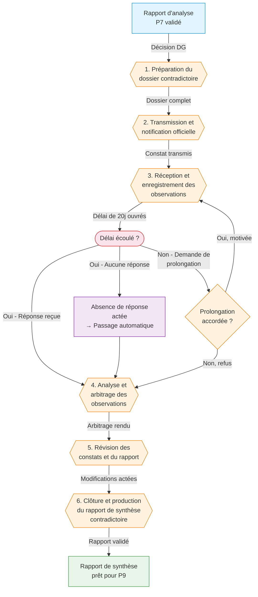

# ⚖️ Phase contradictoire — Échanges avec l'entité évaluée

> **Référence** : `CEV-P08`
> **Niveau** : 💎 Platine
> **Type** : Procédure contradictoire — Échanges et réponse
> **Version** : 1.0
> **Date de création** : 01/08/2026
> **Dernière mise à jour** : 01/08/2026
> **Validée par** : Directeur de l'évaluation

---

## 🃏 FLASH CARD — Résumé 30s

> **Objet** : Organiser et conduire la phase contradictoire avec l'entité évaluée — transmission des constats provisoires, recueil et analyse des observations, arbitrage des divergences, production du rapport de synthèse contradictoire — garantissant le droit de réponse et la robustesse juridique de l'évaluation.
> **Acteurs clés** : Évaluateur public · Directeur de l'évaluation · Entité évaluée (Direction métier) · Comité de pilotage · Contrôle juridique
> **Déclencheur** : Validation du rapport d'analyse des données (CEV-P07) et décision de transmission de l'évaluation provisoire à l'entité évaluée
> **Délai pivot** : 30 jours ouvrés entre la transmission des constats provisoires et la clôture de la phase contradictoire
> **Livrable principal** : Rapport de synthèse contradictoire incluant les constats finaux, les observations de l'entité, les arbitrages rendus et les modifications actées
> **Risque majeur** : Contestation globale de la méthodologie ou des constats par l'entité évaluée, bloquant la finalisation du rapport
> **Indicateur cible** : 100% des constats transmis ayant fait l'objet d'une réponse formalisée ; taux de levée de réserves ≥ 80%

---

## 📍 CRAIE — Localisation

| Axe | Valeur |
|-----|--------|
| **Contexte** | Après la collecte et l'analyse des données (P7), l'évaluateur dispose d'un rapport d'analyse validé avec des constats objectivés. La phase contradictoire constitue un droit fondamental de l'entité évaluée : elle reçoit les constats provisoires, peut les contester, apporter des éléments complémentaires et obtenir des révisions motivées. Cette phase garantit la loyauté, l'équité et la robustesse juridique de l'évaluation avant la publication du rapport final (P9). |
| **Référentiel** | DOX v6.0 · Charte de l'Évaluateur public CEV-001 · Rapport d'analyse CEV-P07 · Cadre juridique de l'évaluation · Principes du contradictoire (CEV-G04) · Guide de gestion des désaccords CEV-G05 |
| **Acteurs** | DG · Entité évaluée · Directeur évaluation · Évaluateur public · Comité pilotage · Contrôle juridique |
| **Intitulé** | CEV-P08 — Phase contradictoire : échanges avec l'entité évaluée |
| **Étapes** | 1. Préparation du dossier contradictoire → 2. Transmission et notification → 3. Réception et enregistrement des observations → 4. Analyse et arbitrage → 5. Révision des constats → 6. Clôture et rapport de synthèse |

### Chaîne de localisation

```
M3 › Restitution › P8 › Phase contradictoire › Évaluateur public
```

**Filière** : Évaluation / Juridique / Qualité

### Processus amont et aval

| Direction | Flux |
|-----------|------|
| **Amont** | P7 Collecte et analyse des données d'évaluation → rapport d'analyse validé | | |
| **Procédure** | **CEV-P08 — Phase contradictoire : échanges avec l'entité évaluée** |
| **Aval** | P9 Élaboration des conclusions et recommandations · P10 Publication du rapport final |

---

## 🔄 Logigramme Mermaid



### Légende

| Couleur | Signification |
|---------|---------------|
| 🔵 Bleu | Amont / Déclencheur |
| 🟠 Orange | Étapes de la procédure |
| 🔴 Rouge | Décision / Point de contrôle / Échéance |
| 🟣 Violet | Contingence / Traitement par défaut |
| 🟢 Vert | Aval / Sortie positive |

---

## 👥 RACI — Matrice des responsabilités

### Acteurs

| # | Rôle | Direction/Service | Rôle dans la procédure |
|---|------|-------------------|------------------------|
| 1 | 👤 Évaluateur public | Évaluateur public | Prépare le dossier contradictoire, analyse les observations, propose les arbitrages, rédige le rapport de synthèse |
| 2 | 🔰 Directeur de l'évaluation | Évaluateur public | Supervise la procédure, arbitre les divergences non résolues, valide le rapport de synthèse |
| 3 | 📋 Entité évaluée | Direction métier | Reçoit les constats, produit des observations écrites et des pièces contradictoires, participe aux réunions d'échange |
| 4 | 🏛️ Comité de pilotage | DG + directions concernées | Valide les arbitrages sensibles, suit le calendrier contradictoire |
| 5 | ⚖️ Contrôle juridique | Direction des affaires juridiques | Vérifie la conformité juridique de la procédure, assiste aux arbitrages complexes |
| 6 | 👑 Direction Générale | DG | Décide en dernier ressort en cas de blocage persistant, notifie la clôture contradictoire |

### Matrice RACI

| Phase / Activité | Évaluateur public | Directeur évaluation | Entité évaluée | Comité pilotage | Contrôle juridique | DG |
|-----------------|:---:|:---:|:---:|:---:|:---:|:---:|
| Préparation du dossier contradictoire | R | A | C | I | C | I |
| Transmission et notification | R | A | I | I | C | C |
| Réception et enregistrement des observations | R | A | C | I | I | I |
| Analyse et arbitrage des observations | R | A | C | C | C | A |
| Révision des constats | R | A | C | I | I | I |
| Clôture et rapport de synthèse | R | A | I | A | I | I |
| Arbitrage de dernier ressort (blocage) | C | C | C | C | A | R |

> **R** = Réalise · **A** = Approuve · **C** = Consulté · **I** = Informé

---

## 📝 Étapes détaillées

### Étape 1 : Préparation du dossier contradictoire

| Champ | Valeur |
|-------|--------|
| **Action** | Constituer le dossier contradictoire à partir du rapport d'analyse validé (P7). Extraire et formaliser les constats provisoires sous forme de fiches individuelles numérotées, chaque fiche comprenant : (1) le constat objectivé issu des données, (2) les sources et éléments de preuve associés, (3) la méthodologie ayant conduit au constat, (4) la portée du constat (général ou circonstancié), (5) les pistes de recommandation préliminaires associées. Vérifier la traçabilité complète de chaque constat vers sa source dans les données collectées. Établir une table de concordance constats/sources. Préparer la note de présentation de la phase contradictoire : rappel du cadre, calendrier, procédure de réponse, voies de recours. Identifier les constats susceptibles d'être contestés (sensibilité politique, impact organisationnel, divergence méthodologique) et les classer par niveau de risque (faible/moyen/critique). Préparer les templates de réponse (fiche d'observations CEV-F08a). Constituer le dossier complet avec : rapport d'analyse, fiches-constats, note de présentation, templates de réponse, bordereau de transmission. Vérifier la conformité du dossier avec les exigences juridiques et les délais réglementaires. |
| **Acteur** | Évaluateur public (réalise la constitution du dossier) · Directeur de l'évaluation (valide le contenu et la classification des risques) · Contrôle juridique (consultée sur la conformité de la procédure) · Entité évaluée (consultée sur la disponibilité des interlocuteurs) |
| **Délai** | 5 jours ouvrés à compter de la validation du rapport d'analyse P7 |
| **Livrable** | Dossier contradictoire complet · Fiches-constats provisoires numérotées (N fiches) · Table de concordance constats/sources · Note de présentation de la phase contradictoire · Cartographie des risques de contestation · Templates de réponse CEV-F08a |
| **Outil** | Template Fiche-constat CEV-F08b · Template Réponse contradictoire CEV-F08a · Tableur de suivi des constats · GED Évaluateur / Dossier contradictoire · Outil de gestion documentaire |
| **Condition de passage** | Dossier validé par le Directeur de l'évaluation ; conformité juridique vérifiée ; cartographie des risques approuvée ; calendrier contradictoire fixé |

### Étape 2 : Transmission et notification officielle

| Champ | Valeur |
|-------|--------|
| **Action** | Notifier officiellement l'ouverture de la phase contradictoire à l'entité évaluée par courrier signé du Directeur de l'évaluation (ou par tout moyen offrant date certaine : LRAR, plateforme dématérialisée avec accusé de réception). Transmettre le dossier contradictoire complet : rapport d'analyse, fiches-constats provisoires, note de présentation, templates de réponse CEV-F08a. Accompagner la transmission d'une lettre de notification précisant : (1) le fondement juridique de la phase contradictoire, (2) le délai imparti pour répondre (20 jours ouvrés par défaut), (3) les modalités de réponse (format, canal, interlocuteur référent), (4) les conditions de prolongation éventuelle, (5) les conséquences de l'absence de réponse (forclusion et passage en phase contradictoire clos), (6) la procédure de demande de réunion d'échange contradictoire. Organiser une réunion de lancement (kick-off contradictoire) avec l'entité évaluée dans les 48h suivant la notification, pour expliquer la procédure, répondre aux questions méthodologiques et clarifier les attentes. Consigner le compte rendu de la réunion de lancement. Mettre à jour le tableau de bord contradictoire avec la date de notification et le délai de réponse. |
| **Acteur** | Évaluateur public (prépare les documents de transmission) · Directeur de l'évaluation (signe la notification) · Entité évaluée (reçoit et accu-se réception) · Contrôle juridique (valide la forme de la notification) |
| **Délai** | 2 jours ouvrés après validation du dossier (Étape 1) |
| **Livrable** | Courrier de notification daté et signé · Accusé de réception (LRAR ou dématérialisé) · Dossier contradictoire transmis · Compte rendu de la réunion de lancement · Tableau de bord contradictoire mis à jour |
| **Outil** | Template Courrier de notification CEV-F08c · Plateforme de notification (i.demat, parapheur électronique) · LRAR · Outil de visioconférence · Template Compte rendu CEV-F08d |
| **Condition de passage** | Notification émise avec date certaine ; réunion de lancement tenue ou programmée ; accusé de réception obtenu ; délai de réponse officiellement ouvert |

### Étape 3 : Réception et enregistrement des observations

| Champ | Valeur |
|-------|--------|
| **Action** | Réceptionner les observations de l'entité évaluée dans le délai imparti (20 jours ouvrés, prolongeable de 10 jours ouvrés sur demande motivée acceptée par le Directeur de l'évaluation). Enregistrer chaque observation dans le système de suivi avec : (1) référence de la fiche-constat concernée, (2) nature de l'observation (correction factuelle, contestation méthodologique, élément complémentaire, désaccord d'interprétation, demande de suppression), (3) pièces justificatives fournies, (4) niveau de l'observation (ponctuelle / structurante / globale). Accuser réception de chaque observation dans les 48h. Classer les observations par catégorie : **A** (corrections factuelles — erreur matérielle, donnée erronée, omission), **B** (contestations méthodologiques — protocole, représentativité, biais), **C** (éléments complémentaires — données nouvelles, documents supplémentaires), **D** (divergences d'interprétation — lecture divergente des résultats), **E** (contestations globales — remise en cause du cadrage ou de la méthodologie d'ensemble). Pour les observations accompagnées de pièces justificatives, intégrer ces éléments dans la base documentaire contradictoire. Produire un état des lieux des observations reçues à J+15, J+20 et à la clôture du délai, avec synthèse quantitative et qualitative (taux de réponse par constat, typologie des observations, constats les plus contestés). Si aucune observation n'est reçue dans le délai, produire un constat d'absence de réponse et notifier l'entité de la clôture contradictoire par défaut. |
| **Acteur** | Évaluateur public (réceptionne, enregistre, classe) · Entité évaluée (produit et transmet les observations) · Directeur de l'évaluation (valide les prolongations de délai) |
| **Délai** | 20 jours ouvrés (délai standard de réponse) + 10 jours ouvrés (prolongation possible) + 2 jours ouvrés pour l'enregistrement complet |
| **Livrable** | Registre des observations contradictoires (classées A→E) · Pièces justificatives intégrées à la GED · Accusés de réception individuels · États des lieux intermédiaires (J+15, J+20, clôture) · Constat d'absence de réponse (si applicable) |
| **Outil** | Registre de suivi des observations CEV-R08a · Template Accusé de réception CEV-F08e · GED Évaluateur / Dossier contradictoire · Tableau de bord contradictoire (suivi des délais) · Outil de classification automatique (catégories A→E) |
| **Condition de passage** | Toutes les observations reçues enregistrées et classées ; ou délai expiré avec constat d'absence ; état des lieux final produit et validé |

### Étape 4 : Analyse et arbitrage des observations

| Champ | Valeur |
|-------|--------|
| **Action** | Analyser chaque observation contradictoire selon son niveau et sa catégorie. Appliquer le protocole d'arbitrage par catégorie : **Catégorie A** (corrections factuelles) — vérifier la pièce justificative, corriger le constat si l'erreur est avérée, sans arbitrage complémentaire nécessaire ; **Catégorie B** (contestations méthodologiques) — évaluer la validité de la contestation au regard du protocole défini dans la note de cadrage (P4), solliciter l'avis d'un expert méthodologique indépendant si nécessaire, produire une note d'arbitrage motivée ; **Catégorie C** (éléments complémentaires) — analyser les nouvelles données, évaluer leur impact sur le constat existant (confirmation, infirmation, nuance), intégrer si elles modifient significativement le constat ; **Catégorie D** (divergences d'interprétation) — organiser une réunion d'échange contradictoire dédiée avec l'entité évaluée, confronter les lectures, rechercher un consensus interprétatif, documenter les divergences résiduelles ; **Catégorie E** (contestations globales) — saisir le Comité de pilotage pour arbitrage collégial, impliquer le Contrôle juridique pour évaluer les implications, préparer une note de synthèse pour la DG si nécessaire. Pour chaque observation, produire une décision d'arbitrage formalisée : constat concerné, observation de l'entité, analyse de l'évaluateur, décision (acceptée/refusée/partiellement acceptée), motivation détaillée, impact sur le constat (inchangé/modifié/supprimé). Documenter les arbitrages rendus dans une fiche individuelle de réponse contradictoire. Identifier les constats modifiés à la suite de l'arbitrage pour révision (Étape 5). Organiser une réunion de restitution des arbitrages avec l'entité évaluée (sauf catégorie A traitée directement). |
| **Acteur** | Évaluateur public (analyse et propose les arbitrages) · Directeur de l'évaluation (valide les arbitrages, notamment B, D, E) · Contrôle juridique (consultée pour E et tout arbitrage à implications juridiques) · Comité de pilotage (arbitre les contestations globales E) · DG (arbitre en dernier ressort si blocage persistant) · Entité évaluée (particip e aux réunions d'échange) |
| **Délai** | 8 jours ouvrés à compter de la clôture des observations |
| **Livrable** | Fiches individuelles de réponse contradictoire (N fiches) · Note d'arbitrage pour chaque observation contestée · Comptes rendus des réunions d'échange contradictoire · Décision d'arbitrage formalisée par observation · Tableau récapitulatif des arbitrages (accepté/refusé/partiel) · Cartographie mise à jour des risques de contestation post-arbitrage |
| **Outil** | Template Fiche de réponse contradictoire CEV-F08f · Protocole d'échange contradictoire CEV-G05 · Tableur de suivi des arbitrages · Outil de visioconférence · GED Évaluateur / Dossier contradictoire |
| **Condition de passage** | 100% des observations arbitrées ; fiches de réponse produites et validées par le Directeur de l'évaluation ; décisions d'arbitrage notifiées à l'entité évaluée ; réunion de restitution tenue ou programmée |

### Étape 5 : Révision des constats et du rapport

| Champ | Valeur |
|-------|--------|
| **Action** | Réviser les constats provisoires sur la base des arbitrages rendus (Étape 4). Pour chaque constat modifié : (1) appliquer la correction décidée (texte révisé, donnée corrigée, méthodologie précisée), (2) mettre à jour la fiche-constat avec la version révisée et l'historique des modifications, (3) conserver la trace de la version initiale et des modifications (traçabilité contradictoire complète). Maintenir la chaîne de traçabilité : constat initial → observation entité → arbitrage → constat révisé → motivation du changement. Pour les constats non modifiés malgré une observation : produire une note de maintien motivée explicitant pourquoi l'observation n'a pas conduit à modification. Mettre à jour le rapport d'évaluation provisoire en intégrant l'ensemble des constats révisés, avec indication claire des passages modifiés (track changes, surlignage ou annotation) et le renvoi vers la fiche d'arbitrage correspondante. Produire une version « avant/après » du rapport pour les constats ayant fait l'objet de modifications substantielles. Vérifier la cohérence globale du rapport révisé : aucun constat modifié ne doit introduire de contradiction avec d'autres constats non modifiés. Réaliser une revue de cohérence transversale par le Directeur de l'évaluation. Préparer la note de synthèse des modifications. |
| **Acteur** | Évaluateur public (réalise les révisions) · Directeur de l'évaluation (revue de cohérence, validation des révisions) · Contrôle juridique (vérifie que les révisions respectent le cadre contradictoire) |
| **Délai** | 5 jours ouvrés après validation des arbitrages (Étape 4) |
| **Livrable** | Fiches-constats révisées (N fiches, version N+1 avec historique) · Rapport d'évaluation révisé (version contradictoire) · Tableau de correspondance avant/après · Note de maintien pour constats non modifiés · Rapport de revue de cohérence · Note de synthèse des modifications |
| **Outil** | Fonctionnalité de suivi des modifications (Word, Google Docs, LaTeX diff) · Template Fiche-constat révisée CEV-F08g · GED Évaluateur / Dossier contradictoire · Tableur de suivi des révisions · Outil de comparaison documentaire |
| **Condition de passage** | Rapport révisé validé par le Directeur de l'évaluation ; traçabilité contradictoire complète pour chaque constat ; revue de cohérence réalisée sans contradiction résiduelle ; version « avant/après » produite |

### Étape 6 : Clôture et production du rapport de synthèse contradictoire

| Champ | Valeur |
|-------|--------|
| **Action** | Produire le rapport de synthèse contradictoire (document final de la phase) structuré comme suit : (1) Rappel du cadre juridique et de la procédure contradictoire, (2) Synthèse quantitative des observations (N observations reçues sur N constats transmis, taux de réponse, répartition par catégorie A→E), (3) Tableau récapitulatif des arbitrages (constat concerné, observation, décision, impact), (4) Rapport d'évaluation révisé intégrant les modifications contradictoires, (5) Annexes : fiches-constats initiales, observations de l'entité, fiches d'arbitrage, fiches-constats révisées, comptes rendus des réunions d'échange. Faire valider le rapport de synthèse par le Directeur de l'évaluation. Présenter le rapport au Comité de pilotage pour information et validation des arbitrages sensibles. Notifier formellement la clôture de la phase contradictoire à l'entité évaluée par courrier signé, accompagné du rapport de synthèse. Archiver l'intégralité du dossier contradictoire dans la GED Évaluateur avec le rapport de synthèse comme pièce maîtresse. Transmettre le rapport de synthèse contradictoire à l'entité en charge de la phase suivante (P9 — Conclusions et recommandations). Mettre à jour le tableau de bord contradictoire avec la date de clôture et les indicateurs finaux. |
| **Acteur** | Évaluateur public (rédige le rapport de synthèse) · Directeur de l'évaluation (valide le rapport) · Comité de pilotage (valide les arbitrages sensibles) · Entité évaluée (reçoit la notification de clôture) |
| **Délai** | 5 jours ouvrés après validation des révisions (Étape 5) |
| **Livrable** | Rapport de synthèse contradictoire · Dossier contradictoire complet archivé (GED) · Courrier de clôture de la phase contradictoire · Tableau de bord contradictoire finalisé · Accusé de réception de la clôture par l'entité évaluée |
| **Outil** | Template Rapport de synthèse contradictoire CEV-F08h · GED Évaluateur / Archives contradictoires · Template Courrier de clôture CEV-F08i · Tableau de bord contradictoire · Outil de signature électronique |
| **Condition de passage** | Rapport de synthèse validé par le Directeur de l'évaluation et présenté au Comité de pilotage ; notification de clôture émise ; dossier contradictoire complètement archivé ; indicateurs de clôture renseignés |

### Boucle de gestion des désaccords persistants

| Champ | Valeur |
|-------|--------|
| **Action** | En cas d'échec de l'arbitrage à l'Étape 4 (désaccord persistant entre l'Évaluateur public et l'Entité évaluée sur un constat ou un arbitrage) : (1) Documenter précisément la nature du désaccord résiduel, les positions respectives et les tentatives de conciliation déjà menées, (2) Transmettre le dossier au Comité de pilotage pour arbitrage collégial dans un délai de 5 jours ouvrés, (3) Le Comité de pilotage examine les éléments objectifs et rend un arbitrage motivé, (4) Si le désaccord persiste après l'arbitrage du Comité de pilotage, saisir la Direction Générale pour décision en dernier ressort (10 jours ouvrés max), (5) La DG notifie sa décision finale, qui est sans appel et clôt le contradictoire sur le point litigieux. Dans tous les cas, le désaccord et son traitement sont documentés dans le rapport de synthèse contradictoire avec les positions de chaque partie et la décision finale motivée. Le rapport de synthèse mentionne explicitement les points de désaccord résiduels et leur traitement. |
| **Acteur** | Évaluateur public (documente et prépare la saisine) · Directeur de l'évaluation (saisit le Comité de pilotage) · Comité de pilotage (arbitre collégialement) · DG (décide en dernier ressort) · Entité évaluée (expose sa position) · Contrôle juridique (assiste et vérifie la régularité) |
| **Délai** | 5 jours ouvrés (saisine Comité pilotage) + 5 jours ouvrés (arbitrage collégial) + 10 jours ouvrés (décision DG si nécessaire) |
| **Livrable** | Saisine motivée du Comité de pilotage · Décision d'arbitrage collégial (ou décision DG dernier ressort) · Note complémentaire au rapport de synthèse · Mise à jour de la fiche-constat concernée |
| **Condition de sortie** | Désaccord résorbé par arbitrage ; ou décision de dernier ressort rendue et actée ; traçabilité complète du processus d'escalade |

---

## ⚠️ Risques identifiés

| # | Code | Risque | Description | Impact | Probabilité |
|---|------|--------|-------------|--------|:-----------:|
| 1 | R1 | Contestation globale de l'évaluation | L'entité évaluée conteste la légitimité, le cadrage ou la méthodologie de l'évaluation dans son ensemble, remettant en cause la validité de toute la procédure | Critique | 2/5 |
| 2 | R2 | Blocage sur des constats sensibles | Désaccord persistant sur des constats à fort enjeu politique, stratégique ou budgétaire, sans consensus possible à l'étape d'arbitrage | Majeur | 3/5 |
| 3 | R3 | Absence ou insuffisance de réponse de l'entité | L'entité évaluée ne répond pas dans les délais ou produit des observations lacunaires, compromettant la qualité du contradictoire | Moyen | 3/5 |
| 4 | R4 | Dérive calendaire de la phase contradictoire | Prolongations, réunions multiples et escalades non maîtrisées allongeant la phase au-delà du délai pivot de 30 jours | Majeur | 3/5 |
| 5 | R5 | Pression sur l'évaluateur ou tentative d'influence | L'entité évaluée exerce des pressions directes ou indirectes (hiérarchiques, politiques) pour obtenir la modification de constats défavorables | Critique | 2/5 |
| 6 | R6 | Contestation juridique de la procédure contradictoire | Vice de forme, non-respect du délai, défaut de motivation des arbitrages, exposant l'évaluation à un recours contentieux | Critique | 2/5 |
| 7 | R7 | Rupture de confidentialité | Diffusion prématurée ou non autorisée des constats provisoires ou des observations de l'entité évaluée | Majeur | 2/5 |

### Criticité

| Risque | Niveau | Action requise |
|--------|--------|----------------|
| R1 | Critique (10) | Cadrage juridique solide en amont (P4) ; lettre de mission DG ; procédure d'escalade vers Comité pilotage et DG |
| R2 | Élevée (8) | Cartographie des risques de contestation réalisée en Étape 1 ; réunions d'échange dédiées (catégorie D) ; escalade progressive documentée |
| R3 | Moyenne (6) | Relances programmées (J+10, J+15, J+18) ; réunion de lancement pour expliciter les enjeux ; constat d'absence de réponse motivé |
| R4 | Moyenne (6) | Marges de sécurité (J+25%) dans le planning ; points d'étape hebdomadaires ; tableau de bord des délais ; seuil d'alerte à J+25 |
| R5 | Critique (10) | Déclaration d'indépendance de l'évaluateur ; confidentialité des échanges ; traçabilité complète ; saisine DG si pression avérée |
| R6 | Critique (10) | Contrôle juridique associé dès l'Étape 1 ; templates standardisés ; délais impératifs ; documentation systématique des décisions |
| R7 | Élevée (8) | Accès restreint au dossier contradictoire ; signatures de confidentialité ; circuit de transmission sécurisé ; classification des documents |

> **Échelle** : Impact (1-5) × Probabilité (1-5) → **Criticité** : Faible (1-4) · Moyenne (5-9) · Élevée (10-16) · Critique (17-25)

---

## 📄 Documents de référence

Documents support et d'enregistrement associés à la procédure :

### Documents support

| Type | Document | Référence | Emplacement |
|------|----------|-----------|-------------|
| Support | Template Fiche d'observations contradictoires | CEV-F08a | BDD 1 Procédures / Outils |
| Support | Template Fiche-constat provisoire | CEV-F08b | BDD 1 Procédures / Outils |
| Support | Template Courrier de notification contradictoire | CEV-F08c | BDD 1 Procédures / Outils |
| Support | Template Compte rendu de réunion contradictoire | CEV-F08d | BDD 1 Procédures / Outils |
| Support | Template Accusé de réception d'observations | CEV-F08e | BDD 1 Procédures / Outils |
| Support | Template Fiche de réponse contradictoire (arbitrage) | CEV-F08f | BDD 1 Procédures / Outils |
| Support | Template Fiche-constat révisée (version N+1) | CEV-F08g | BDD 1 Procédures / Outils |
| Support | Template Rapport de synthèse contradictoire | CEV-F08h | BDD 1 Procédures / Outils |
| Support | Template Courrier de clôture contradictoire | CEV-F08i | BDD 1 Procédures / Outils |
| Support | Procédure de gestion des désaccords | CEV-G05 | BDD 1 Procédures / Guides |
| Support | Guide des principes du contradictoire | CEV-G04 | BDD 1 Procédures / Guides |
| Support | Charte de l'Évaluateur public | CEV-001 | BDD 1 Procédures / Chartes |
| Support | Rapport d'analyse des données d'évaluation | CEV-P07 | BDD 1 Procédures / Procédures |
| Support | DOX v6.0 — Doctrine PROC | DOX Core | BDD 1 Procédures / Référentiels |
| Support | Cadre juridique de l'évaluation publique | CEV-G06 | BDD 1 Procédures / Guides |

### Documents d'enregistrement

| Type | Document | Référence | Emplacement |
|------|----------|-----------|-------------|
| Enregistrement | Rapport de synthèse contradictoire (chaque évaluation) | N/A | GED Évaluateur / Contradictoires |
| Enregistrement | Dossier contradictoire complet (archivé) | N/A | GED Évaluateur / Archives contradictoires |
| Enregistrement | Registre des observations contradictoires | CEV-R08a | BDD 1 Procédures / Registres |
| Enregistrement | Tableau de bord contradictoire (suivi des délais) | CEV-R08b | BDD 1 Procédures / Registres |
| Enregistrement | Fiches d'arbitrage signées (par constat) | N/A | GED Évaluateur / Contradictoires / Arbitrages |
| Enregistrement | Comptes rendus des réunions d'échange contradictoire | N/A | GED Évaluateur / Contradictoires / Réunions |
| Enregistrement | Correspondances contradictoires (courriers, accusés) | N/A | GED Évaluateur / Contradictoires / Courriers |

---

## 📋 Informations générales

| Champ | Valeur |
|-------|--------|
| **Périmètre** | Toute évaluation conduite par l'Évaluateur public ayant atteint la phase contradictoire (rapport d'analyse P7 validé et transmis) |
| **Directions concernées** | Entité évaluée · DG · Comité de pilotage · Direction des affaires juridiques |
| **Services concernés** | Évaluateur public · Contrôle juridique · Secrétariat du comité de pilotage · Services archivage/GED |
| **Date d'effet** | 01/08/2026 |
| **Validité** | Jusqu'à prochaine revue |
| **Révision** | Version 1.0 |

---

## 📊 Tableau de bord — Indicateurs de performance

| Indicateur | Cible | Mesure | Fréquence | Seuil d'alerte |
|------------|:----:|--------|-----------|:--------------:|
| Taux de réponse aux constats transmis | 100% | Constats ayant reçu une observation / Constats transmis | Par contradictoire | < 90% |
| Taux de levée de réserves | ≥ 80% | Observations acceptées (A+B) / Total observations | Par contradictoire | < 60% |
| Délai total de la phase contradictoire | ≤ 30 jours ouvrés | Date clôture - Date notification | Par contradictoire | > 40 jours |
| Délai moyen de traitement par observation | ≤ 3 jours ouvrés | Somme délais traitement / Nb observations | Par contradictoire | > 5 jours |
| Taux de contestations globales (Catégorie E) | ≤ 5% | Observations E / Total observations | Par contradictoire | > 10% |
| Taux de modification des constats après contradictoire | 15-40% | Constats modifiés / Total constats | Par contradictoire | > 50% ou < 5% |
| Satisfaction de l'entité évaluée sur la procédure | ≥ 3,5/5 | Enquête de satisfaction post-contradictoire | Par évaluation | < 2,5/5 |
| Taux de recours contentieux post-contradictoire | 0% | Recours / Évaluations clôturées | Annuelle | > 0% |

---

## 🔗 Références normatives

| Texte | Référence |
|-------|-----------|
| Charte de l'Évaluateur public — CEV-001 | Niveau Argent, 01/08/2026 |
| DOX v6.0 — Doctrine PROC | DOX Core |
| Procédure P7 — Collecte et analyse des données d'évaluation | CEV-P07, Niveau Or, 01/08/2026 |
| Procédure P9 — Élaboration des conclusions et recommandations | CEV-P09 |
| Guide des principes du contradictoire — CEV-G04 | BDD 1 Procédures / Guides |
| Procédure de gestion des désaccords — CEV-G05 | BDD 1 Procédures / Guides |
| Cadre juridique de l'évaluation publique — CEV-G06 | BDD 1 Procédures / Guides |
| Code des relations entre le public et l'administration (CRPA) | Articles L.121-1 et suivants |
| Charte de la déontologie de l'évaluation (SFE) | Société Française de l'Évaluation |

---

## ✅ Checklist PLATINE — Phase contradictoire

- [x] FLASH CARD complète (objet, acteurs, délai pivot, livrable, risque majeur, indicateur cible)
- [x] Localisation CRAIE avec chaîne M3 › P8 et amont/aval détaillés
- [x] Logigramme Mermaid (6 étapes + boucle de gestion des désaccords, nœud de décision temporelle, prolongation, escalade)
- [x] RACI complet (6 acteurs, 7 phases couvertes) avec DG en arbitre dernier ressort
- [x] Étapes détaillées (6 étapes + boucle désaccords, chaque étape : action détaillée, acteurs, délai, livrable, outil, condition de passage)
- [x] Catégorisation des observations contradictoires (A→E) avec protocole d'arbitrage différencié
- [x] Boucle de gestion des désaccords persistants avec escalade progressive (Comité pilotage → DG)
- [x] Risques (7 risques avec code R1→R7, catégorisation Critique/Élevé/Moyen, actions spécifiques)
- [x] Documents de référence (15 support + 7 enregistrement)
- [x] Tableau de bord (8 indicateurs avec cible, mesure, fréquence, seuil d'alerte)
- [x] Traçabilité contradictoire complète (constat initial → observation → arbitrage → constat révisé)
- [x] Niveau PLATINE : procédure transversale avec volets juridique et déontologique intégrés

### Critères QG Niveau PLATINE

| Gate | Critère | Statut | Poids |
|:----:|---------|:------:|:-----:|
| G1 | Titre et référence conformes | ✅ | 3 |
| G2 | FLASH CARD complète (objet, acteurs, délais, risques, indicateur) | ✅ | 5 |
| G3 | Localisation CRAIE explicite (Mission › Processus) | ✅ | 4 |
| G4 | Logigramme Mermaid (≥ 3 nœuds, amont→aval, nœud décisionnel) | ✅ | 5 |
| G5 | RACI complet (≥ 5 acteurs, ≥ 4 phases, R/A/C/I) | ✅ | 4 |
| G6 | Étapes détaillées (action, acteur, délai, livrable par étape) | ✅ | 5 |
| G7 | Risques (≥ 5 documentés avec code, impact, probabilité, criticité) | ✅ | 5 |
| G7B | Documents support + enregistrement listés (≥ 10 support, ≥ 5 enregistrement) | ✅ | 3 |
| G8 | Catégorisation des observations contradictoires | ✅ | 5 |
| G9 | Boucle de gestion des désaccords persistants avec escalade | ✅ | 5 |
| G10 | Traçabilité contradictoire complète documentée | ✅ | 4 |
| G11 | Volet juridique et déontologique intégré | ✅ | 3 |
| G21 | Score total ≥ 85% requis pour le Niveau PLATINE | ✅ | 5 |
| | **Score QG total** | **56/56** (100%) | **56** |

---

> **Généré par Hermes Agent — PROC v1.0**
> **DOX v6.0 — Niveau Platine**
> **Prochaine évolution suggérée** : Passage à P9 — Élaboration des conclusions et recommandations
> **Mission** : M3 Restitution · **Processus** : P8 Phase contradictoire
