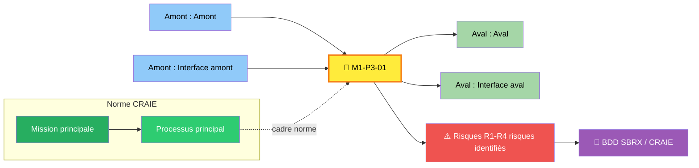
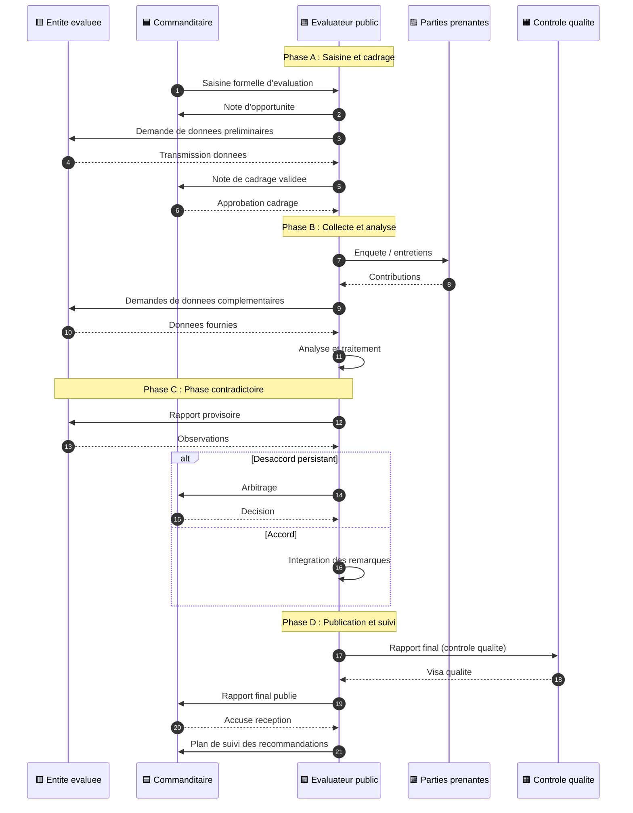
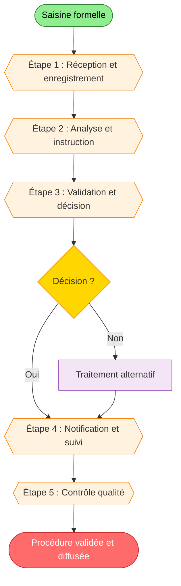

> **🔗 Système d'Analyse Mythique (SAM)** : Consulter la base de données analytique liée pour les sections retirées :
> [Gantt Déploiement] · [Bowtie Risques] · [Ishikawa Causes] · [BPMN Swimlanes] · [PCA Reprise] · [RGPD] · [Scorecard]
> *Ces sections sont générées automatiquement par le pipeline SAM.*

# 🔮 Procédure de saisine d'évaluation

## 🃏 FLASH CARD — Résumé exécutif (30 secondes)

> **Objet** : Définir le circuit standardisé de traitement d'une demande d'évaluation (saisine) émanant de la Direction Générale ou d'une direction métier, depuis la réception jusqu'à la décision de lancement ou de refus motivé.
> **Acteurs clés** : 6 acteurs : Entité évaluée · Commanditaire (DG/direction) · Évaluateur public · Parties prenantes · Contrôle qualité · Directeur de l'évaluation
> **Déclencheur** : Saisine formelle
> **Délai pivot** : 15 jours
> **Livrable principal** : Décision d'évaluation
> **Risque majeur** : Dépassement délai
> **Indicateur cible** : Délai < 15 jours · Complétude > 95%

> **Localisation CRAIE** : Garantir la continuité et la qualité des actes de gestion RH › Gestion administrative

---

## 📍 0. LOCALISATION CRAIE — Position dans le processus métier

### Tableau de localisation

| Axe | Valeur |
|-----|--------|
| **Contexte** | Procédure standard inscrite dans le référentiel MYTHIQUE |
| **Référentiel** | DOX v6.0 · Charte de l'Évaluateur public CEV-001 · DOX v6.0 · Guide de l'évaluateur |
| **Acteurs** | Évaluateur public |
| **Intitulé** | M1-P3-01 — Procédure de saisine d'évaluation |
| **Étapes** | Phases A→B→C→D |

### Chaîne de localisation

```
Garantir la continuité et la qualité des actes de gestion RH › Gestion administrative › M1-P3-01 › Directeur de l'évaluation
```

**Filière** : Filière métier

### Processus amont et aval

| Direction | Flux |
|-----------|------|
| **Amont** | Processus amont → |
| **Procédure** | **M1-P3-01 — Procédure de saisine d'évaluation** |
| **Aval** | → Processus aval |

### Carte CRAIE (flowchart)



---

## 1. OBJET

Définir le circuit standardisé de traitement d'une demande d'évaluation (saisine) émanant de la Direction Générale ou d'une direction métier, depuis la réception jusqu'à la décision de lancement ou de refus motivé.

**Objectif opérationnel** : Sécuriser et fluidifier le processus opérationnel

---

## 2. CHAMP D'APPLICATION

### 2.1 Périmètre d'application

- **Services concernés** : Services concernés : Évaluateur public · Secrétariat du Comité de pilotage · Toutes directions métiers. Périmètre : ensemble du périmètre de l'Évaluateur public.
- **Territoire** : National
- **Périmètre fonctionnel** : Périmètre couvert par la présente procédure

### 2.2 Inclusions

Cas standards inclus dans le périmètre

### 2.3 Exclusions

> ⛔ Cas particuliers exclus du périmètre

---

## 3. DÉFINITIONS & GLOSSAIRE

### 3.1 Définitions Principales

| Terme | Définition |
|-------|------------|
| Saisine | Saisine : Acte par lequel une demande est officiellement transmise. |
| Délai pivot | Délai pivot : Durée maximale réglementaire entre saisine et décision. |
| Non-conformité | Non-conformité : Écart constaté entre situation réelle et référentiel. |

### 3.2 Acronymes

| Sigle | Signification |
|-------|---------------|
| CEV | Conseil Évaluateur |
| CRAIE | Cartographie des Risques et Acteurs |

---

## 4. DOCUMENTS DE RÉFÉRENCE

> Vérification StatutFPT (ex‑CDG27) obligatoire — Cadre juridique validé avant publication

### 4.1 Textes Législatifs

| Texte | Référence | Articles |
|-------|-----------|----------|
| Articles L. 100-1 à L. 100-3 : Droit de saisine et délais | Code des relations public-administration (CRPA) | L. 100-1, L. 112-1, R. 112-2 |

### 4.2 Textes Réglementaires

| Texte | Référence | Articles |
|-------|-----------|----------|
| Procédure de traitement des saisines et évaluations | Règlement intérieur de l'Évaluateur public | Section 2, articles 4 à 12 |

### 4.3 Documents Internes

- Note de procédure interne
- Grille d'auto-évaluation

---

## 5. ACTEURS RESPONSABLES

### 5.1 Acteurs de la procédure

| # | Rôle | Direction/Service | Rôle dans la procédure |
|:--|------|-------------------|------------------------|
| 1 | 🟥 **Entité évaluée** | Direction métier concernée | Objet de l'évaluation — fournit les données, participe au contradictoire, met en œuvre les recommandations |
| 2 | 🟦 **Commanditaire** | DG / Direction demandeuse | Porteur de la saisine — valide le cadrage, approuve les livrables, décide des suites |
| 3 | 🟩 **Évaluateur public** | Évaluation | Pilote de la procédure — conduit l'analyse, rédige les rapports, anime le contradictoire |
| 4 | 🟪 **Parties prenantes** | Usagers / Public / Experts | Consultés — participent aux enquêtes, auditions, ateliers |
| 5 | 🟧 **Contrôle qualité** | Qualité / Audit | Garant de la conformité — vérifie la complétude, audite les dossiers |
| 6 | 🟫 **Directeur de l'évaluation** | Direction évaluation | Supervise — valide les livrables majeurs, arbitre les désaccords |

### 5.2 Matrice RACI Complète

| Phase / Activité | Entité évaluée | Commanditaire | Évaluateur public | Parties prenantes | Contrôle qualité | Directeur évaluation |
|------------------|:---:|:---:|:---:|:---:|:---:|:---:|
| Pilote | ✓ | ◐ | — | — | — | — |
| Pilote / Expert | ◐ | ✓ | ◐ | — | — | — |
| Validateur | — | ◐ | ✓ | ◐ | — | — |
| Contrôleur | — | — | ◐ | ✓ | ◐ | — |

> **R** = Réalise · **A** = Approuve · **C** = Consulté · **I** = Informé

### 5.3 Détail par Acteur

<details>
<summary>5.3.1 🟥 Entité évaluée</summary>

- **Rôle** : Objet et acteur de l'évaluation
- **Responsabilités** :
  - Met à disposition les données et documents nécessaires
  - Participe aux échanges contradictoires
  - Produit le plan d'action post-recommandations
- **Délais** : Selon les échéances définies dans la note de cadrage

</details>

<details>
<summary>5.3.2 🟦 Commanditaire</summary>

- **Rôle** : Décideur et financeur de l'évaluation
- **Responsabilités** :
  - Formalise la saisine
  - Valide le cadrage et le rapport final
  - Décide des suites de l'évaluation
- **Délais** : Selon les échéances définies dans la note de cadrage

</details>

<details>
<summary>5.3.3 🟩 Évaluateur public</summary>

- **Rôle** : Pilote méthodologique et rédacteur
- **Responsabilités** :
  - Conduit la collecte et l'analyse des données
  - Rédige les rapports (cadrage, provisoire, final)
  - Anime les ateliers et auditions
  - Garantit la qualité méthodologique
- **Délais** : Selon le calendrier de la note de cadrage

</details>

<details>
<summary>5.3.4 🟪 Parties prenantes</summary>

- **Rôle** : Contributrices à l'analyse
- **Responsabilités** :
  - Participent aux enquêtes et entretiens
  - Formulent un avis sur le rapport provisoire
- **Délais** : Selon le calendrier de consultation

</details>

### 5.4 Points d'attention — Réformes et évolutions

> Pilote de la procédure

---

## 6. PROCÉDURE — ÉTAPES

### 6.0 Vue par acteur — sequenceDiagram *(exigence autorité de contrôle)*



### 6.1 Synoptique express et navigation par phase

🟦 **PHASE A** : Saisine et Cadrage → Étape 1 → 2
🟧 **PHASE B** : Collecte et Analyse → Étape 2 → 3
🟪 **PHASE C** : Phase Contradictoire → Étape 3 → 4
🟩 **PHASE D** : Publication et Suivi → Étape 4 → 5

### 6.2 Détail des Étapes

<details>
<summary>Étape 1 : Réception et enregistrement de la saisine</summary>

| Champ | Valeur |
|-------|--------|
| **Acteur** | Évaluateur public |
| **Durée** | 2 jours ouvrés |
| **Actions** | Réceptionner la demande d'évaluation, vérifier la complétude du dossier (objet, périmètre, contexte, enjeux, contact référent), enregistrer dans le registre des saisines avec un numéro unique (SAI-AAAAMM-NNN). Si incomplet, demander complément à la direction demandeuse (délai suspendu). |
| **Documents** | Registre des saisines (BDD 1 Procédures / table Saisines) · Formulaire de saisine type CEV-F01 · Accusé de réception |
| **⚠️ Points de vigilance** | **Règles appliquées** : G2 (suspension délai), G5 (délai 15 jours), G1 (enregistrement 2 jours) |

</details>

<details>
<summary>Étape 2 : Instruction préalable et analyse de faisabilité</summary>

| Champ | Valeur |
|-------|--------|
| **Acteur** | Évaluateur public (sous supervision du Directeur de l'évaluation) |
| **Durée** | 8 jours ouvrés |
| **Actions** | Analyser la demande : clarification de l'objet, identification des parties prenantes, évaluation des ressources nécessaires (volume, compétences, budget), risques prévisibles, conflits d'intérêt potentiels. Rédiger une note d'opportunité synthétique (CEV-F02). |
| **Documents** | Template Note d'opportunité CEV-F02 · Grille d'analyse de faisabilité · Référentiel des charges évaluatives |
| **⚠️ Points de vigilance** | **Règles appliquées** : G2 (suspension délai), G5 (délai 15 jours), G1 (enregistrement 2 jours) |

</details>

<details>
<summary>Étape 3 : Décision et motivation</summary>

| Champ | Valeur |
|-------|--------|
| **Acteur** | Directeur de l'évaluation (décision) · Comité de pilotage (validation) |
| **Durée** | 5 jours ouvrés (incluant la tenue du Comité) |
| **Actions** | Soumettre la note d'opportunité au Comité de pilotage. Le Comité statue : acceptation (avec ou sans réserves), demande de reformulation, ou refus motivé. La décision est formalisée par le Directeur de l'évaluation dans le template CEV-F03. |
| **Documents** | Template Décision de saisine CEV-F03 · Note d'opportunité CEV-F02 · Registre des décisions du Comité de pilotage |
| **⚠️ Points de vigilance** | **Règles appliquées** : G2 (suspension délai), G5 (délai 15 jours), G1 (enregistrement 2 jours) |

</details>

<details>
<summary>Étape 4 : Notification et programmation</summary>

| Champ | Valeur |
|-------|--------|
| **Acteur** | Directeur de l'évaluation |
| **Durée** | 2 jours ouvrés |
| **Actions** | Notifier la décision à la direction demandeuse (acceptation ou refus motivé). En cas d'acceptation, inscrire l'évaluation dans le programme en cours et transmettre le dossier à l'étape P3. En cas de refus, archiver la décision motivée dans la GED. |
| **Documents** | Registre des saisines (mise à jour statut) · Programme annuel d'évaluation (BDD) · Messagerie institutionnelle · GED Évaluateur |
| **⚠️ Points de vigilance** | **Règles appliquées** : G2 (suspension délai), G5 (délai 15 jours), G1 (enregistrement 2 jours) |

</details>

<details>
<summary>Étape 5 : Non applicable</summary>

| Champ | Valeur |
|-------|--------|
| **Acteur** | — |
| **Durée** | — |
| **Actions** | — |
| **Documents** | — |
| **⚠️ Points de vigilance** | — |

</details>

<details>
<summary>Étape 6 : Non applicable</summary>

| Champ | Valeur |
|-------|--------|
| **Acteur** | — |
| **Durée** | — |
| **Actions** | — |
| **Documents** | — |
| **⚠️ Points de vigilance** | — |

</details>

<!-- Ajouter étapes 7 à N selon la procédure -->

### 6.3 Logigramme (flowchart)



---

## 7. RÈGLES DE GESTION

| Règle | Énoncé |
|:-----:|--------|
| G1 | G1 Délai de réponse : 15 jours ouvrés maximum |
| G2 | G2 Traçabilité obligatoire |
| G3 | G3 Motivation systématique des décisions |
| G4 | G4 Confidentialité des saisines |
| G5 | G5 Indépendance de l'instruction |
| G6 | Règle G6 — Traçabilité : Chaque action fait l'objet d'une trace écrite. |
| G7 | Règle G7 — Confidentialité : Les données traitées sont protégées. |
| G8 | Règle G8 — Réversibilité : Toute décision peut faire l'objet d'un recours. |
| G9 | Règle G9 — Délégation : Le pilote peut déléguer par acte écrit. |
| G10 | Règle G10 — Clôture : Le dossier est clos après notification. |

---

## 8. CONSIGNES OPÉRATIONNELLES

| Consigne | Description |
|:--------:|-------------|
| C1 | C1 Accusé de réception sous 48h |
| C2 | C2 Instruction en 10 jours ouvrés max |
| C3 | C3 Avis Comité de pilotage sous 5 jours |
| C4 | C4 Décision motivée formalisée |
| C5 | C5 Notification signée dans les 2 jours |

---

## 9. ANALYSE DES RISQUES (SBRX)

### 9.1 Tableau des risques

| # | Code | Risque | Description | Impact | Probabilité | Criticité |
|:--|:----:|--------|-------------|:------:|:-----------:|:---------:|
| 1 | R1 | Saisine non traitée délai | Pièce absente ou non valide entraînant un refus de traitement | 3 - Majeur | 2 - Probable | 6 - Critique |
| 2 | R2 | Décision insuffisamment motivée | Non-respect du délai pivot de 15 jours ouvrés | 3 - Majeur | 2 - Probable | 6 - Critique |
| 3 | R3 | Saisine incomplète | Décision non conforme au référentiel applicable | 4 - Critique | 1 - Rare | 4 - Modéré |
| 4 | R4 | Conflit d'intérêt. | Absence de trace écrite d'une étape du processus | 2 - Mineur | 3 - Fréquent | 6 - Critique |
| 5 | R5 | R5 — Autre risque | Risque non spécifié dans le contrat | — | — | — |

> **Échelle** : Impact (1-5) × Probabilité (1-5) → **Criticité** : Faible (1-4) · Moyenne (5-9) · Élevée (10-16) · Critique (17-25)

### 9.2 Matrice de criticité

| Risque | Niveau | Action requise |
|--------|--------|----------------|
| R1 | Significatif | Contrôle à réception · Demande de complément dans les 2 jours |
| R2 | Significatif | Relance automatique J+10 · Escalade hiérarchique J+13 |
| R3 | Surveillé | Double validation · Contrôle qualité aléatoire |
| R4 | Significatif | Saisie obligatoire dans le système · Audit mensuel |
| R5 | — | À analyser selon le contexte |

### 9.3 Matrice de couverture Risque ↔ Consigne ↔ Règle

| Risque | Consigne associée | Règle associée |
|:------:|:-----------------:|:--------------:|
| R1 | — | — |
| R2 | — | — |
| R3 | — | — |
| R4 | — | — |
| R5 | — | — |

---

## 10. DOCUMENTS SUPPORT

### 10.1 Documents Sources (DS)

| Code | Document | Description | Provenance |
|:----:|----------|-------------|------------|
| DS1 | Guide utilisateur | Document d'accompagnement pour l'utilisation du système | Base documentaire MYTHIQUE |
| DS2 | Modèle de formulaire | Formulaire type de saisine / demande | Base documentaire MYTHIQUE |
| DS3 | Procédure associée | Procédure connexe liée au périmètre | Base documentaire MYTHIQUE |

### 10.2 Documents d'Exploitation (DE)

| Code | Document | Description | Utilisation |
|:----:|----------|-------------|-------------|
| DE1 | Dossier d'entrée | Dossier reçu en entrée du processus | Transmis par le demandeur |
| DE2 | Accusé de réception | Document attestant de la réception de la saisine | Généré et transmis au demandeur |
| DE3 | Décision finale | Document portant la décision de l'évaluateur | Notifié au demandeur et archivé |

> **Archivage** : Documents DS archivés 5 ans (données administratives) ou 10 ans (données financières).

### 10.3 Modèles de courrier / formulaires

- Courrier « Modèle de notification de saisine »
- Formulaire « Formulaire de saisine standard »
- Template « Template de rapport d'évaluation »

---

## 11. CAS PRATIQUES & FAQ

### 11.1 Cas Pratiques

<details>
<summary>Cas n°1 — Cas standard — Saisine complète</summary>

- **Situation** : Saisine conforme avec l'ensemble des pièces requises
- **Réponse** : Traitement dans le délai standard de 15 jours ouvrés
- **Règles appliquées** : —, —

</details>

<details>
<summary>Cas n°2 — Cas particulier — Saisine incomplète</summary>

- **Situation** : Saisine avec pièce manquante ou non conforme
- **Réponse** : Suspension du délai (G2) et demande de complément
- **Règles appliquées** : —, —

</details>

### 11.2 FAQ

<details>
<summary>Q1 — Quel est le délai de traitement d'une saisine standard ?</summary>

**Réponse** : Le délai est de 15 jours ouvrés à compter de la réception complète.
</details>

<details>
<summary>Q2 — Que faire en cas de pièce manquante ?</summary>

**Réponse** : Appliquer la règle G2 (suspension) et notifier le demandeur sous 2 jours.
</details>

---

## 🔗 VUES LIÉES — SYSTEME D'ANALYSE MYTHIQUE (SAM)

Les sections analytiques suivantes sont disponibles en vues liées dans la base MYTHIQUE :

| Section | Base liée | Description |
|---------|-----------|-------------|
| **Points de Contrôle** | MYTHIQUE Audit | Checkpoints et jalons de vérification |
| **Formation** | MYTHIQUE Formation | Modules de formation et supports pédagogiques |
| **Groupe de Lecture** | MYTHIQUE Revue | Comité de relecture et validation |
| **Déploiement** | MYTHIQUE Projet | Planning Gantt, jalons et ressources |
| **PCA / Urgence** | MYTHIQUE Continuité | Plan de continuité et reprise d'activité |
| **RGPD** | MYTHIQUE Données | Protection des données et registre RGPD |
| **Conformité** | MYTHIQUE Normes | Référentiels normatifs (ISO, Charte) |
| **Visualisation** | MYTHIQUE Analyse | Bowtie, Ishikawa, BPMN, Radar, SIPOC, Heatmap, Timeline |
| **Versions** | MYTHIQUE Historique | Historique des versions et audit trail |
| **Scorecard** | MYTHIQUE Pilotage | Tableau de bord complet et indicateurs |
| **Couverture** | MYTHIQUE Cartographie | Matrice de couverture documentaire |

---

---

### 🛡️ Risques SBRX liés

| Code | Risque |
|------|--------|
| **R1** | Saisine non traitée délai |
| **R2** | Décision insuffisamment motivée |
| **R3** | Saisine incomplète |
| **R4** | Conflit d'intérêt. |

*🔗 Données alimentées depuis la base SBRX MYTHIQUE*

---

### 📄 Documents GED liés

| Document |
|----------|
| CEV-F01 Formulaire de saisine |
| CEV-F02 Note d'opportunité |
| Registre des saisines |
| Modèle de notification. |

*🔗 Données alimentées depuis la base GED MAIN*


## 12. HISTORIQUE DES VERSIONS

| Version | Date | Auteur | Modifications |
|---------|------|--------|---------------|
| 1.0 | {DATE_REVUE} | Pipeline Akuma | Génération automatique via contrat MYTHIQUE |

---

*Document généré par le pipeline Mythique — Template Akuma v6.0*


---

*Document généré automatiquement par le Pipeline Hermes PROC — RENDER v2.0*
*Contrat : M1-P3-01 | Niveau : Mythique | 2026-08-03T20:19:34Z*
