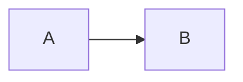

# Convertisseur Markdown → Notion Blocks (Référence technique)

## Vue d'ensemble

Le convertisseur dans `sync_notion.py`, fonction `_markdown_to_notion_blocks()`, transforme un fichier `.md` complet en une liste de blocs Notion (pour `PATCH /v1/blocks/{id}/children`). Supporte les callouts, toggles, blocs de code, listes, et le formatage inline complet.

## Architecture

```
_markdown_to_notion_blocks(md_content)
├── 1. Stripper le YAML frontmatter (--- ... ---)
├── 2. Diviser en lignes, grouper par type
│   ├── ```code``` blocks → block `code`
│   ├── > citation consécutives → callout (buffering)
│   ├── <details>/<summary> → toggle avec enfants
│   ├── | ... | + ligne séparation → tableau (table + table_rows)  # ⚠️ ajout session 2026-08-03
│   ├── --- → block `divider`
│   ├── ## → heading_2
│   ├── ### → heading_3
│   ├── #### → ignored (Notion max H3)
│   ├── ^\\d+\\.\\s → numbered_list_item
│   ├── ^[-*]\\s → bulleted_list_item
│   └── fallback → paragraph
├── 3. _parse_inline_formatting(line)
├── 4. Troncature à 2000 chars par bloc
└── 5. Groupement en lots de max 2000 blocs
```

## Blocs spéciaux (ajoutés session 2026-08-02)

### 1. Callout blocks (remplacent les quote blocks)

Au lieu de blocs `quote` (gris, sans icône), le convertisseur produit des **callout blocks** avec emoji + couleur de fond. La détection se fait par buffering : les lignes `> ` consécutives sont regroupées en un seul callout.

**Détection d'icône** : automatique par mot-clé dans la première ligne via `_detect_callout_icon()` :

| Mot-clé dans `> **EMOJI**` | Emoji | Couleur fond | Usage |
|---|---|---|---|
| `🔮`, `MYTHIQUE`, `RÉFÉRENCE`, `NIVEAU` | 🔮 | `purple_background` | Info niveau, référence |
| `⚠️`, `OBJET`, `ATTENTION`, `RISQUE`, `LECTURE` | ⚠️ | `red_background` | Avertissements, objet |
| `🧭`, `LOCALISATION`, `CRAIE` | 🧭 | `purple_background` | Localisation |
| `💡`, `INFO`, `CONSEIL`, `RÈGLE`, `DRY`, `TRACABILITÉ`, `ÉCHELLE`, `SCORE`, `LÉGENDE` | 💡 | `gray_background` | Tips, infos |
| `⚖️`, `JURIDIQUE`, `VALIDATION`, `VISA`, `CONFORMITÉ` | ⚖️ | `blue_background` | Cadre juridique |
| `🔄`, `ÉVOLUTION`, `SANS OBJET` | 🔄 | `orange_background` | Évolutions |
| `🎯`, `OBJECTIF`, `CARTES`, `RB`/`RN`/`RC` | 🎯 | `blue_background` | Objectifs, risques |
| `📊`, `INDICATEUR`, `RATTACHEMENT` | 📊 | `purple_background` | Indicateurs |
| `✅`, `CONFORME`, `VALIDÉ`, `FRANCHISSEMENT` | ✅ | `green_background` | Validations |
| Défaut (aucun mot-clé) | 💡 | `gray_background` | Fallback |

**Fonction** : `_detect_callout_icon(first_line)` dans `sync_notion.py`. Utilise `str.lower()` + `any(keyword in text)` — mots-clés en français. Retourne `(emoji, color, cleaned_text)`.

**Fonction de création** : `_callout_block(text, icon='💡', color='gray_background')` — produit un block Notion `type: "callout"` avec le bon emoji et la couleur.

**Buffering** : les lignes `> ` consécutives sont collectées dans une liste. Quand une ligne non-`> ` est rencontrée (ou fin de fichier), le buffer est vidé en un seul callout. Ceci permet des callouts multi-lignes avec formatage inline sur chaque ligne.

### 2. Toggle blocks avec enfants

Les blocs HTML `<details>/<summary>...</details>` sont convertis en **toggle blocks Notion** avec enfants (`has_children=True`).

**Syntaxe markdown attendue** :
```html
<details>
<summary>📂 Titre du toggle</summary>

Contenu ici (paragraphes, listes, code...)

</details>
```

**Parsing** :
1. `<summary>...</summary>` → `rich_text[]` du toggle (titre)
2. Tout contenu entre `<summary>` et `</details>` → `children[]` (sous-blocs)
3. Chaque enfant est parsé récursivement via `_process_toggle_child()`

**Formatage du titre** : le contenu de `<summary>` passe par `_parse_inline_formatting()` — supporte `**gras**`, `*italique*`, etc.

**Conversion récursive** : le contenu d'un toggle est parsé comme un mini-markdown. `_process_toggle_child()` retourne une liste de blocks enfants pour la propriété `toggle.children`. Les mêmes règles s'appliquent (headers, listes, code, callouts — sauf toggles imbriqués qui ne sont pas supportés actuellement).

**Fonction** : `_toggle_block_with_children(summary_text, children_content)` dans `sync_notion.py`.

### 3. Gestion du `</details>` mal formé

⚠️ **Bug fréquent** : des lignes de tableau markdown avec `||</details>suite du texte` font que `</details>` apparaît noyé dans une ligne de contenu.

**Solution** : le parser ne traite `</details>` comme fermeture de toggle que si la ligne **entière** (après `strip()`) est `</details>`. Si `</details>` est suivi d'autre texte, il est ignoré et traité comme contenu normal.

```python
# Ligne entière = close réel
"</details>" → ferme le toggle

# Noyé dans du texte = pas un close
"||</details>s appliquées**" → traité comme texte normal dans le toggle
```

### 4. Tableaux markdown natifs Notion (session 2026-08-03)

⚠️ **Mise à jour majeure** : les tableaux markdown NE sont PLUS convertis en paragraphes. Le convertisseur produit des blocks Notion natifs `table` + `table_row` avec `has_column_header` et `table_width`. Supportés par l'API `2022-06-28`.

**Détection et parsing** :
- La première ligne `| ... |` détectée → commence un tableau
- La ligne suivante `|:---|---:|` (ligne de séparation) confirme le tableau
  - `has_column_header = True` si la ligne de séparation est détectée
- Toutes les lignes `| ... |` suivantes → blocks `table_row`
- Une ligne vide ou ne commençant pas par `|` termine le tableau
- `table_width` = nombre de colonnes (déduit du premier `table_row`)

**Formatage des cellules (`cells[]`)** :
- Chaque cellule passe par `_parse_inline_formatting()` — supporte `**gras**`, `*italique*`, `` `code` ``, `~~barré~~`, `[liens](url)`
- Les pipes de début/fin de ligne sont retirés (`strip("| ")`)
- Les cellules vides deviennent `""` (chaîne vide)

**Exemple** :
```markdown
| Critère | Poids | Score |
|---------|-------|-------|
| **Complétude** | 25% | 4/5 |
| Conformité | 25% | 3/5 |
```
→ Output Notion :
```json
{"type": "table", "table": {"table_width": 3, "has_column_header": true, "children": [
  {"type": "table_row", "table_row": {"cells": [["Critère (bold)"], ["Poids"], ["Score"]]}},
  {"type": "table_row", "table_row": {"cells": [["Complétude (bold)"], ["25%"], ["4/5"]]}},
  {"type": "table_row", "table_row": {"cells": [["Conformité"], ["25%"], ["3/5"]]}}
]}}
```

**Intégration dans `_markdown_to_notion_blocks()`** :

```python
# Phase de détection (après code blocks, callouts, etc.)
if line.startswith('|') and line.endswith('|') and not in_code and not in_toggle:
    if detected_table is None:
        # Vérifier si la ligne suivante est une ligne de séparation
        remaining = md_lines[pos+1:]
        if remaining and remaining[0].strip().startswith('|') and ':---' in remaining[0]:
            detected_table = {
                'header': line,
                'rows': [],
                'sep': next(i for i, l in enumerate(remaining) if l.strip().startswith('|') and ':---' in l.strip())
            }
```

**Fonction de conversion** : `_convert_table_blocks(header, rows, sep_line)` dans `sync_notion.py` :
- Parse `header` → première `table_row` avec `has_column_header=true` si `sep_line` détectée
- Chaque `row` → `table_row` avec `cells[]` formatés
- La ligne de séparation n'est pas incluse dans les children

**Utilisation dans les toggles** : le convertisseur récursif `_process_toggle_child()` détecte aussi les tableaux dans les enfants toggle. Il n'y a plus de garde `not_in_toggle` qui filtrerait les tableaux — le même code de détection `|...|` ↔ ligne de séparation s'applique dans les toggles comme dans le corps principal.

⚠️ **Bug corrigé (session 2026-08-03)** : La toute première version du convertisseur toggle avait un filtre qui convertissait les tableaux en `paragraph` dans les enfants des toggles (lignes 868-893 de `sync_notion.py`). Ce filtre a été **supprimé**, permettant aux tableaux d'être rendus nativement dans les toggles. Vérifié sur CEV-P02 Section 6.1 : 6 toggles contiennent chacun 1 tableau Champ|Valeur (5 lignes).

**Cas réel validé** : CEV-P02 Section 26 — Matrice de couverture documentaire par niveau :
- 28 lignes × 6 colonnes
- 6 colonnes : Niveau, Bronze, Argent, Or, Platine, Ultra/Mythique
- Toutes les cellules passées par `_parse_inline_formatting()` (gras sur les noms de niveaux)
- Rendu Notion : 1 block `table` (width=6, has_column_header=true) + 28 blocks `table_row`

**42 tableaux rendus** au total dans CEV-P02, dont :
- Matrice RACI-like (width=7, 9 rows)
- Matrice risques (width=7, 11 rows)
- Matrice de couverture (width=6, 28 rows)
- Scorecard détail (width=4, 19 rows)
- Tableaux d'acteurs, phases, documents, KPI, etc.

## Architecture du parser (vue d'ensemble)

```
_markdown_to_notion_blocks(md)
│
├── Frontmatter YAML stripping
│
├── Phase 1 : Groupement par type de bloc
│   ├── Ligne par ligne
│   ├── Détection : code fence → mode code, > → buffer callout
│   ├── | ... | → détection tableau (vérifie ligne suivante pour séparateur)
│   ├── <details> → ouvre un toggle, collecte tout jusqu'à </details>
│   └── --- → divider
│
├── Phase 2 : Conversion en blocks Notion
│   ├── Callout buffer → _callout_block()
│   ├── Toggle data → _toggle_block_with_children()
│   ├── Code fence → block type code
│   ├── Headers → heading_2/heading_3
│   └── Autre → paragraph/list_item avec _parse_inline_formatting()
│
└── Retour : list[dict] — blocks prêts pour PATCH /v1/blocks/{id}/children
```

Chaque type de bloc a sa propre fonction :
- `_code_block(code, lang)` — block code
- `_callout_block(text, icon, color)` — block callout
- `_toggle_block_with_children(summary, children)` — block toggle
- `_paragraph_or_list(line)` — paragraph ou liste (détecte numérotation)
- `_heading(line)` — heading_2 ou heading_3
- `_divider_block()` — divider

## Parseur inline : spécification regex

| Format | Regex | Annotations |
|--------|-------|-------------|
| Bold | `\*\*(.+?)\*\*` | `bold: true` |
| Italic | `\*(.+?)\*` | `italic: true` |
| Code inline | `` `(.+?)` `` | `code: true` |
| Strikethrough | `~~(.+?)~~` | `strikethrough: true` |
| Lien | `\[(.+?)\]\((.+?)\)` | `text.link.url: url` |

**Priorité de parsing** : les `**` (bold) sont parsés AVANT `*` (italic) dans la boucle de remplacement. Si le bold est parsé en premier, le `**` restant n'est plus disponible pour l'italic, ce qui évite les faux positifs.

## Cas particuliers

### 1. Titres avec `**` (headers MYTHIQUE etc.)

Les templates MYTHIQUE produisent des titres comme `## 1. Objet` ou `## **§1. Objet**`. Dans les deux cas :
- Le header Notion reçoit le texte **sans les `**`** si le parseur inline les transforme en annotations bold
- Mais pour un `heading_2`, il vaut mieux envoyer le texte PLAIN (sans annotations bold) car Notion affiche déjà le header en gras

**Décision 2026-08-02** : Les headers passent par `_parse_inline_formatting()` comme tout le monde. Les `**` dans les titres deviennent `bold=True` dans le `rich_text[]` — Notion les affiche normalement (pas de `**` visibles). Les `## **1. Objet**` deviennent un heading_2 avec texte « 1. Objet » et `bold: true`.

### 2. Frontmatter YAML

Tout bloc entre `---` et `---` en début de fichier est ignoré. La détection se fait ligne par ligne : si on voit `^---$` avant tout contenu non-YAML, on skip jusqu'au prochain `---`.

### 3. Ligne vides entre listes

Entre `numbered_list_item` et l'item précédent, les lignes vides NE cassent PAS la séquence de numérotation. Le convertisseur les ignore simplement.

### 4. Blocs de code

```
```python
def test():
    pass
```
```

Devient un block `type: "code"` avec `"language": "python"`. Le contenu ne passe PAS par `_parse_inline_formatting()`.

Pour Mermaid :
```

```

Devient `"language": "mermaid"` — Notion l'affiche avec la coloration Mermaid.

### 5. Ligne avec `<!-- LINKED_VIEW:xxx -->`

Ces lignes sont des commentaires HTML (marqueurs structurels) et deviennent des blocks `paragraph` avec contenu vide. Notion les traite comme des espaces invisibles. Ce ne sont pas des blocs spéciaux — les vues liées sont des propriétés `relation`, pas des blocks.

### 6. Limites de taille

- **Max 2000 blocs** par appel PATCH (limite Notion : 50 par requête, pagination en lots)
- **Max 2000 caractères** par bloc de type `paragraph` ou `heading` (décision interne)
- **Blocs de code** (type `code`) : pas de limite spécifique, mais garder chaque bloc < 50000 chars

## Tests de vérification

### Test 1 : Conversion basique

```python
from sync_notion import _markdown_to_notion_blocks, _parse_inline_formatting

md = """---
id: test
---
## **1. Objet**
Ceci est un texte **en gras** et `du code`.
*Italique* et ~~barré~~.

1. Item numéroté
2. Second item

```python
print("hello")
```
"""

blocks = _markdown_to_notion_blocks(md)
# Vérifications :
assert blocks[0]['type'] == 'heading_2'
assert blocks[0]['heading_2']['rich_text'][0]['annotations']['bold']
assert blocks[1]['type'] == 'paragraph'
assert blocks[1]['paragraph']['rich_text'][1]['annotations']['bold']
assert blocks[2]['type'] == 'numbered_list_item'
assert blocks[4]['type'] == 'code'
assert blocks[4]['code']['language'] == 'python'
```

### Test 2 : Pas de `**` bruts dans le output

```python
import json
blocks = _markdown_to_notion_blocks("Test **bold** et `code`")
text = json.dumps(blocks)
assert '**bold**' not in text
assert '**' not in text
```

### Test 3 : Callout avec icône détectée

```python
md = """> **⚠️ Objet** : Définir le circuit
> Ceci est une alerte importante
> Multi-ligne"""
blocks = _markdown_to_notion_blocks(md)
callout = blocks[0]
assert callout['type'] == 'callout'
assert callout['callout']['icon']['emoji'] == '⚠️'
assert callout['callout']['color'] == 'red_background'
text = ''.join(t['text']['content'] for t in callout['callout']['rich_text'])
assert '⚠️' not in text  # emoji dans l'icon, pas dans le texte
```

### Test 4 : Toggle avec enfants

```python
md = """<details>
<summary>**Étape 1** : Réception</summary>

| Champ | Valeur |
|-------|--------|
| Acteur | Évaluateur |

</details>"""
blocks = _markdown_to_notion_blocks(md)
toggle = blocks[0]
assert toggle['type'] == 'toggle'
summary_text = ''.join(t['text']['content'] for t in toggle['toggle']['rich_text'])
assert 'Étape 1' in summary_text
assert toggle['toggle']['children'][0]['type'] == 'paragraph'
para_text = ''.join(t['text']['content'] for t in toggle['toggle']['children'][0]['paragraph']['rich_text'])
assert 'Acteur' in para_text and 'Évaluateur' in para_text
```

### Test 5 : `</details>` mal formé ignoré

```python
md = """<details>
<summary>Test</summary>

Ceci est ||</details>s appliquées** — ligne mal formée

</details>"""
blocks = _markdown_to_notion_blocks(md)
toggle = blocks[0]
children_texts = []
for c in toggle['toggle']['children']:
    t = c.get(c['type'], {}).get('rich_text', [])
    children_texts.append(''.join(x.get('text', {}).get('content', '') for x in t))
assert any('s appliquées' in t for t in children_texts)
```

## Vérification post-sync dans Notion

```bash
python3 -c "
from notion_shared import notion_request
all_blocks = []; cursor = None
while len(all_blocks) < 300:
    url = f'https://api.notion.com/v1/blocks/{PAGE_ID}/children?page_size=100'
    if cursor: url += f'&start_cursor={cursor}'
    data = notion_request('GET', url)
    all_blocks.extend(data.get('results', []))
    has_more = data.get('has_more', False)
    cursor = data.get('next_cursor')

from collections import Counter
types = Counter(b.get('type') for b in all_blocks)
print('Block distribution:', dict(types))
print(f'Callouts: {types.get(\"callout\", 0)}')
print(f'Toggles: {types.get(\"toggle\", 0)}')
# Vérifier que tous les toggles ont has_children=True
empty = [b for b in all_blocks if b['type']=='toggle' and not b.get('has_children', False)]
if empty: print(f'⚠️ {len(empty)} toggles SANS enfants')
else: print('✅ Tous les toggles ont des enfants')
"
```

## Cas réel documenté : CEV-P02

Après application des callouts/toggles (session 2026-08-02), la page CEV-P02 dans Notion contient :
- **256 blocs** (total)
- **27 callouts** avec icônes : 🔮 (purple), ⚠️ (red), 🧭 (purple), 💡 (gray/blue), ⚖️ (blue), 🔄 (orange), 🎯 (blue), 📊 (purple), ✅ (green)
- **18 toggles** — tous avec `has_children=True`
  - 4 acteurs (5.3.1-5.3.4)
  - 6 étapes principales
  - 2 cas concrets
  - 2 FAQ
  - 3 contrôle qualité
  - 1 protocole d'urgence
- **93 en-têtes** (H2 + H3)
- **50 listes** (bullet_list_item)
- **13 blocs de code**
- **28 paragraphes**

## Relation avec create_related_pages

Le convertisseur traite le .md pour le rendu visuel dans Notion. En parallèle, `create_related_pages.py` parse le MÊME .md pour **extraire des données** (risques, documents, FAQ, glossaire). Les deux opérations sont indépendantes.

⚠️ **Ne pas confondre :**
- `sync_notion.py._markdown_to_notion_blocks()` → rendu visuel (contenu de la page)
- `create_related_pages.py.parse_md_section()` → extraction de données (relations satellites)
