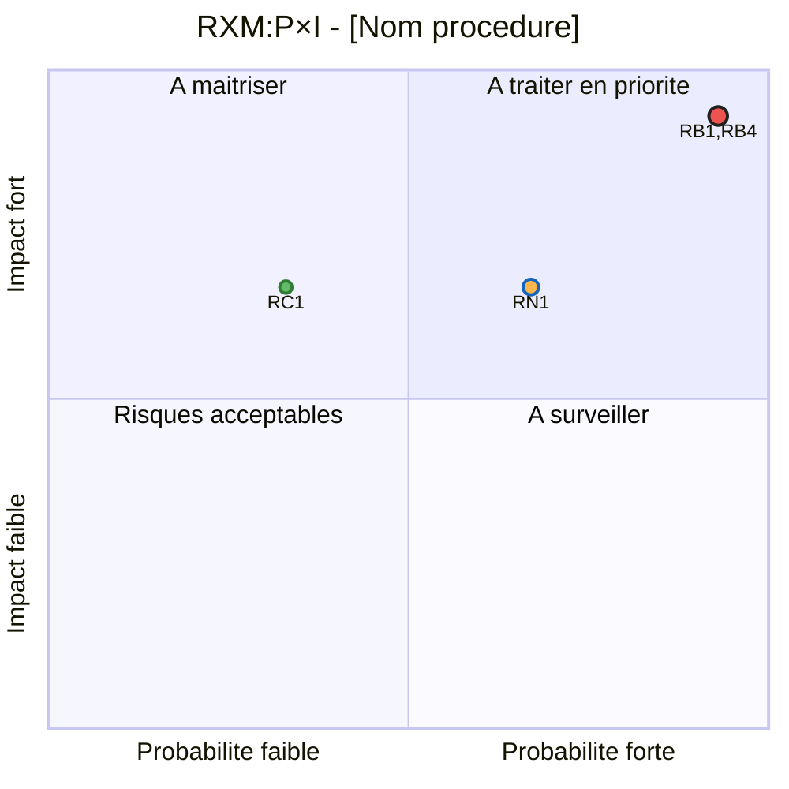

# Matrice des risques P×I — Mermaid quadrantChart

**Source canonique :** Notion COMP.MERMAID.RISK_MATRIX_PI (DOX v10 FDL)
**Script :** `render_procedure.py` → `generate_risk_matrix()`
**Pipeline :** `publish_procedure.py` → Étape 5 (dashboard, auto)

## Aperçu

Un diagramme `quadrantChart` Mermaid positionnant chaque risque SBRX selon ses niveaux d'Impact (y) et Probabilité (x), avec superposition possible des modes Brut (RB), Net (RN), et Cible (RC).

## Spécification canonique

### Quadrants

| Quadrant | Position | Intitulé |
|:--|:--|:--|
| Q1 | Probabilité forte × Impact fort | A traiter en priorité |
| Q2 | Probabilité faible × Impact fort | A maîtriser |
| Q3 | Probabilité faible × Impact faible | Risques acceptables |
| Q4 | Probabilité forte × Impact faible | A surveiller |

### Mapping niveau → coordonnée (COORDS)

| Niveau (1-4) | Coordonnée (0-1) |
|:--:|:--:|
| 1 | 0.07 |
| 2 | 0.33 |
| 3 | 0.67 |
| 4 | 0.93 |

### Niveaux de criticité (produit P×I)

| Score | Niveau | Fill | Radius |
|:--:|:--|:--|:--:|
| 1-3 | **faible** | `#66BB6A` | 4 |
| 4-7 | **moyen** | `#FFB74D` | 5 |
| 8-16 | **haut** | `#EF5350` | 6 |

### Modes supportés

| Mode | Signification | Stroke | Points label |
|:--|:--|:--|:--|
| **RB** | Brut (état initial) | `#212121` (noir) | `RB1, RB2...` |
| **RN** | Net (après PMRI) | `#1565C0` (bleu) | `RN1, RN2...` |
| **RC** | Cible (après toutes barrières) | `#2E7D32` (vert) | `RC1, RC2...` |

Combinaisons possibles : `RB-RN`, `RB-RN-RC`, etc. → titre `RXM:RB×RN - [Procédure]`

### Titre du graphique

Format : `RXM:{MODE} - {code procédure} - {titre procédure}`

## Template Mermaid canonique



## Utilisation dans le code

### Appel direct

```python
from render_procedure import generate_risk_matrix

# Mode simple (RB seulement)
matrix = generate_risk_matrix(contract=contract, mode="RB")

# Superposition RB + RN + RC
matrix = generate_risk_matrix(
    contract=contract,
    mode="RB-RN-RC",
    procedure_title="M1-P3-01 - Saisine"
)

# Depuis une liste de risques directe (sans contrat)
risks = [
    {"code": "R1", "impact": 3, "probability": 2, "title": "Non-respect délai"},
    {"code": "R2", "impact": 2, "probability": 2, "title": "Saisine incomplète"},
]
mesures = [
    {"risque_code": "R1", "effet_impact": -1, "effet_probabilite": -1},
]
matrix = generate_risk_matrix(risks=risks, mesures=mesures, mode="RB-RN")
```

### Intégration pipeline

Le pipeline `publish_procedure.py` génère automatiquement la matrice en mode `RB-RN` dans le dashboard (Étape 5) :

```python
# Dans build_dashboard_blocks() — automatique si risks_detail présent
mermaid_code = generate_risk_matrix(
    contract=proc,
    mode="RB-RN",
    procedure_title=f"{proc.get('procedure_id','')} - {proc.get('titre','')}"
)
```

Le bloc est ajouté comme un **toggle** contenant :
1. Un heading "📊 Matrice des risques P×I"
2. Un paragraphe explicatif
3. Un bloc `code[language=mermaid]` avec le code Mermaid

## Calcul RN et RC

- **RN** = `RB` + toutes les mesures PMRI liées au risque (cumul des `effet_impact` et `effet_probabilite`)
- **RC** = `RN` - 1 point de marge (plancher 1)

Les effets des mesures sont additionnés pour un même risque, puis clampés `max(1, min(4, niveau))`.

## Règles de génération

1. Fusionner les risques partageant les mêmes coordonnées (même P, même I) → une seule ligne Mermaid
2. Tri : Haut d'abord, puis Moyen, puis Faible
3. Style inline préféré + classDef de compatibilité
4. Chaque point affiche son label (ex: `RB1,RB4:::haut`)
5. Un risque peut apparaître dans plusieurs modes (ex: R1 à la fois RB1 et RN1)

## Format Notion block

```json
{
    "object": "block",
    "type": "code",
    "code": {
        "rich_text": [{"type": "text", "text": {"content": "quadrantChart\n..."}}],
        "language": "mermaid"
    }
}
```

## Pièges

1. **Notion ne supporte que `language: "mermaid"`** — pas de variante
2. **Limite de taille :** les blocs Notion ont une limite. Si > 20 risques, envisager plusieurs diagrammes (un par mode)
3. **Les risques sans PMRI** n'ont pas de RN → ils n'apparaissent qu'en mode RB
4. **Tous les RN à [0.07, 0.07]** si toutes les mesures ramènent à impact=1, prob=1 → c'est correct mais visuellement plat
5. **stroke-color différent par mode** : RB=noir, RN=bleu, RC=vert — bien choisir pour lisibilité
