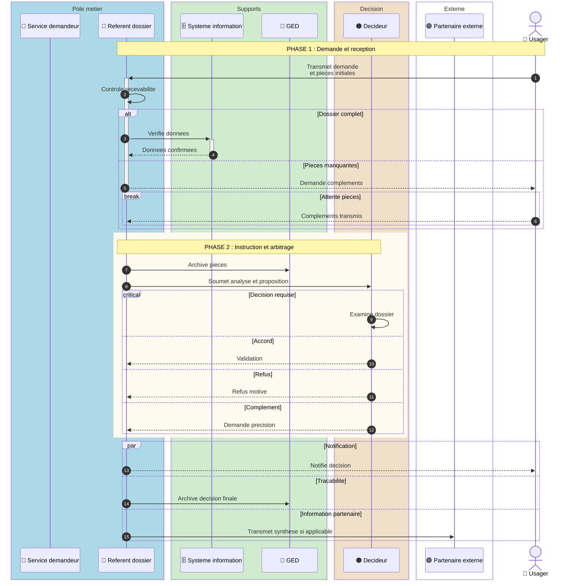
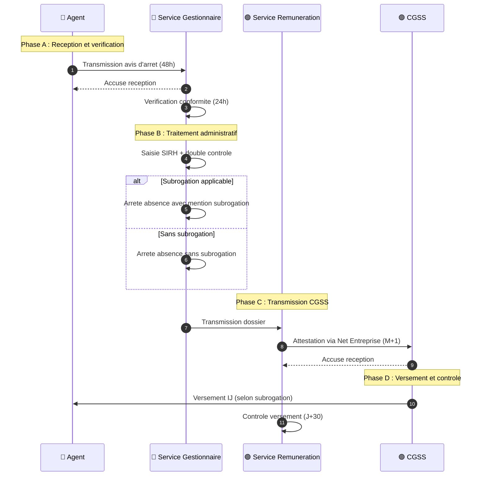

# COMP.MERMAID.SEQUENCE_MULTI_ACTOR — Spécification

Source : BDD COMP (db_id: `1e9c9e7b-8a6b-4d8a-942f-ee80a930b5f3`)

## Grammaire Mermaid

## Best Practices Table

Les règles suivantes sont extraites du composant COMP :

| Règle | Valeur |
|-------|--------|
| `MYTHIQUE_SEQUENCE_SUPPORTED` | true |
| `MYTHIQUE_SOURCE_EXAMPLES` | CGSS-118; Niveau Mythique visualisations avancées; Template sequenceDiagram CTG |
| `TITLE_POLICY` | `SEQ[:MODE] - [Nom procedure]` |
| `TITLE_EXAMPLES` | `SEQ:ACTORS - [Nom procedure]`; `SEQ:CGSS - [Nom procedure]` |
| `AUTONUMBER_REQUIRED` | true |
| `MIRROR_ACTORS_IF_LONG` | true |
| `BOX_BY_ACTOR_FAMILY` | true (groupes : Métier, Supports, Décision, Externe) |
| `ACTOR_TYPES` | `actor`, `participant` |
| `ARROWS` | `->>` action ; `-->>` retour ; `<<->>` échange bidirectionnel |
| `PHASES` | `Note over` pour les titres de phase |
| `CONDITIONS` | `alt/else`, `opt`, `break`, `critical/option` |
| `PARALLEL` | `par/and` |
| `ACTIVATION` | use `+` and `-` for long processing (short syntax: `->>+Acteur`) |
| `LINKS` | allowed for documentation references |
| `LINE_BREAK` | ` ` tag allowed in message labels |
| `COMPLEMENT_TEXT_REQUIRED` | true |

## Quality Gates (SEQ_QG)

Chaque diagramme de séquence doit passer ces vérifications :

| QG | Vérification |
|----|-------------|
| QG-1 | `sequenceDiagram` présent |
| QG-2 | `init` directive valid JSON (guillemets doubles) |
| QG-3 | `autonumber` présent |
| QG-4 | Déclarations `actor` ou `participant` uniquement (pas de `database`, `entity`, `collections`, `queue`) |
| QG-5 | Participants déclarés avant utilisation |
| QG-6 | `Note over` de phase présent (au moins 1) |
| QG-7 | Familles d'acteurs explicites par `box` (si >4 acteurs) |
| QG-8 | `alt/else` balancés (pas d'orphan) |
| QG-9 | `par/and` balancés |
| QG-10 | `critical/options` balancés |
| QG-11 | Pas d'acteur orphelin (déclaré mais jamais utilisé) |
| QG-12 | Tableau ou texte complémentaire présent sous le diagramme |

## Autofix (ordre de priorité)

1. Ajouter `autonumber` si manquant
2. Convertir `database`/`entity`/`collections`/`queue` en `participant`
3. Déclarer les participants manquants
4. Remplacer les syntaxes locales non supportées
5. Ajouter `Note over` de phase
6. Rééquilibrer les blocs `alt`/`par`/`critical` si déterministe
7. Sinon → réserve explicite

## Exemple CGSS 118 (simplifié, sans box)

## Règles CGSS 118 pour adaptation

- Les phases utilisent `Note over [acteur pivot]` (pas de `box`)
- Quand <5 acteurs, les `box` ne sont pas nécessaires
- Les `alt/else` suffisent pour les conditions simples
- Les activations `+` sont implicites (flux direct entre acteurs)
