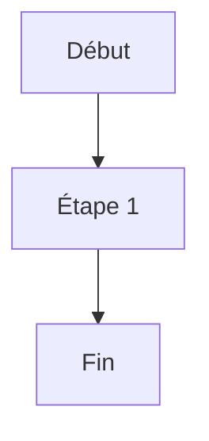

# TEST — Procédure de validation

> **FLASH CARD** : Cette procédure permet de tester le validateur QG.
> Résumé exécutif : Test simple de la chaîne de validation.

**CRAIE Localisation** : CTG — Direction des Systèmes d'Information

## Logigramme

## Matrice RACI

| Tâche | Resp. | Part. | Info. |
|-------|-------|-------|-------|
| Tester | Jean | Marie | Paul |

## Étapes détaillées

1. Ouvrir le fichier
2. Lancer la validation
3. Lire le rapport

## Risques identifiés

- Risque 1 : Fichier manquant (probabilité faible)
- Risque 2 : Token expiré (probabilité moyenne)
