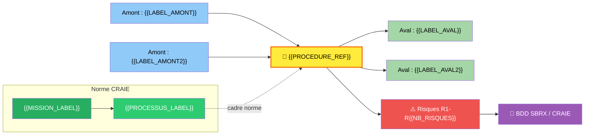
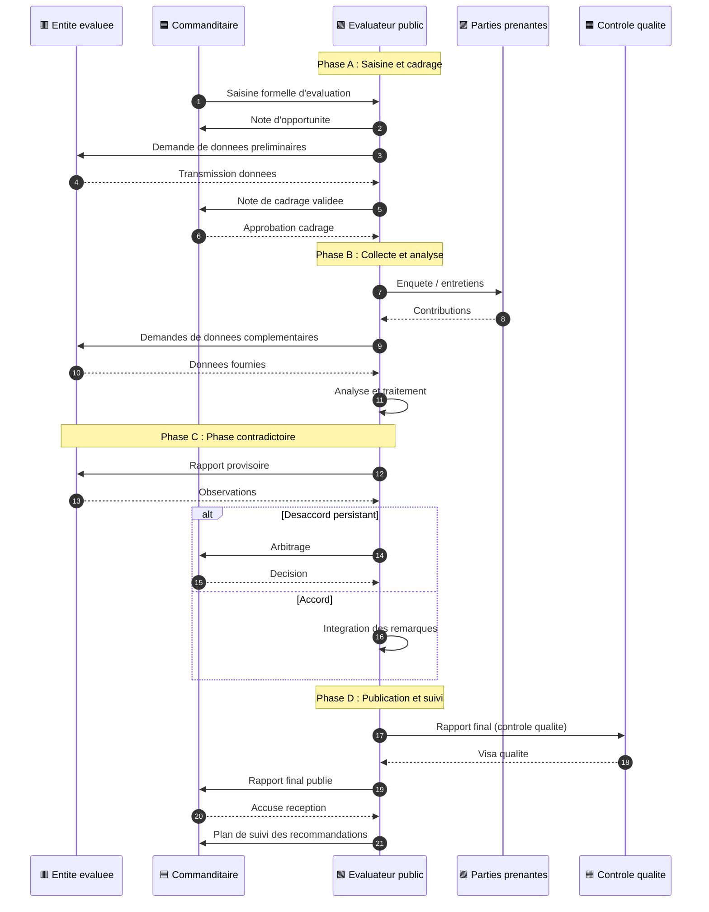

> **🔗 Système d'Analyse Mythique (SAM)** : Consulter la base de données analytique liée pour les sections retirées :
> [Gantt Déploiement] · [Bowtie Risques] · [Ishikawa Causes] · [BPMN Swimlanes] · [PCA Reprise] · [RGPD] · [Scorecard]
> *Ces sections sont générées automatiquement par le pipeline SAM.*

# 🔮 {{PROCEDURE_TITLE}}

## 🃏 FLASH CARD — Résumé exécutif (30 secondes)

> **Objet** : {{OBJET}}
> **Acteurs clés** : {{ACTEURS_CLES}}
> **Déclencheur** : {{DECLENCHEUR}}
> **Délai pivot** : {{DELAI_PIVOT}}
> **Livrable principal** : {{LIVRABLE_PRINCIPAL}}
> **Risque majeur** : {{RISQUE_MAJEUR}}
> **Indicateur cible** : {{INDICATEUR_CIBLE}}

> **Localisation CRAIE** : {{MISSION}} › {{PROCESSUS_FILIERE}}

---

## 📍 0. LOCALISATION CRAIE — Position dans le processus métier

### Tableau de localisation

| Axe | Valeur |
|-----|--------|
| **Contexte** | {{CONTEXTE_CRAIE}} |
| **Référentiel** | DOX v6.0 · Charte de l'Évaluateur public CEV-001 · {{REFERENTIELS_CRAIE}} |
| **Acteurs** | {{ACTEURS_CRAIE}} |
| **Intitulé** | {{PROCEDURE_REF}} — {{TITRE_COURT}} |
| **Étapes** | {{ETAPES_SYNOPTIQUE}} |

### Chaîne de localisation

```
{{MISSION}} › {{PROCESSUS}} › {{PROCEDURE_REF}} › {{ACTEUR_PILOTE}}
```

**Filière** : {{FILIERE}}

### Processus amont et aval

| Direction | Flux |
|-----------|------|
| **Amont** | {{PROCES_AMONT}} → |
| **Procédure** | **{{PROCEDURE_REF}} — {{TITRE_COURT}}** |
| **Aval** | → {{PROCES_AVAL}} |

### Carte CRAIE (flowchart)



---

## 1. OBJET

{{OBJET_DETAILLE}}

**Objectif opérationnel** : {{OBJECTIF_OPERATIONNEL}}

---

## 2. CHAMP D'APPLICATION

### 2.1 Périmètre d'application

- **Services concernés** : {{SERVICES_CONCERNES}}
- **Territoire** : {{TERRITOIRE}}
- **Périmètre fonctionnel** : {{PERIMETRE_FONCTIONNEL}}

### 2.2 Inclusions

{{LISTE_INCLUSIONS}}

### 2.3 Exclusions

> ⛔ {{LISTE_EXCLUSIONS}}

---

## 3. DÉFINITIONS & GLOSSAIRE

### 3.1 Définitions Principales

| Terme | Définition |
|-------|------------|
| {{TERME_1}} | {{DEFINITION_1}} |
| {{TERME_2}} | {{DEFINITION_2}} |
| {{TERME_3}} | {{DEFINITION_3}} |

### 3.2 Acronymes

| Sigle | Signification |
|-------|---------------|
| {{SIGLE_1}} | {{SIGNIFICATION_1}} |
| {{SIGLE_2}} | {{SIGNIFICATION_2}} |

---

## 4. DOCUMENTS DE RÉFÉRENCE

> Vérification StatutFPT (ex‑CDG27) obligatoire — Cadre juridique validé avant publication

### 4.1 Textes Législatifs

| Texte | Référence | Articles |
|-------|-----------|----------|
| {{TEXTE_LEG1}} | {{REF_LEG1}} | {{ARTICLES_LEG1}} |

### 4.2 Textes Réglementaires

| Texte | Référence | Articles |
|-------|-----------|----------|
| {{TEXTE_REG1}} | {{REF_REG1}} | {{ARTICLES_REG1}} |

### 4.3 Documents Internes

- {{DOC_INTERNE_1}}
- {{DOC_INTERNE_2}}

---

## 5. ACTEURS RESPONSABLES

### 5.1 Acteurs de la procédure

| # | Rôle | Direction/Service | Rôle dans la procédure |
|:--|------|-------------------|------------------------|
| 1 | 🟥 **Entité évaluée** | Direction métier concernée | Objet de l'évaluation — fournit les données, participe au contradictoire, met en œuvre les recommandations |
| 2 | 🟦 **Commanditaire** | DG / Direction demandeuse | Porteur de la saisine — valide le cadrage, approuve les livrables, décide des suites |
| 3 | 🟩 **Évaluateur public** | Évaluation | Pilote de la procédure — conduit l'analyse, rédige les rapports, anime le contradictoire |
| 4 | 🟪 **Parties prenantes** | Usagers / Public / Experts | Consultés — participent aux enquêtes, auditions, ateliers |
| 5 | 🟧 **Contrôle qualité** | Qualité / Audit | Garant de la conformité — vérifie la complétude, audite les dossiers |
| 6 | 🟫 **Directeur de l'évaluation** | Direction évaluation | Supervise — valide les livrables majeurs, arbitre les désaccords |

### 5.2 Matrice RACI Complète

| Phase / Activité | Entité évaluée | Commanditaire | Évaluateur public | Parties prenantes | Contrôle qualité | Directeur évaluation |
|------------------|:---:|:---:|:---:|:---:|:---:|:---:|
| {{PHASE_1_RACI}} | {{R_1_1}} | {{R_1_2}} | {{R_1_3}} | {{R_1_4}} | {{R_1_5}} | {{R_1_6}} |
| {{PHASE_2_RACI}} | {{R_2_1}} | {{R_2_2}} | {{R_2_3}} | {{R_2_4}} | {{R_2_5}} | {{R_2_6}} |
| {{PHASE_3_RACI}} | {{R_3_1}} | {{R_3_2}} | {{R_3_3}} | {{R_3_4}} | {{R_3_5}} | {{R_3_6}} |
| {{PHASE_4_RACI}} | {{R_4_1}} | {{R_4_2}} | {{R_4_3}} | {{R_4_4}} | {{R_4_5}} | {{R_4_6}} |

> **R** = Réalise · **A** = Approuve · **C** = Consulté · **I** = Informé

### 5.3 Détail par Acteur

<details>
<summary>5.3.1 🟥 Entité évaluée</summary>

- **Rôle** : Objet et acteur de l'évaluation
- **Responsabilités** :
  - Met à disposition les données et documents nécessaires
  - Participe aux échanges contradictoires
  - Produit le plan d'action post-recommandations
- **Délais** : Selon les échéances définies dans la note de cadrage

</details>

<details>
<summary>5.3.2 🟦 Commanditaire</summary>

- **Rôle** : Décideur et financeur de l'évaluation
- **Responsabilités** :
  - Formalise la saisine
  - Valide le cadrage et le rapport final
  - Décide des suites de l'évaluation
- **Délais** : Selon les échéances définies dans la note de cadrage

</details>

<details>
<summary>5.3.3 🟩 Évaluateur public</summary>

- **Rôle** : Pilote méthodologique et rédacteur
- **Responsabilités** :
  - Conduit la collecte et l'analyse des données
  - Rédige les rapports (cadrage, provisoire, final)
  - Anime les ateliers et auditions
  - Garantit la qualité méthodologique
- **Délais** : Selon le calendrier de la note de cadrage

</details>

<details>
<summary>5.3.4 🟪 Parties prenantes</summary>

- **Rôle** : Contributrices à l'analyse
- **Responsabilités** :
  - Participent aux enquêtes et entretiens
  - Formulent un avis sur le rapport provisoire
- **Délais** : Selon le calendrier de consultation

</details>

### 5.4 Points d'attention — Réformes et évolutions

> {{REFORMES_ACTEURS}}

---

## 6. PROCÉDURE — ÉTAPES

### 6.0 Vue par acteur — sequenceDiagram *(exigence autorité de contrôle)*



### 6.1 Synoptique express et navigation par phase

🟦 **PHASE A** : Saisine et Cadrage → {{PHASE_A_ETAPES}}
🟧 **PHASE B** : Collecte et Analyse → {{PHASE_B_ETAPES}}
🟪 **PHASE C** : Phase Contradictoire → {{PHASE_C_ETAPES}}
🟩 **PHASE D** : Publication et Suivi → {{PHASE_D_ETAPES}}

### 6.2 Détail des Étapes

<details>
<summary>Étape 1 : {{ETAPE_1_TITRE}}</summary>

| Champ | Valeur |
|-------|--------|
| **Acteur** | {{ETAPE_1_ACTEURS}} |
| **Durée** | {{ETAPE_1_DUREE}} |
| **Actions** | {{ETAPE_1_ACTIONS}} |
| **Documents** | {{ETAPE_1_DOCUMENTS}} |
| **⚠️ Points de vigilance** | {{ETAPE_1_VIGILANCE}} |

</details>

<details>
<summary>Étape 2 : {{ETAPE_2_TITRE}}</summary>

| Champ | Valeur |
|-------|--------|
| **Acteur** | {{ETAPE_2_ACTEURS}} |
| **Durée** | {{ETAPE_2_DUREE}} |
| **Actions** | {{ETAPE_2_ACTIONS}} |
| **Documents** | {{ETAPE_2_DOCUMENTS}} |
| **⚠️ Points de vigilance** | {{ETAPE_2_VIGILANCE}} |

</details>

<details>
<summary>Étape 3 : {{ETAPE_3_TITRE}}</summary>

| Champ | Valeur |
|-------|--------|
| **Acteur** | {{ETAPE_3_ACTEURS}} |
| **Durée** | {{ETAPE_3_DUREE}} |
| **Actions** | {{ETAPE_3_ACTIONS}} |
| **Documents** | {{ETAPE_3_DOCUMENTS}} |
| **⚠️ Points de vigilance** | {{ETAPE_3_VIGILANCE}} |

</details>

<details>
<summary>Étape 4 : {{ETAPE_4_TITRE}}</summary>

| Champ | Valeur |
|-------|--------|
| **Acteur** | {{ETAPE_4_ACTEURS}} |
| **Durée** | {{ETAPE_4_DUREE}} |
| **Actions** | {{ETAPE_4_ACTIONS}} |
| **Documents** | {{ETAPE_4_DOCUMENTS}} |
| **⚠️ Points de vigilance** | {{ETAPE_4_VIGILANCE}} |

</details>

<details>
<summary>Étape 5 : {{ETAPE_5_TITRE}}</summary>

| Champ | Valeur |
|-------|--------|
| **Acteur** | {{ETAPE_5_ACTEURS}} |
| **Durée** | {{ETAPE_5_DUREE}} |
| **Actions** | {{ETAPE_5_ACTIONS}} |
| **Documents** | {{ETAPE_5_DOCUMENTS}} |
| **⚠️ Points de vigilance** | {{ETAPE_5_VIGILANCE}} |

</details>

<details>
<summary>Étape 6 : {{ETAPE_6_TITRE}}</summary>

| Champ | Valeur |
|-------|--------|
| **Acteur** | {{ETAPE_6_ACTEURS}} |
| **Durée** | {{ETAPE_6_DUREE}} |
| **Actions** | {{ETAPE_6_ACTIONS}} |
| **Documents** | {{ETAPE_6_DOCUMENTS}} |
| **⚠️ Points de vigilance** | {{ETAPE_6_VIGILANCE}} |

</details>

<!-- Ajouter étapes 7 à N selon la procédure -->

### 6.3 Logigramme (flowchart)

```mermaid
flowchart TB
    A([{{DECLENCHEUR}}]) --> B{{Étape 1 : {{ETAPE_1_COURT}}}}
    B --> C{{Étape 2 : {{ETAPE_2_COURT}}}}
    C --> D{{Étape 3 : {{ETAPE_3_COURT}}}}
    D --> E{Décision ?}
    E -->|Oui| F{{Étape 4 : {{ETAPE_4_COURT}}}}
    E -->|Non| G[Traitement alternatif]
    G --> F
    F --> H{{Étape 5 : {{ETAPE_5_COURT}}}}
    H --> I([{{LIVRABLE_FINAL}}])

    style A fill:#90EE90,stroke:#2e7d32,color:#000
    style I fill:#FF6B6B,stroke:#c62828,color:#fff
    style E fill:#FFD700,stroke:#f9a825,stroke-width:2px
    style B fill:#fff3e0,stroke:#f57c00
    style C fill:#fff3e0,stroke:#f57c00
    style D fill:#fff3e0,stroke:#f57c00
    style F fill:#fff3e0,stroke:#f57c00
    style G fill:#f3e5f5,stroke:#7b1fa2
    style H fill:#fff3e0,stroke:#f57c00
```

---

## 7. RÈGLES DE GESTION

| Règle | Énoncé |
|:-----:|--------|
| G1 | {{REGLE_G1}} |
| G2 | {{REGLE_G2}} |
| G3 | {{REGLE_G3}} |
| G4 | {{REGLE_G4}} |
| G5 | {{REGLE_G5}} |
| G6 | {{REGLE_G6}} |
| G7 | {{REGLE_G7}} |
| G8 | {{REGLE_G8}} |
| G9 | {{REGLE_G9}} |
| G10 | {{REGLE_G10}} |

---

## 8. CONSIGNES OPÉRATIONNELLES

| Consigne | Description |
|:--------:|-------------|
| C1 | {{CONSIGNE_C1}} |
| C2 | {{CONSIGNE_C2}} |
| C3 | {{CONSIGNE_C3}} |
| C4 | {{CONSIGNE_C4}} |
| C5 | {{CONSIGNE_C5}} |

---

## 9. ANALYSE DES RISQUES (SBRX)

### 9.1 Tableau des risques

| # | Code | Risque | Description | Impact | Probabilité | Criticité |
|:--|:----:|--------|-------------|:------:|:-----------:|:---------:|
| 1 | R1 | {{RISQUE_1_TITRE}} | {{RISQUE_1_DESC}} | {{RISQUE_1_IMPACT}} | {{RISQUE_1_PROBA}} | {{RISQUE_1_CRIT}} |
| 2 | R2 | {{RISQUE_2_TITRE}} | {{RISQUE_2_DESC}} | {{RISQUE_2_IMPACT}} | {{RISQUE_2_PROBA}} | {{RISQUE_2_CRIT}} |
| 3 | R3 | {{RISQUE_3_TITRE}} | {{RISQUE_3_DESC}} | {{RISQUE_3_IMPACT}} | {{RISQUE_3_PROBA}} | {{RISQUE_3_CRIT}} |
| 4 | R4 | {{RISQUE_4_TITRE}} | {{RISQUE_4_DESC}} | {{RISQUE_4_IMPACT}} | {{RISQUE_4_PROBA}} | {{RISQUE_4_CRIT}} |
| 5 | R5 | {{RISQUE_5_TITRE}} | {{RISQUE_5_DESC}} | {{RISQUE_5_IMPACT}} | {{RISQUE_5_PROBA}} | {{RISQUE_5_CRIT}} |

> **Échelle** : Impact (1-5) × Probabilité (1-5) → **Criticité** : Faible (1-4) · Moyenne (5-9) · Élevée (10-16) · Critique (17-25)

### 9.2 Matrice de criticité

| Risque | Niveau | Action requise |
|--------|--------|----------------|
| R1 | {{RISQUE_1_NIVEAU}} | {{RISQUE_1_ACTION}} |
| R2 | {{RISQUE_2_NIVEAU}} | {{RISQUE_2_ACTION}} |
| R3 | {{RISQUE_3_NIVEAU}} | {{RISQUE_3_ACTION}} |
| R4 | {{RISQUE_4_NIVEAU}} | {{RISQUE_4_ACTION}} |
| R5 | {{RISQUE_5_NIVEAU}} | {{RISQUE_5_ACTION}} |

### 9.3 Matrice de couverture Risque ↔ Consigne ↔ Règle

| Risque | Consigne associée | Règle associée |
|:------:|:-----------------:|:--------------:|
| R1 | C{{N}} | G{{N}} |
| R2 | C{{N}} | G{{N}} |
| R3 | C{{N}} | G{{N}} |
| R4 | C{{N}} | G{{N}} |
| R5 | C{{N}} | G{{N}} |

---

## 10. DOCUMENTS SUPPORT

### 10.1 Documents Sources (DS)

| Code | Document | Description | Provenance |
|:----:|----------|-------------|------------|
| DS1 | {{DS_1_TITRE}} | {{DS_1_DESC}} | {{DS_1_SOURCE}} |
| DS2 | {{DS_2_TITRE}} | {{DS_2_DESC}} | {{DS_2_SOURCE}} |
| DS3 | {{DS_3_TITRE}} | {{DS_3_DESC}} | {{DS_3_SOURCE}} |

### 10.2 Documents d'Exploitation (DE)

| Code | Document | Description | Utilisation |
|:----:|----------|-------------|-------------|
| DE1 | {{DE_1_TITRE}} | {{DE_1_DESC}} | {{DE_1_USAGE}} |
| DE2 | {{DE_2_TITRE}} | {{DE_2_DESC}} | {{DE_2_USAGE}} |
| DE3 | {{DE_3_TITRE}} | {{DE_3_DESC}} | {{DE_3_USAGE}} |

> **Archivage** : Documents DS archivés 5 ans (données administratives) ou 10 ans (données financières).

### 10.3 Modèles de courrier / formulaires

- Courrier « {{MODELE_COURRIER_1}} »
- Formulaire « {{MODELE_FORMULAIRE_1}} »
- Template « {{MODELE_TEMPLATE_1}} »

---

## 13. CAS PRATIQUES & FAQ

### 13.1 Cas Pratiques

<details>
<summary>Cas n°1 — {{CAS_1_TITRE}}</summary>

- **Situation** : {{CAS_1_SITUATION}}
- **Réponse** : {{CAS_1_REPONSE}}
- **Règles appliquées** : G{{N}}, G{{N}}

</details>

<details>
<summary>Cas n°2 — {{CAS_2_TITRE}}</summary>

- **Situation** : {{CAS_2_SITUATION}}
- **Réponse** : {{CAS_2_REPONSE}}
- **Règles appliquées** : G{{N}}, G{{N}}

</details>

### 13.2 FAQ

<details>
<summary>Q1 — {{FAQ_1_QUESTION}}</summary>

**Réponse** : {{FAQ_1_REPONSE}}
</details>

<details>
<summary>Q2 — {{FAQ_2_QUESTION}}</summary>

**Réponse** : {{FAQ_2_REPONSE}}
</details>

---

## 🔗 SYSTÈME D'ANALYSE MYTHIQUE (SAM)

Les sections analytiques suivantes sont disponibles en vues liées dans la base MYTHIQUE :

| Section | Base liée | Description |
|---------|-----------|-------------|
| **14. Points de Contrôle** | MYTHIQUE Audit | Checkpoints et jalons de vérification |
| **15. Formation** | MYTHIQUE Formation | Modules de formation et supports pédagogiques |
| **17. Groupe de Lecture** | MYTHIQUE Revue | Comité de relecture et validation |
| **18. Déploiement** | MYTHIQUE Projet | Planning Gantt, jalons et ressources |
| **19. PCA / Urgence** | MYTHIQUE Continuité | Plan de continuité et reprise d'activité |
| **20. RGPD** | MYTHIQUE Données | Protection des données et registre RGPD |
| **21. Conformité** | MYTHIQUE Normes | Référentiels normatifs (ISO, Charte) |
| **23. Visualisation** | MYTHIQUE Analyse | Bowtie, Ishikawa, BPMN, Radar, SIPOC, Heatmap, Timeline |
| **24. Versions** | MYTHIQUE Historique | Historique des versions et audit trail |
| **25. Scorecard** | MYTHIQUE Pilotage | Tableau de bord complet et indicateurs |
| **26. Couverture** | MYTHIQUE Cartographie | Matrice de couverture documentaire |

---

## 24. HISTORIQUE DES VERSIONS

| Version | Date | Auteur | Modifications |
|---------|------|--------|---------------|
| 1.0 | {DATE_REVUE} | Pipeline Akuma | Génération automatique via contrat MYTHIQUE |

---

*Document généré par le pipeline Mythique — Template Akuma v6.0*