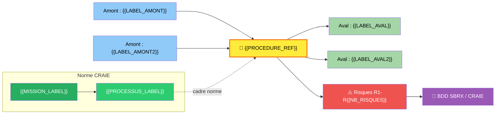
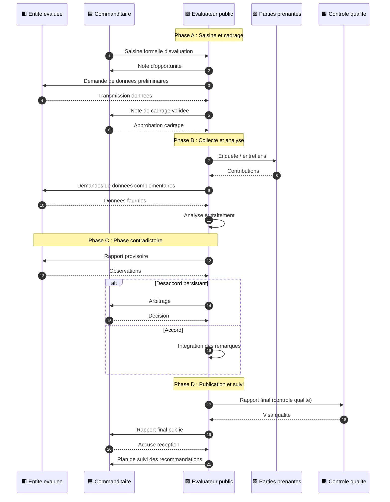
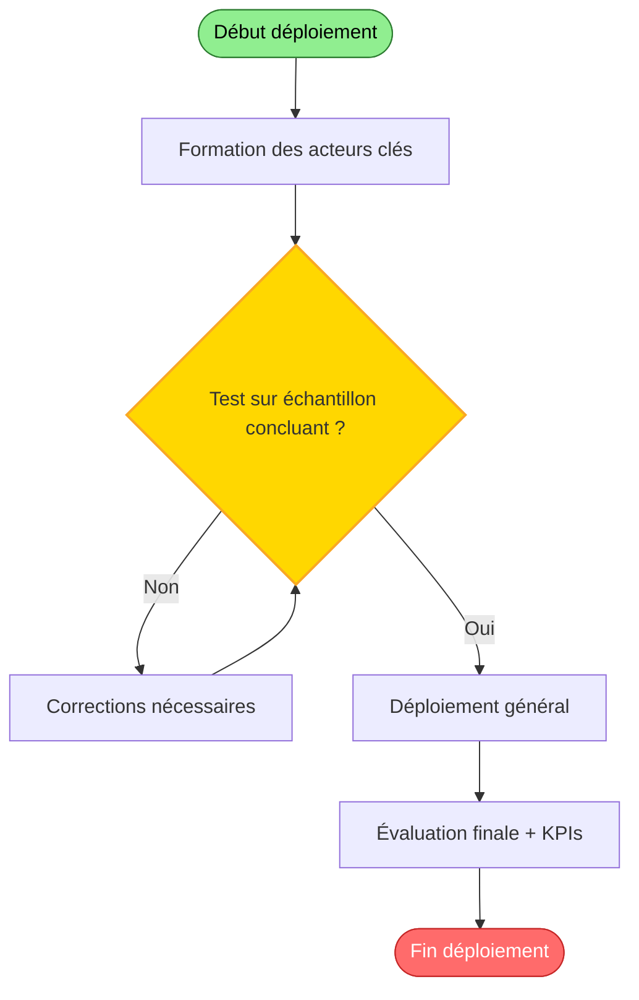
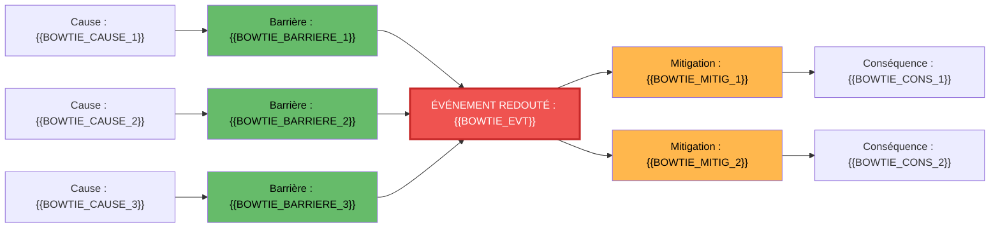
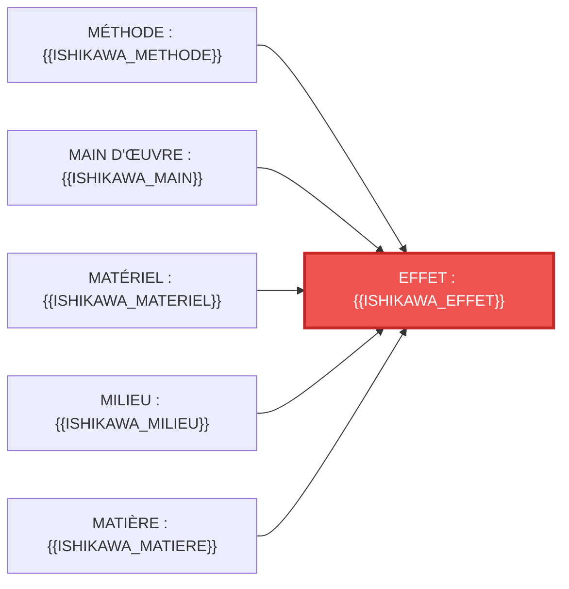
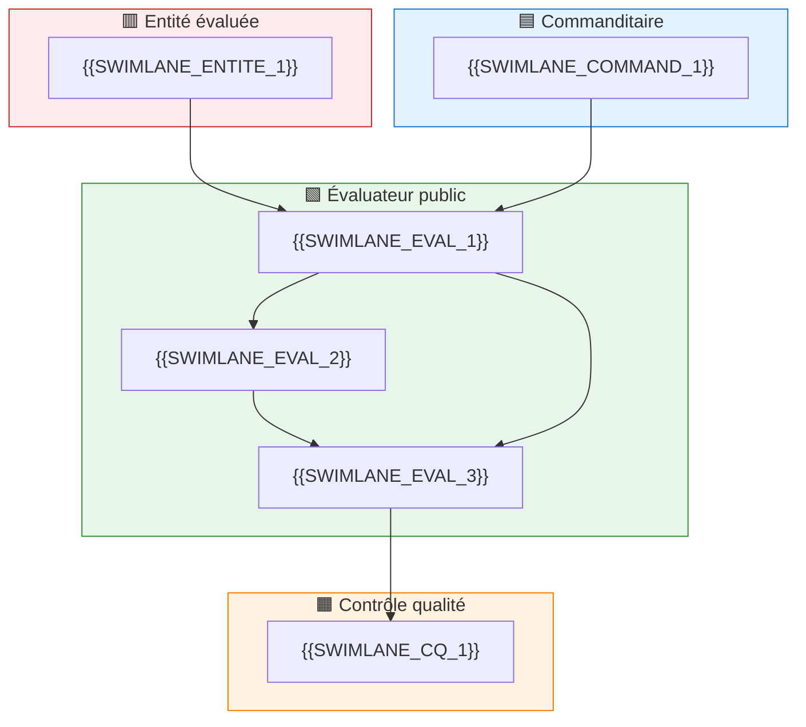
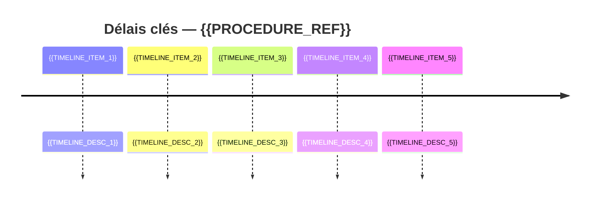

# 🔮 {{PROCEDURE_TITLE}}

> **Référence** : `{{PROCEDURE_REF}}`
> **Niveau** : 🔮 Mythique
> **Type** : {{TYPE_PROCEDURE}}
> **Version** : 1.0
> **Date de création** : {{DATE_CREATION}}
> **Dernière mise à jour** : {{DATE_REVUE}}
> **Validée par** : {{VALIDATEUR}}

---

## 🃏 FLASH CARD — Résumé exécutif (30 secondes)

> **Objet** : {{OBJET}}
> **Acteurs clés** : {{ACTEURS_CLES}}
> **Déclencheur** : {{DECLENCHEUR}}
> **Délai pivot** : {{DELAI_PIVOT}}
> **Livrable principal** : {{LIVRABLE_PRINCIPAL}}
> **Risque majeur** : {{RISQUE_MAJEUR}}
> **Indicateur cible** : {{INDICATEUR_CIBLE}}

> **Localisation CRAIE** : {{MISSION}} › {{PROCESSUS_FILIERE}}

---

## 📍 0. LOCALISATION CRAIE — Position dans le processus métier

### Tableau de localisation

| Axe | Valeur |
|-----|--------|
| **Contexte** | {{CONTEXTE_CRAIE}} |
| **Référentiel** | DOX v6.0 · Charte de l'Évaluateur public CEV-001 · {{REFERENTIELS_CRAIE}} |
| **Acteurs** | {{ACTEURS_CRAIE}} |
| **Intitulé** | {{PROCEDURE_REF}} — {{TITRE_COURT}} |
| **Étapes** | {{ETAPES_SYNOPTIQUE}} |

### Chaîne de localisation

```
{{MISSION}} › {{PROCESSUS}} › {{PROCEDURE_REF}} › {{ACTEUR_PILOTE}}
```

**Filière** : {{FILIERE}}

### Processus amont et aval

| Direction | Flux |
|-----------|------|
| **Amont** | {{PROCES_AMONT}} → |
| **Procédure** | **{{PROCEDURE_REF}} — {{TITRE_COURT}}** |
| **Aval** | → {{PROCES_AVAL}} |

### Carte CRAIE (flowchart)



---

## 1. OBJET

{{OBJET_DETAILLE}}

**Objectif opérationnel** : {{OBJECTIF_OPERATIONNEL}}

---

## 2. CHAMP D'APPLICATION

### 2.1 Périmètre d'application

- **Services concernés** : {{SERVICES_CONCERNES}}
- **Territoire** : {{TERRITOIRE}}
- **Périmètre fonctionnel** : {{PERIMETRE_FONCTIONNEL}}

### 2.2 Inclusions

{{LISTE_INCLUSIONS}}

### 2.3 Exclusions

> ⛔ {{LISTE_EXCLUSIONS}}

---

## 3. DÉFINITIONS & GLOSSAIRE

### 3.1 Définitions Principales

| Terme | Définition |
|-------|------------|
| {{TERME_1}} | {{DEFINITION_1}} |
| {{TERME_2}} | {{DEFINITION_2}} |
| {{TERME_3}} | {{DEFINITION_3}} |

### 3.2 Acronymes

| Sigle | Signification |
|-------|---------------|
| {{SIGLE_1}} | {{SIGNIFICATION_1}} |
| {{SIGLE_2}} | {{SIGNIFICATION_2}} |

---

## 4. DOCUMENTS DE RÉFÉRENCE

> Vérification StatutFPT (ex‑CDG27) obligatoire — Cadre juridique validé avant publication

### 4.1 Textes Législatifs

| Texte | Référence | Articles |
|-------|-----------|----------|
| {{TEXTE_LEG1}} | {{REF_LEG1}} | {{ARTICLES_LEG1}} |

### 4.2 Textes Réglementaires

| Texte | Référence | Articles |
|-------|-----------|----------|
| {{TEXTE_REG1}} | {{REF_REG1}} | {{ARTICLES_REG1}} |

### 4.3 Documents Internes

- {{DOC_INTERNE_1}}
- {{DOC_INTERNE_2}}

---

## 5. ACTEURS RESPONSABLES

### 5.1 Acteurs de la procédure

| # | Rôle | Direction/Service | Rôle dans la procédure |
|:--|------|-------------------|------------------------|
| 1 | 🟥 **Entité évaluée** | Direction métier concernée | Objet de l'évaluation — fournit les données, participe au contradictoire, met en œuvre les recommandations |
| 2 | 🟦 **Commanditaire** | DG / Direction demandeuse | Porteur de la saisine — valide le cadrage, approuve les livrables, décide des suites |
| 3 | 🟩 **Évaluateur public** | Évaluation | Pilote de la procédure — conduit l'analyse, rédige les rapports, anime le contradictoire |
| 4 | 🟪 **Parties prenantes** | Usagers / Public / Experts | Consultés — participent aux enquêtes, auditions, ateliers |
| 5 | 🟧 **Contrôle qualité** | Qualité / Audit | Garant de la conformité — vérifie la complétude, audite les dossiers |
| 6 | 🟫 **Directeur de l'évaluation** | Direction évaluation | Supervise — valide les livrables majeurs, arbitre les désaccords |

### 5.2 Matrice RACI Complète

| Phase / Activité | Entité évaluée | Commanditaire | Évaluateur public | Parties prenantes | Contrôle qualité | Directeur évaluation |
|------------------|:---:|:---:|:---:|:---:|:---:|:---:|
| {{PHASE_1_RACI}} | {{R_1_1}} | {{R_1_2}} | {{R_1_3}} | {{R_1_4}} | {{R_1_5}} | {{R_1_6}} |
| {{PHASE_2_RACI}} | {{R_2_1}} | {{R_2_2}} | {{R_2_3}} | {{R_2_4}} | {{R_2_5}} | {{R_2_6}} |
| {{PHASE_3_RACI}} | {{R_3_1}} | {{R_3_2}} | {{R_3_3}} | {{R_3_4}} | {{R_3_5}} | {{R_3_6}} |
| {{PHASE_4_RACI}} | {{R_4_1}} | {{R_4_2}} | {{R_4_3}} | {{R_4_4}} | {{R_4_5}} | {{R_4_6}} |

> **R** = Réalise · **A** = Approuve · **C** = Consulté · **I** = Informé

### 5.3 Détail par Acteur

<details>
<summary>5.3.1 🟥 Entité évaluée</summary>

- **Rôle** : Objet et acteur de l'évaluation
- **Responsabilités** :
  - Met à disposition les données et documents nécessaires
  - Participe aux échanges contradictoires
  - Produit le plan d'action post-recommandations
- **Délais** : Selon les échéances définies dans la note de cadrage

</details>

<details>
<summary>5.3.2 🟦 Commanditaire</summary>

- **Rôle** : Décideur et financeur de l'évaluation
- **Responsabilités** :
  - Formalise la saisine
  - Valide le cadrage et le rapport final
  - Décide des suites de l'évaluation
- **Délais** : Selon les échéances définies dans la note de cadrage

</details>

<details>
<summary>5.3.3 🟩 Évaluateur public</summary>

- **Rôle** : Pilote méthodologique et rédacteur
- **Responsabilités** :
  - Conduit la collecte et l'analyse des données
  - Rédige les rapports (cadrage, provisoire, final)
  - Anime les ateliers et auditions
  - Garantit la qualité méthodologique
- **Délais** : Selon le calendrier de la note de cadrage

</details>

<details>
<summary>5.3.4 🟪 Parties prenantes</summary>

- **Rôle** : Contributrices à l'analyse
- **Responsabilités** :
  - Participent aux enquêtes et entretiens
  - Formulent un avis sur le rapport provisoire
- **Délais** : Selon le calendrier de consultation

</details>

### 5.4 Points d'attention — Réformes et évolutions

> {{REFORMES_ACTEURS}}

---

## 6. PROCÉDURE — ÉTAPES

### 6.0 Vue par acteur — sequenceDiagram *(exigence autorité de contrôle)*



### 6.1 Synoptique express et navigation par phase

🟦 **PHASE A** : Saisine et Cadrage → {{PHASE_A_ETAPES}}
🟧 **PHASE B** : Collecte et Analyse → {{PHASE_B_ETAPES}}
🟪 **PHASE C** : Phase Contradictoire → {{PHASE_C_ETAPES}}
🟩 **PHASE D** : Publication et Suivi → {{PHASE_D_ETAPES}}

### 6.2 Détail des Étapes

<details>
<summary>Étape 1 : {{ETAPE_1_TITRE}}</summary>

| Champ | Valeur |
|-------|--------|
| **Acteur** | {{ETAPE_1_ACTEURS}} |
| **Durée** | {{ETAPE_1_DUREE}} |
| **Actions** | {{ETAPE_1_ACTIONS}} |
| **Documents** | {{ETAPE_1_DOCUMENTS}} |
| **⚠️ Points de vigilance** | {{ETAPE_1_VIGILANCE}} |

</details>

<details>
<summary>Étape 2 : {{ETAPE_2_TITRE}}</summary>

| Champ | Valeur |
|-------|--------|
| **Acteur** | {{ETAPE_2_ACTEURS}} |
| **Durée** | {{ETAPE_2_DUREE}} |
| **Actions** | {{ETAPE_2_ACTIONS}} |
| **Documents** | {{ETAPE_2_DOCUMENTS}} |
| **⚠️ Points de vigilance** | {{ETAPE_2_VIGILANCE}} |

</details>

<details>
<summary>Étape 3 : {{ETAPE_3_TITRE}}</summary>

| Champ | Valeur |
|-------|--------|
| **Acteur** | {{ETAPE_3_ACTEURS}} |
| **Durée** | {{ETAPE_3_DUREE}} |
| **Actions** | {{ETAPE_3_ACTIONS}} |
| **Documents** | {{ETAPE_3_DOCUMENTS}} |
| **⚠️ Points de vigilance** | {{ETAPE_3_VIGILANCE}} |

</details>

<details>
<summary>Étape 4 : {{ETAPE_4_TITRE}}</summary>

| Champ | Valeur |
|-------|--------|
| **Acteur** | {{ETAPE_4_ACTEURS}} |
| **Durée** | {{ETAPE_4_DUREE}} |
| **Actions** | {{ETAPE_4_ACTIONS}} |
| **Documents** | {{ETAPE_4_DOCUMENTS}} |
| **⚠️ Points de vigilance** | {{ETAPE_4_VIGILANCE}} |

</details>

<details>
<summary>Étape 5 : {{ETAPE_5_TITRE}}</summary>

| Champ | Valeur |
|-------|--------|
| **Acteur** | {{ETAPE_5_ACTEURS}} |
| **Durée** | {{ETAPE_5_DUREE}} |
| **Actions** | {{ETAPE_5_ACTIONS}} |
| **Documents** | {{ETAPE_5_DOCUMENTS}} |
| **⚠️ Points de vigilance** | {{ETAPE_5_VIGILANCE}} |

</details>

<details>
<summary>Étape 6 : {{ETAPE_6_TITRE}}</summary>

| Champ | Valeur |
|-------|--------|
| **Acteur** | {{ETAPE_6_ACTEURS}} |
| **Durée** | {{ETAPE_6_DUREE}} |
| **Actions** | {{ETAPE_6_ACTIONS}} |
| **Documents** | {{ETAPE_6_DOCUMENTS}} |
| **⚠️ Points de vigilance** | {{ETAPE_6_VIGILANCE}} |

</details>

<!-- Ajouter étapes 7 à N selon la procédure -->

### 6.3 Logigramme (flowchart)

```mermaid
flowchart TB
    A([{{DECLENCHEUR}}]) --> B{{Étape 1 : {{ETAPE_1_COURT}}}}
    B --> C{{Étape 2 : {{ETAPE_2_COURT}}}}
    C --> D{{Étape 3 : {{ETAPE_3_COURT}}}}
    D --> E{Décision ?}
    E -->|Oui| F{{Étape 4 : {{ETAPE_4_COURT}}}}
    E -->|Non| G[Traitement alternatif]
    G --> F
    F --> H{{Étape 5 : {{ETAPE_5_COURT}}}}
    H --> I([{{LIVRABLE_FINAL}}])

    style A fill:#90EE90,stroke:#2e7d32,color:#000
    style I fill:#FF6B6B,stroke:#c62828,color:#fff
    style E fill:#FFD700,stroke:#f9a825,stroke-width:2px
    style B fill:#fff3e0,stroke:#f57c00
    style C fill:#fff3e0,stroke:#f57c00
    style D fill:#fff3e0,stroke:#f57c00
    style F fill:#fff3e0,stroke:#f57c00
    style G fill:#f3e5f5,stroke:#7b1fa2
    style H fill:#fff3e0,stroke:#f57c00
```

---

## 7. RÈGLES DE GESTION

| Règle | Énoncé |
|:-----:|--------|
| G1 | {{REGLE_G1}} |
| G2 | {{REGLE_G2}} |
| G3 | {{REGLE_G3}} |
| G4 | {{REGLE_G4}} |
| G5 | {{REGLE_G5}} |
| G6 | {{REGLE_G6}} |
| G7 | {{REGLE_G7}} |
| G8 | {{REGLE_G8}} |
| G9 | {{REGLE_G9}} |
| G10 | {{REGLE_G10}} |

---

## 8. CONSIGNES OPÉRATIONNELLES

| Consigne | Description |
|:--------:|-------------|
| C1 | {{CONSIGNE_C1}} |
| C2 | {{CONSIGNE_C2}} |
| C3 | {{CONSIGNE_C3}} |
| C4 | {{CONSIGNE_C4}} |
| C5 | {{CONSIGNE_C5}} |

---

## 9. ANALYSE DES RISQUES (SBRX)

### 9.1 Tableau des risques

| # | Code | Risque | Description | Impact | Probabilité | Criticité |
|:--|:----:|--------|-------------|:------:|:-----------:|:---------:|
| 1 | R1 | {{RISQUE_1_TITRE}} | {{RISQUE_1_DESC}} | {{RISQUE_1_IMPACT}} | {{RISQUE_1_PROBA}} | {{RISQUE_1_CRIT}} |
| 2 | R2 | {{RISQUE_2_TITRE}} | {{RISQUE_2_DESC}} | {{RISQUE_2_IMPACT}} | {{RISQUE_2_PROBA}} | {{RISQUE_2_CRIT}} |
| 3 | R3 | {{RISQUE_3_TITRE}} | {{RISQUE_3_DESC}} | {{RISQUE_3_IMPACT}} | {{RISQUE_3_PROBA}} | {{RISQUE_3_CRIT}} |
| 4 | R4 | {{RISQUE_4_TITRE}} | {{RISQUE_4_DESC}} | {{RISQUE_4_IMPACT}} | {{RISQUE_4_PROBA}} | {{RISQUE_4_CRIT}} |
| 5 | R5 | {{RISQUE_5_TITRE}} | {{RISQUE_5_DESC}} | {{RISQUE_5_IMPACT}} | {{RISQUE_5_PROBA}} | {{RISQUE_5_CRIT}} |

> **Échelle** : Impact (1-5) × Probabilité (1-5) → **Criticité** : Faible (1-4) · Moyenne (5-9) · Élevée (10-16) · Critique (17-25)

### 9.2 Matrice de criticité

| Risque | Niveau | Action requise |
|--------|--------|----------------|
| R1 | {{RISQUE_1_NIVEAU}} | {{RISQUE_1_ACTION}} |
| R2 | {{RISQUE_2_NIVEAU}} | {{RISQUE_2_ACTION}} |
| R3 | {{RISQUE_3_NIVEAU}} | {{RISQUE_3_ACTION}} |
| R4 | {{RISQUE_4_NIVEAU}} | {{RISQUE_4_ACTION}} |
| R5 | {{RISQUE_5_NIVEAU}} | {{RISQUE_5_ACTION}} |

### 9.3 Matrice de couverture Risque ↔ Consigne ↔ Règle

| Risque | Consigne associée | Règle associée |
|:------:|:-----------------:|:--------------:|
| R1 | C{{N}} | G{{N}} |
| R2 | C{{N}} | G{{N}} |
| R3 | C{{N}} | G{{N}} |
| R4 | C{{N}} | G{{N}} |
| R5 | C{{N}} | G{{N}} |

---

## 10. DOCUMENTS SUPPORT

### 10.1 Documents Sources (DS)

| Code | Document | Description | Provenance |
|:----:|----------|-------------|------------|
| DS1 | {{DS_1_TITRE}} | {{DS_1_DESC}} | {{DS_1_SOURCE}} |
| DS2 | {{DS_2_TITRE}} | {{DS_2_DESC}} | {{DS_2_SOURCE}} |
| DS3 | {{DS_3_TITRE}} | {{DS_3_DESC}} | {{DS_3_SOURCE}} |

### 10.2 Documents d'Exploitation (DE)

| Code | Document | Description | Utilisation |
|:----:|----------|-------------|-------------|
| DE1 | {{DE_1_TITRE}} | {{DE_1_DESC}} | {{DE_1_USAGE}} |
| DE2 | {{DE_2_TITRE}} | {{DE_2_DESC}} | {{DE_2_USAGE}} |
| DE3 | {{DE_3_TITRE}} | {{DE_3_DESC}} | {{DE_3_USAGE}} |

> **Archivage** : Documents DS archivés 5 ans (données administratives) ou 10 ans (données financières).

### 10.3 Modèles de courrier / formulaires

- Courrier « {{MODELE_COURRIER_1}} »
- Formulaire « {{MODELE_FORMULAIRE_1}} »
- Template « {{MODELE_TEMPLATE_1}} »

---

## 13. CAS PRATIQUES & FAQ

### 13.1 Cas Pratiques

<details>
<summary>Cas n°1 — {{CAS_1_TITRE}}</summary>

- **Situation** : {{CAS_1_SITUATION}}
- **Réponse** : {{CAS_1_REPONSE}}
- **Règles appliquées** : G{{N}}, G{{N}}

</details>

<details>
<summary>Cas n°2 — {{CAS_2_TITRE}}</summary>

- **Situation** : {{CAS_2_SITUATION}}
- **Réponse** : {{CAS_2_REPONSE}}
- **Règles appliquées** : G{{N}}, G{{N}}

</details>

### 13.2 FAQ

<details>
<summary>Q1 — {{FAQ_1_QUESTION}}</summary>

**Réponse** : {{FAQ_1_REPONSE}}
</details>

<details>
<summary>Q2 — {{FAQ_2_QUESTION}}</summary>

**Réponse** : {{FAQ_2_REPONSE}}
</details>

---

## 14. POINTS DE CONTRÔLE & AUDIT TRAIL

### 14.1 Checkpoints

| Gate | Point de contrôle | Responsable | Délai | Critère de passage |
|:----:|-------------------|:-----------:|:-----:|--------------------|
| CP1 | {{CHECKPOINT_1_TITRE}} | {{CHECKPOINT_1_RESP}} | {{CHECKPOINT_1_DELAI}} | {{CHECKPOINT_1_CRITERE}} |
| CP2 | {{CHECKPOINT_2_TITRE}} | {{CHECKPOINT_2_RESP}} | {{CHECKPOINT_2_DELAI}} | {{CHECKPOINT_2_CRITERE}} |
| CP3 | {{CHECKPOINT_3_TITRE}} | {{CHECKPOINT_3_RESP}} | {{CHECKPOINT_3_DELAI}} | {{CHECKPOINT_3_CRITERE}} |
| CP4 | {{CHECKPOINT_4_TITRE}} | {{CHECKPOINT_4_RESP}} | {{CHECKPOINT_4_DELAI}} | {{CHECKPOINT_4_CRITERE}} |

### 14.2 Audit Trail

**Éléments tracés** :

- {{TRACE_1}}
- {{TRACE_2}}
- {{TRACE_3}}
- {{TRACE_4}}
- {{TRACE_5}}

**Durée de conservation** :

- Documents administratifs : 5 ans
- Documents financiers : 10 ans
- Logs système : 3 ans

### 14.3 Indicateurs de Conformité

| Indicateur | Cible | Fréquence | Seuil d'alerte |
|------------|:-----:|:---------:|:--------------:|
| {{INDIC_CONF_1}} | {{INDIC_CONF_1_CIBLE}} | {{INDIC_CONF_1_FREQ}} | {{INDIC_CONF_1_ALERTE}} |
| {{INDIC_CONF_2}} | {{INDIC_CONF_2_CIBLE}} | {{INDIC_CONF_2_FREQ}} | {{INDIC_CONF_2_ALERTE}} |

---

## 15. FORMATION & SUPPORT

### 15.1 Programme de Formation

> Durée totale : {{FORMATION_DUREE}}

| Module | Durée | Public | Contenu |
|--------|:-----:|--------|---------|
| {{MODULE_1_TITRE}} | {{MODULE_1_DUREE}} | {{MODULE_1_PUBLIC}} | {{MODULE_1_CONTENU}} |
| {{MODULE_2_TITRE}} | {{MODULE_2_DUREE}} | {{MODULE_2_PUBLIC}} | {{MODULE_2_CONTENU}} |

### 15.2 Contacts Support

| Rôle | Contact |
|------|---------|
| Référent méthodologique | {{CONTACT_METHODO}} |
| Support technique (SI) | {{CONTACT_SI}} |
| Pilote de la procédure | {{CONTACT_PILOTE}} |

---

## 16. PILOTAGE & KPIs

### 16.1 Tableau de Bord

| Indicateur | Cible | Mesure | Fréquence | Seuil d'alerte |
|------------|:-----:|--------|:---------:|:--------------:|
| {{KPI_1_TITRE}} | {{KPI_1_CIBLE}} | {{KPI_1_MESURE}} | {{KPI_1_FREQ}} | {{KPI_1_ALERTE}} |
| {{KPI_2_TITRE}} | {{KPI_2_CIBLE}} | {{KPI_2_MESURE}} | {{KPI_2_FREQ}} | {{KPI_2_ALERTE}} |
| {{KPI_3_TITRE}} | {{KPI_3_CIBLE}} | {{KPI_3_MESURE}} | {{KPI_3_FREQ}} | {{KPI_3_ALERTE}} |
| {{KPI_4_TITRE}} | {{KPI_4_CIBLE}} | {{KPI_4_MESURE}} | {{KPI_4_FREQ}} | {{KPI_4_ALERTE}} |
| {{KPI_5_TITRE}} | {{KPI_5_CIBLE}} | {{KPI_5_MESURE}} | {{KPI_5_FREQ}} | {{KPI_5_ALERTE}} |

### 16.2 Système d'Alertes

- 🔴 **Alerte critique** : {{ALERTE_CRITIQUE}}
- 🔴 **Alerte critique** : {{ALERTE_CRITIQUE_2}}
- 🟡 **Alerte modérée** : {{ALERTE_MODEREE}}
- 🟢 **Information** : {{ALERTE_INFO}}

### 16.3 Boucle PDCA

| Phase | Action | Fréquence |
|:-----:|--------|:---------:|
| **Plan** | {{PDCA_PLAN}} | {{PDCA_PLAN_FREQ}} |
| **Do** | {{PDCA_DO}} | {{PDCA_DO_FREQ}} |
| **Check** | {{PDCA_CHECK}} | {{PDCA_CHECK_FREQ}} |
| **Act** | {{PDCA_ACT}} | {{PDCA_ACT_FREQ}} |

### 16.4 Actions d'Amélioration Identifiées

| # | Action | Responsable | Échéance | Statut |
|:--|--------|:-----------:|:--------:|:------:|
| 1 | {{AMELIO_1_TITRE}} | {{AMELIO_1_RESP}} | {{AMELIO_1_ECHEANCE}} | {{AMELIO_1_STATUT}} |
| 2 | {{AMELIO_2_TITRE}} | {{AMELIO_2_RESP}} | {{AMELIO_2_ECHEANCE}} | {{AMELIO_2_STATUT}} |

### 16.5 Alignement OKR / Performance

> Rattachement stratégique — les indicateurs §16 alimentent les objectifs de performance du service d'évaluation.

| Objectif stratégique | KPI associé | Cible |
|---------------------|:-----------:|:-----:|
| {{OKR_1_OBJECTIF}} | {{OKR_1_KPI}} | {{OKR_1_CIBLE}} |
| {{OKR_2_OBJECTIF}} | {{OKR_2_KPI}} | {{OKR_2_CIBLE}} |

---

## 17. RAPPORT GROUPE DE LECTURE

### 17.1 Composition du Groupe de Lecture

| Rôle | Nom / Fonction |
|------|----------------|
| Président | {{GL_PRESIDENT}} |
| Expert métier | {{GL_EXPERT_METIER}} |
| Expert juridique | {{GL_EXPERT_JURIDIQUE}} |
| Représentant entité évaluée | {{GL_REPRESENTANT}} |

### 17.2 Analyse Multi-Dimensionnelle

<details>
<summary>Cohérence technique/fonctionnelle</summary>

- **Points forts** : {{GL_COHERENCE_FORTS}}
- **Améliorations proposées** : {{GL_COHERENCE_AMELIO}}
</details>

<details>
<summary>Conformité réglementaire</summary>

- **Points forts** : {{GL_CONFORMITE_FORTS}}
- **Améliorations proposées** : {{GL_CONFORMITE_AMELIO}}
</details>

<details>
<summary>Adéquation aux besoins métiers</summary>

- **Points forts** : {{GL_BESOINS_FORTS}}
- **Améliorations proposées** : {{GL_BESOINS_AMELIO}}
</details>

### 17.3 Avis du Groupe de Lecture

- **Avis** : {{GL_AVIS}}
- **Date de revue** : {{GL_DATE_REVUE}}
- **Prochaine revue** : {{GL_PROCHAINE_REVUE}}

---

## 18. MISE EN ŒUVRE, DÉPLOIEMENT & PLAN DE COMMUNICATION

### 18.1 Phases de déploiement

| Phase | Action | Durée | Responsable |
|:-----:|--------|:-----:|:-----------:|
| 1 | {{DEPLOIEMENT_PHASE_1}} | {{DEPLOIEMENT_PHASE_1_DUREE}} | {{DEPLOIEMENT_PHASE_1_RESP}} |
| 2 | {{DEPLOIEMENT_PHASE_2}} | {{DEPLOIEMENT_PHASE_2_DUREE}} | {{DEPLOIEMENT_PHASE_2_RESP}} |
| 3 | {{DEPLOIEMENT_PHASE_3}} | {{DEPLOIEMENT_PHASE_3_DUREE}} | {{DEPLOIEMENT_PHASE_3_RESP}} |
| 4 | {{DEPLOIEMENT_PHASE_4}} | {{DEPLOIEMENT_PHASE_4_DUREE}} | {{DEPLOIEMENT_PHASE_4_RESP}} |

### 18.2 Plan de communication

| Cible | Message | Canal | Échéance |
|-------|---------|:-----:|:--------:|
| {{COMM_CBLE_1}} | {{COMM_MSG_1}} | {{COMM_CANAL_1}} | {{COMM_ECHEANCE_1}} |
| {{COMM_CBLE_2}} | {{COMM_MSG_2}} | {{COMM_CANAL_2}} | {{COMM_ECHEANCE_2}} |

### 18.3 Planning de déploiement & communication (Gantt)

```mermaid
gantt
    title Planning de Déploiement — {{PROCEDURE_REF}}
    dateFormat YYYY-MM-DD
    section Formation
    {{GANTT_FORMATION_1}} :{{GANTT_FORMATION_1_DEBUT}}, {{GANTT_FORMATION_1_DUREE}}
    {{GANTT_FORMATION_2}} :{{GANTT_FORMATION_2_DEBUT}}, {{GANTT_FORMATION_2_DUREE}}
    Jalon fin formation :milestone, {{GANTT_FORMATION_JALON}}
    section Test
    {{GANTT_TEST_1}} :{{GANTT_TEST_1_DEBUT}}, {{GANTT_TEST_1_DUREE}}
    {{GANTT_TEST_2}} :{{GANTT_TEST_2_DEBUT}}, {{GANTT_TEST_2_DUREE}}
    Jalon fin test :milestone, {{GANTT_TEST_JALON}}
    section Déploiement
    {{GANTT_DEPLOIEMENT_1}} :{{GANTT_DEPLOIEMENT_1_DEBUT}}, {{GANTT_DEPLOIEMENT_1_DUREE}}
    {{GANTT_DEPLOIEMENT_2}} :{{GANTT_DEPLOIEMENT_2_DEBUT}}, {{GANTT_DEPLOIEMENT_2_DUREE}}
    section Évaluation
    {{GANTT_EVAL_1}} :{{GANTT_EVAL_1_DEBUT}}, {{GANTT_EVAL_1_DUREE}}
    Jalon validation finale :milestone, {{GANTT_EVAL_JALON}}
```

### 18.4 Ressources & budget prévisionnel

- **Ressources humaines** : {{RESSOURCES_HUMAINES}}
- **Ressources matérielles** : {{RESSOURCES_MATERIELLES}}
- **Budget prévisionnel** :
  - Formation : [XX] k€
  - Communication : [XX] k€
  - Support technique : [XX] k€

### 18.5 Suivi de la mise en œuvre



---

## 19. CONTINUITÉ DE SERVICE & PCA

### 19.1 Scénarios d'indisponibilité

| Scénario | Impact | Procédure dégradée | RTO | RPO |
|:--------:|:------:|:------------------:|:---:|:---:|
| {{PCA_SCENARIO_1}} | {{PCA_IMPACT_1}} | {{PCA_DEGRADE_1}} | {{PCA_RTO_1}} | {{PCA_RPO_1}} |
| {{PCA_SCENARIO_2}} | {{PCA_IMPACT_2}} | {{PCA_DEGRADE_2}} | {{PCA_RTO_2}} | {{PCA_RPO_2}} |

### 19.2 Plan de reprise

- **RTO (délai de reprise visé)** : ≤ {{PCA_RTO}} pour la reprise des activités critiques
- **RPO (perte de données maximale tolérée)** : ≤ {{PCA_RPO}}
- **Mode dégradé** : {{PCA_MODE_DEGRADE}}
- **Reprise** : {{PCA_REPRISE}}

### 19.3 Protocole d'urgence

<details>
<summary>🚨 Protocole d'urgence — {{PCA_URGENCE_TITRE}}</summary>

| Champ | Valeur |
|-------|--------|
| **Déclencheur** | {{PCA_URGENCE_DECLENCHEUR}} |
| **Délai de réaction** | {{PCA_URGENCE_DELAI}} |
| **Actions immédiates** | {{PCA_URGENCE_ACTIONS}} |
| **Escalade** | {{PCA_URGENCE_ESCALADE}} |
| **Responsable** | {{PCA_URGENCE_RESPONSABLE}} |

</details>

---

## 20. PROTECTION DES DONNÉES (RGPD)

### 20.1 Base légale & finalité

- **Finalité** : {{RGPD_FINALITE}}
- **Base légale** : {{RGPD_BASE_LEGALE}}
- **Responsable de traitement** : {{RGPD_RESPONSABLE}}

### 20.2 Données traitées & durées de conservation

| Catégorie de données | Données collectées | Durée de conservation |
|----------------------|--------------------|:---------------------:|
| {{RGPD_CAT_1}} | {{RGPD_DONNEES_1}} | {{RGPD_DUREE_1}} |
| {{RGPD_CAT_2}} | {{RGPD_DONNEES_2}} | {{RGPD_DUREE_2}} |

### 20.3 Droits des personnes & sécurité

- **Droits** : accès, rectification, limitation ; exercice auprès du DPO
- **Minimisation** : seules les données nécessaires à l'évaluation sont collectées
- **Sécurité** : accès restreint aux habilités, chiffrement des transferts, traçabilité
- **Registre** : ce traitement figure au registre des activités de traitement

---

## 21. CONFORMITÉ & RÉFÉRENTIELS NORMATIFS

### 21.1 Matrice de conformité

| Référentiel | Critère | Statut | Échéance |
|-------------|---------|:------:|:--------:|
| ISO 9001 (Qualité) | {{NORME_ISO9001_CRITERE}} | 🟡 | {{NORME_ISO9001_ECHEANCE}} |
| ISO 31000 (Risques) | {{NORME_ISO31000_CRITERE}} | 🟡 | {{NORME_ISO31000_ECHEANCE}} |
| RGPD | {{NORME_RGPD_CRITERE}} | 🟢 | {{NORME_RGPD_ECHEANCE}} |
| Charte Évaluateur public | {{NORME_CHARTE_CRITERE}} | 🟢 | {{NORME_CHARTE_ECHEANCE}} |

> **Légende** : 🟢 Conforme | 🟡 Partiel | 🔴 Non conforme | 🔵 Non applicable

### 21.2 Plan d'action conformité

| # | Écart | Action corrective | Responsable | Échéance |
|:--|:-----|:-----------------:|:-----------:|:--------:|
| 1 | {{ECART_1}} | {{ACTION_1}} | {{RESP_1}} | {{ECHEANCE_1}} |
| 2 | {{ECART_2}} | {{ACTION_2}} | {{RESP_2}} | {{ECHEANCE_2}} |

---

## 22. ASSURANCE QUALITÉ & MAINTENANCE

### 22.1 Porte Qualité (Quality Gate — 7 critères)

> Règle de franchissement : le passage en Validation « 2-Production » est conditionné à la validation des 7 critères.

| Gate | Critère | Statut | Poids |
|:----:|---------|:------:|:-----:|
| G1 | Titre et référence conformes | ❌ | 3 |
| G2 | FLASH CARD complète (objet, acteurs, délais, risques, indicateur) | ❌ | 5 |
| G3 | Localisation CRAIE explicite (Mission › Processus) | ❌ | 4 |
| G4 | Logigramme + sequenceDiagram Mermaid | ❌ | 5 |
| G5 | RACI complet (≥ 6 acteurs, R/A/C/I) | ❌ | 4 |
| G6 | Étapes détaillées (action, acteur, délai, livrable, outil, condition) | ❌ | 5 |
| G7 | Risques (≥ 5 documentés avec code, impact, probabilité, criticité) | ❌ | 5 |
| G7B | Documents support + enregistrement listés | ❌ | 3 |
| G8 | Consignes (C) + Règles (G) présentes | ❌ | 4 |
| G9 | Cas pratiques / FAQ | ❌ | 3 |
| G10 | Tableau de bord KPIs (≥ 5 indicateurs) | ❌ | 4 |
| G11 | Scorecard MYTHIQUE présente | ❌ | 3 |
| G12 | Section §23 Visualisation avancée (M1→M9) | ❌ | 5 |
| G13 | Audit trail et points de contrôle | ❌ | 3 |
| G14 | Dernière revue renseignée | ❌ | 3 |
| G15 | Périodicité définie | ❌ | 2 |
| G16 | Prochaine revue cohérente | ❌ | 2 |
| | **Score QG total** | **0/62** | **62** |

### 22.2 Anti-obsolescence (VERSION-CHECK)

| Élément versionné | Version | Dernière vérification | Échéance vérification |
|-------------------|:-------:|:---------------------:|:---------------------:|
| {{VERSION_CHECK_1_NOM}} | {{VERSION_CHECK_1_VERSION}} | {{VERSION_CHECK_1_DERNIERE}} | {{VERSION_CHECK_1_ECHEANCE}} |
| {{VERSION_CHECK_2_NOM}} | {{VERSION_CHECK_2_VERSION}} | {{VERSION_CHECK_2_DERNIERE}} | {{VERSION_CHECK_2_ECHEANCE}} |

> 💡 **Règle** : toute référence dont la date dépasse l'échéance de vérification déclenche une revue documentaire (§16.3 PDCA).

---

## 23. VISUALISATION AVANCÉE & INTELLIGENCE DÉCISIONNELLE

> Niveau 🔮 MYTHIQUE — couche de visualisation avancée (au-dessus d'ULTRA). Les 9 briques M1→M9 sont issues de la 🧰 Bibliothèque de composants de référence.

### 23.1 🎀 M1 — Nœud papillon (Bow-tie) *— Risques critiques*



### 23.2 🐟 M2 — Ishikawa (causes-effet, 5M)



### 23.3 🕸️ M3 — Radar de criticité (RB → RN → RC)

| Risque | Risque Brut (RB) | Risque Net (RN) | Risque Cible (RC) |
|:------:|:----------------:|:----------------:|:-----------------:|
| R1 | {{RB_1}} | {{RN_1}} | {{RC_1}} |
| R2 | {{RB_2}} | {{RN_2}} | {{RC_2}} |
| R3 | {{RB_3}} | {{RN_3}} | {{RC_3}} |
| R4 | {{RB_4}} | {{RN_4}} | {{RC_4}} |
| R5 | {{RB_5}} | {{RN_5}} | {{RC_5}} |

> 🟥 Brut → 🟧 Net → 🟩 Cible. Vue native depuis SBRX.

### 23.4 🏊 M4 — BPMN : couloirs d'acteurs (swimlanes)



### 23.5 🧾 M5 — SIPOC

| S — Suppliers | I — Inputs | P — Process | O — Outputs | C — Customers |
|:-------------:|:----------:|:-----------:|:-----------:|:-------------:|
| {{SIPOC_S_1}} | {{SIPOC_I_1}} | {{SIPOC_P_1}} | {{SIPOC_O_1}} | {{SIPOC_C_1}} |
| {{SIPOC_S_2}} | {{SIPOC_I_2}} | ↳ {{SIPOC_P_2}} | {{SIPOC_O_2}} | {{SIPOC_C_2}} |
| {{SIPOC_S_3}} | {{SIPOC_I_3}} | ↳ {{SIPOC_P_3}} | {{SIPOC_O_3}} | {{SIPOC_C_3}} |

### 23.6 🌊 M6 — Sankey : flux & déperdition

```mermaid
sankey-beta
{{SANKEY_DATA}}
```

### 23.7 ⏱️ M7 — Timeline : délais pivots



### 23.8 🎛️ M8 — Cockpit KPI (jauges)

| KPI | Cible | Réel | Tendance | Jauge |
|:---:|:-----:|:----:|:--------:|:-----:|
| {{COCKPIT_KPI_1}} | {{COCKPIT_CIBLE_1}} | {{COCKPIT_REEL_1}} | {{COCKPIT_TREND_1}} | 🟢/🟡/🔴 |
| {{COCKPIT_KPI_2}} | {{COCKPIT_CIBLE_2}} | {{COCKPIT_REEL_2}} | {{COCKPIT_TREND_2}} | 🟢/🟡/🔴 |
| {{COCKPIT_KPI_3}} | {{COCKPIT_CIBLE_3}} | {{COCKPIT_REEL_3}} | {{COCKPIT_TREND_3}} | 🟢/🟡/🔴 |

### 23.9 🌡️ M9 — Heatmap RACI

| Phase | Entité évaluée | Commanditaire | Évaluateur public | Parties prenantes | Contrôle qualité | Directeur évaluation |
|-------|:---:|:---:|:---:|:---:|:---:|:---:|
| {{HEATMAP_PHASE_1}} | {{HEATMAP_C1}} | {{HEATMAP_C2}} | {{HEATMAP_C3}} | {{HEATMAP_C4}} | {{HEATMAP_C5}} | {{HEATMAP_C6}} |
| {{HEATMAP_PHASE_2}} | {{HEATMAP_C1}} | {{HEATMAP_C2}} | {{HEATMAP_C3}} | {{HEATMAP_C4}} | {{HEATMAP_C5}} | {{HEATMAP_C6}} |
| {{HEATMAP_PHASE_3}} | {{HEATMAP_C1}} | {{HEATMAP_C2}} | {{HEATMAP_C3}} | {{HEATMAP_C4}} | {{HEATMAP_C5}} | {{HEATMAP_C6}} |

> 🟥 R/A (max) · 🟧 R · 🟨 C · ⬜ I

> Ces 9 briques sont des gabarits — à remplir avec les données réelles de la procédure.

---

## 24. HISTORIQUE DES VERSIONS

> **Traçabilité des modifications** — Format : ✨ Ajout · 📝 Modif · 🗑️ Suppression · 🐛 Correction · 🚀 Refonte

**Version 1.0** — 🔮 MYTHIQUE ({{DATE_CREATION}}) — {{AUTEUR}}

- ✨ Création : passage au standard MYTHIQUE complet, dérivé de l'architecture CGSS-118
- ✨ Ajout : §0 Localisation CRAIE, §6.0 SequenceDiagram, §7 Règles, §8 Consignes
- ✨ Ajout : §13 Cas pratiques & FAQ, §14 Audit trail, §15 Formation
- ✨ Ajout : §16 KPIs & PDCA, §18 Déploiement & Gantt, §19 PCA
- ✨ Ajout : §20 RGPD, §21 Conformité, §22 Quality Gate
- ✨ Ajout : §23 Visualisation avancée (M1→M9 — Bow-tie, Ishikawa, Radar, Swimlane, SIPOC, Sankey, Timeline, Cockpit, Heatmap)
- ✨ Ajout : Scorecard MYTHIQUE, Matrice de couverture documentaire

---

## 25. SCORECARD MYTHIQUE

> 🎮 SCORECARD MYTHIQUE — Notation par dimension (7 critères pondérés)

### Grille d'évaluation

| Dimension | Pondération | Score /100 | Commentaire |
|:---------:|:-----------:|:----------:|-------------|
| 📋 **Cadrage & Structure** | 18% | — | Sections 1-5 : objet, champ, définitions, acteurs |
| ⚖️ **Conformité & Réglementation** | 17% | — | Sections 4, 20, 21 : documents, RGPD, normes |
| ⚠️ **Risques & Maîtrise** | 18% | — | Sections 7-9, 14 : règles, consignes, risques, audit |
| 🔄 **Pilotage & Performance** | 12% | — | Sections 16, 22 : KPIs, PDCA, Quality Gate |
| 🔗 **Déploiement & Continuité** | 12% | — | Sections 18, 19 : déploiement, PCA, protocole urgence |
| 🎨 **Pédagogie & Opérationnalité** | 8% | — | Sections 6, 10, 13 : séquence, étapes, cas pratiques |
| 🔮 **Visualisation & Excellence** | 15% | — | Section 23 : M1→M9, scorecard, historique |
| | **Total** | **/100** | |

### Seuils trophée

| Trophée | Score |
|:-------:|:----:|
| 💎 Chef-d'œuvre | ≥ 90 |
| 🥇 Or | 75-89 |
| 🥈 Argent | 60-74 |
| 🥉 Bronze | < 60 |

### Verdict

> **Score :** 0/100 — 🔮 En cours de rédaction
> **Recommandation :** Compléter les sections marquées `{{VARIABLE}}` et valider les Quality Gates §22 avant mise en Production.

---

## 26. MATRICE DE COUVERTURE DOCUMENTAIRE PAR NIVEAU

| Section | ARGENT | OR | PLATINE | ULTRA | **MYTHIQUE** |
|---------|:------:|:--:|:-------:|:-----:|:------------:|
| §0 CRAIE | ✅ | ✅ | ✅ | ✅ | **✅** |
| §1 Objet | ✅ | ✅ | ✅ | ✅ | **✅** |
| §2 Champ d'application | ✅ | ✅ | ✅ | ✅ | **✅** |
| §3 Définitions & Glossaire | ✅ | ✅ | ✅ | ✅ | **✅** |
| §4 Documents de référence | ✅ | ✅ | ✅ | ✅ | **✅** |
| §5 Acteurs & RACI | ✅ | ✅ | ✅ | ✅ | **✅** |
| §6.0 SequenceDiagram | ❌ | ❌ | ✅ | ✅ | **✅** |
| §6.1 Synoptique express | ❌ | ❌ | ✅ | ✅ | **✅** |
| §6.2 Étapes détaillées | ✅ | ✅ | ✅ | ✅ | **✅** |
| §7 Règles de gestion (G) | ❌ | ❌ | ✅ | ✅ | **✅** |
| §8 Consignes (C) | ❌ | ❌ | ✅ | ✅ | **✅** |
| §9 Analyse des risques | ❌ | ✅ | ✅ | ✅ | **✅** |
| §10 Documents support | ❌ | ✅ | ✅ | ✅ | **✅** |
| §13 Cas pratiques & FAQ | ❌ | ❌ | ✅ | ✅ | **✅** |
| §14 Audit trail | ❌ | ❌ | ❌ | ✅ | **✅** |
| §15 Formation & Support | ❌ | ❌ | ❌ | ✅ | **✅** |
| §16 KPIs & PDCA | ❌ | ❌ | ✅ | ✅ | **✅** |
| §17 Groupe de lecture | ❌ | ❌ | ❌ | ✅ | **✅** |
| §18 Déploiement & Communication | ❌ | ❌ | ❌ | ✅ | **✅** |
| §19 PCA & Continuité | ❌ | ❌ | ❌ | ❌ | **✅** |
| §20 RGPD | ❌ | ❌ | ❌ | ❌ | **✅** |
| §21 Conformité normative | ❌ | ❌ | ❌ | ❌ | **✅** |
| §22 Quality Gate | ❌ | ❌ | ✅ | ✅ | **✅** |
| §23 Visualisation M1→M9 | ❌ | ❌ | ❌ | ❌ | **✅** |
| Scorecard | ❌ | ✅ | ✅ | ✅ | **✅** |
| Matrice couverture | ❌ | ❌ | ❌ | ❌ | **✅** |
| **Score total** | **8/26** | **11/26** | **17/26** | **20/26** | **26/26** |

---

> **Généré par Hermes Agent — PROC v1.0**
> **DOX v6.0 — Niveau 🔮 MYTHIQUE**
> **Modèle : CGSS-118 — Attestation de Salaires CGSS (PROC-MYTHIQUE-118)**
> **Prochaine étape** : Remplacer toutes les `{{VARIABLE}}` par le contenu spécifique à la procédure
