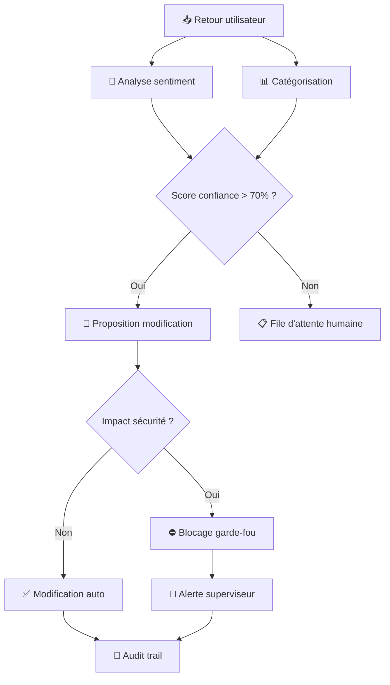

# 👹 PROCÉDURE {{TITRE}} — AKUMA MODE

<callout icon="👹" color="red_bg">
**AKUMA MODE — Auto-Évolution Contrôlée**
Cette procédure est au niveau **AKUMA**. Elle intègre des capacités d'auto-évaluation,
de détection de dérive, et de boucle de retour automatique avec garde-fous.
⚠️ Activation restreinte — réservée aux procédures certifiées Mythique+.
</callout>

---

## 🧬 1. DIAGNOSTIC IA DYNAMIQUE

### 1.1 Indicateurs vitaux

| Indicateur | Valeur actuelle | Seuil bas | Seuil haut | Statut | Tendance |
|------------|----------------|-----------|------------|--------|----------|
| Taux exécution conforme | {{TAUX_CONFORME}} | 90% | 100% | {{STATUT_1}} | {{TENDANCE_1}} |
| Temps cycle moyen | {{TEMPS_CYCLE}} | {{MIN_CYCLE}} | {{MAX_CYCLE}} | {{STATUT_2}} | {{TENDANCE_2}} |
| Taux erreur | {{TAUX_ERREUR}} | 0% | {{MAX_ERREUR}} | {{STATUT_3}} | {{TENDANCE_3}} |
| Complétude QG | {{COMPLETUDE_QG}} | 85% | 100% | {{STATUT_4}} | {{TENDANCE_4}} |
| Dérive procédurale | {{DERIVE}} | 0 | {{SEUIL_DERIVE}} | {{STATUT_5}} | {{TENDANCE_5}} |

### 1.2 Diagnostic automatique

```
🧬 AKUMA Diagnostic — {{TIMESTAMP}}
━━━━━━━━━━━━━━━━━━━━━━━━━━━━━━━━━━━━━
📊 Taux exécution     : {{TAUX_CONFORME}} ({{STATUT_1}})
📊 Temps cycle         : {{TEMPS_CYCLE}} ({{STATUT_2}})
📊 Taux erreur         : {{TAUX_ERREUR}} ({{STATUT_3}})
━━━━━━━━━━━━━━━━━━━━━━━━━━━━━━━━━━━━━
🔍 Anomalies détectées : {{NB_ANOMALIES}}
⚠️  Alertes actives     : {{NB_ALERTES}}
━━━━━━━━━━━━━━━━━━━━━━━━━━━━━━━━━━━━━
🧠 Recommandation      : {{RECOMMANDATION}}
⬆️ Evolution proposée  : {{EVOLUTION}}
```

---

## 🎯 2. BOUCLE DE RETOUR AUTOMATIQUE

### 2.1 Sources d'apprentissage

| Source | Type | Fréquence | Pondération |
|--------|------|-----------|-------------|
| Logs exécution | Automatique | Continue | 40% |
| Retours utilisateurs | Manuel | Hebdomadaire | 25% |
| Résultats QG | Automatique | Mensuelle | 20% |
| Incidents et dérives | Automatique | Temps réel | 15% |

### 2.2 Traitement des retours



---

## 🛡️ 3. GARDE-FOUS DE SÉCURITÉ

### 3.1 Périmètre d'évolution

| Paramètre | Limite | Action si dépassement |
|-----------|--------|----------------------|
| Modification sections obligatoires | Verrouillée | 🔴 Bloqué — requiert validation humaine |
| Ajout/suppression risques | Max ±2 par cycle | 🟡 Alerte + validation superviseur |
| Modification RACI | Max 25% des acteurs | 🟡 Notification + confirmation |
| Délais processus | ±20% de la valeur initiale | 🟠 Audit automatique requis |
| Score QG | Jamais < 85% | 🔴 Rollback version précédente |

### 3.2 Verrous de sécurité

| Verrou | Activation | Code |
|--------|-----------|------|
| ⛔ Anti-régression structurelle | Toujours | `LOCK-CORE-001` |
| ⛔ Plafond de dérive procédurale | Dérive > 3 | `LOCK-EVOL-002` |
| ⛔ Seuil de confiance retour | Confiance < 70% | `LOCK-FEED-003` |
| ⛔ Interdiction suppression QG | Toujours | `LOCK-QG-004` |

---

## 🔄 4. SIMULATION D'ÉVOLUTION

### 4.1 Scénarios d'évolution

| Scénario | Impact attendu | Risque | Durée | Décision |
|----------|---------------|--------|-------|----------|
| {{SCENARIO_1}} | {{IMPACT_1}} | {{RISQUE_SC_1}} | {{DUREE_1}} | {{DECISION_1}} |
| {{SCENARIO_2}} | {{IMPACT_2}} | {{RISQUE_SC_2}} | {{DUREE_2}} | {{DECISION_2}} |
| {{SCENARIO_3}} | {{IMPACT_3}} | {{RISQUE_SC_3}} | {{DUREE_3}} | {{DECISION_3}} |

### 4.2 Analyse prédictive

```mermaid
xychart-beta
    title "Simulation évolution — Score QG projeté"
    x-axis ["T0", "T+1m", "T+3m", "T+6m"]
    y-axis "Score QG (%)" 70 --> 100
    line "Sans évolution" [{{SCORE_T0}}, {{SCORE_T1A}}, {{SCORE_T3A}}, {{SCORE_T6A}}]
    line "Avec évolution" [{{SCORE_T0}}, {{SCORE_T1B}}, {{SCORE_T3B}}, {{SCORE_T6B}}]
```

---

## 📊 5. TABLEAU DE BORD AKUMA

### 5.1 Indicateurs dynamiques

| Métrique | Actuel | J-30 | J-60 | Δ | Prévision J+30 |
|----------|--------|------|------|---|----------------|
| Efficacité procédurale | {{EFFICACITE}} | {{EFF_J30}} | {{EFF_J60}} | {{DELTA_EFF}} | {{PREV_EFF}} |
| Taux d'auto-correction | {{AUTOCORR}} | {{AUTO_J30}} | {{AUTO_J60}} | {{DELTA_AUTO}} | {{PREV_AUTO}} |
| Temps d'adaptation | {{ADAPT}} | {{ADAPT_J30}} | {{ADAPT_J60}} | {{DELTA_ADAPT}} | {{PREV_ADAPT}} |

### 5.2 Cycles d'apprentissage

| Cycle # | Modification | Déclencheur | Validation | Impact mesuré |
|---------|-------------|-------------|------------|---------------|
| 1 | {{CYCLE_MODIF_1}} | {{CYCLE_DECL_1}} | {{CYCLE_VAL_1}} | {{CYCLE_IMPACT_1}} |
| 2 | {{CYCLE_MODIF_2}} | {{CYCLE_DECL_2}} | {{CYCLE_VAL_2}} | {{CYCLE_IMPACT_2}} |
| 3 | {{CYCLE_MODIF_3}} | {{CYCLE_DECL_3}} | {{CYCLE_VAL_3}} | {{CYCLE_IMPACT_3}} |

---

## ✅ QUALITY GATE AKUMA

- [ ] **A1** — Diagnostic IA dynamique fonctionnel
- [ ] **A2** — Indicateurs vitaux tous verts
- [ ] **A3** — Boucle de retour opérationnelle
- [ ] **A4** — Garde-fous actifs (4/4 verrous)
- [ ] **A5** — Pas de dérive procédurale
- [ ] **A6** — Score QG Mythique maintenu
- [ ] **A7** — Audit trail continu actif
- [ ] **A8** — Scénarios d'évolution simulés
- [ ] **A9** — Aucun verrou désactivé
- [ ] **A10** — Cycle d'apprentissage documenté
