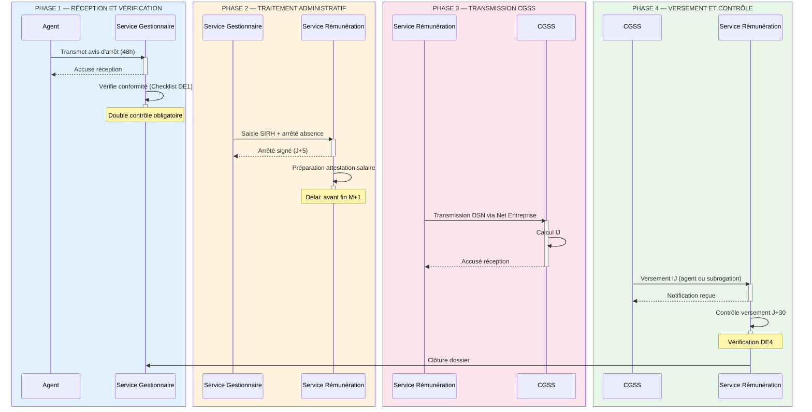

# Exemple — Diagramme de Séquence CGSS-118 MYTHIQUE

## Descriptif des étapes

| Étape | Phase | Action | Acteur | Livrable | Délai |
|:-----:|:-----:|--------|:------:|----------|:-----:|
| **1** | Réception et vérification | Transmet avis d'arrêt | Agent → S. Gestionnaire | Avis d'arrêt reçu | 48h |
| **2** | Réception et vérification | Vérification conformité | S. Gestionnaire | Checklist DE1 validée | J+1 |
| **3** | Traitement administratif | Saisie SIRH + arrêté | S. Gestionnaire → S. Rémunération | Arrêté signé | J+5 |
| **4** | Traitement administratif | Préparation attestation | S. Rémunération | Attestation prête | M+0 |
| **5** | Transmission CGSS | DSN via Net Entreprise | S. Rémunération → CGSS | Accusé réception CGSS | M+1 |
| **6** | Versement et contrôle | Calcul et versement IJ | CGSS → S. Rémunération | IJ versées | J+30 |
| **7** | Versement et contrôle | Contrôle versements | S. Rémunération | Tableau DE4 à jour | J+30 |
| **8** | — | Clôture dossier | S. Gestionnaire | Dossier archivé | — |
