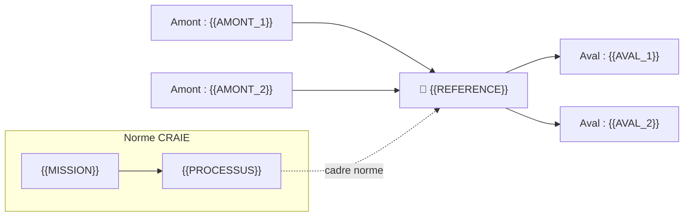
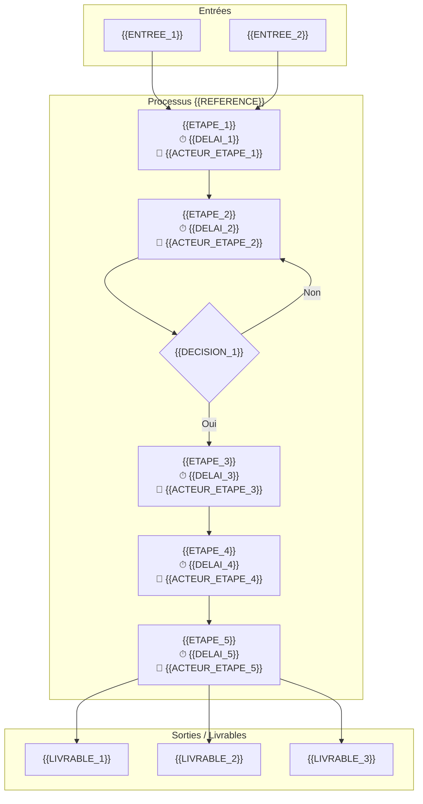

# 📋 PROCÉDURE {{TITRE}} — {{TYPE_RH}}/{{REFERENCE}}

<callout icon="🎯" color="blue_bg">
**Procédure Standard CTG** — {{DIRECTION}}
**Version** : {{VERSION}} | **Date création** : {{DATE}} | **Rédacteur** : {{REDACTEUR}}
**Validation** : {{VALIDATION}} | **Priorité** : {{PRIORITE}}
</callout>

<callout icon="🔮" color="purple_bg">
**NIVEAU MYTHIQUE — Cockpit décisionnel avancé**
Cette procédure est rédigée au niveau **🔮 MYTHIQUE** avec cockpit KPI, analyse tendances et alertes prédictives.
Toutes les sections des niveaux inférieurs (🥉 Bronze → 💎 Ultra) sont incluses par construction.
</callout>

<callout icon="⚠️" color="red_bg">
**Points de vigilance critiques**
{{POINTS_VIGILANCE}}
</callout>

## 🃏 FLASH CARD — Résumé exécutif (30 secondes)

| Élément | Description |
|---------|-------------|
| **Objet** | {{OBJET}} |
| **Acteurs clés** | {{ACTEURS_CLES}} |
| **Délais pivots** | {{DELAIS_PIVOTS}} |
| **Risques majeurs** | {{RISQUES_MAJEURS}} |
| **Indicateur cible** | {{INDICATEUR_CIBLE}} |
| **Niveau** | 🔮 MYTHIQUE · **Trophée** : {{TROPHEE}} |

---

## 📍 0. LOCALISATION CRAIE

<callout icon="🧭" color="purple_bg">
**Localisation CRAIE** — **{{MISSION}}** › **{{PROCESSUS}}** › {{SERVICE}}
</callout>

### Chaîne de valeur



---

## 👥 1. ACTEURS & RACI

### 1.1 Matrice RACI

| Phase \ Acteur | {{ACTEUR_1}} | {{ACTEUR_2}} | {{ACTEUR_3}} | {{ACTEUR_4}} | {{ACTEUR_5}} | {{ACTEUR_6}} |
|---|---|---|---|---|---|---|
| {{PHASE_1}} | {{R_A_1}} | {{R_A_2}} | {{R_A_3}} | {{R_A_4}} | {{R_A_5}} | {{R_A_6}} |
| {{PHASE_2}} | {{R_A_7}} | {{R_A_8}} | {{R_A_9}} | {{R_A_10}} | {{R_A_11}} | {{R_A_12}} |
| {{PHASE_3}} | {{R_A_13}} | {{R_A_14}} | {{R_A_15}} | {{R_A_16}} | {{R_A_17}} | {{R_A_18}} |
| {{PHASE_4}} | {{R_A_19}} | {{R_A_20}} | {{R_A_21}} | {{R_A_22}} | {{R_A_23}} | {{R_A_24}} |

> **Légende** : R = Responsable · A = Approbateur · C = Consulté · I = Informé

### 1.2 Fiches acteurs détaillées

<details>
<summary>**{{ACTEUR_1}}**</summary>

- **Rôle** : {{ROLE_1}}
- **Responsabilités** : {{RESP_1}}
- **Compétences requises** : {{COMP_1}}
</details>

<details>
<summary>**{{ACTEUR_2}}**</summary>

- **Rôle** : {{ROLE_2}}
- **Responsabilités** : {{RESP_2}}
- **Compétences requises** : {{COMP_2}}
</details>

---

## 🔄 2. LOGIGRAMME DE PROCESSUS



---

## 📋 3. CORPS PROCÉDURE — Étapes détaillées

### 3.1 Phase préparatoire — {{PHASE_1}}

| Étape | Action | Acteur | Délai | Livrable | Point de contrôle |
|-------|--------|--------|-------|----------|-------------------|
| {{ETAPE_1}} | {{ACTION_1}} | {{ACTEUR_1}} | {{DELAI_1}} | {{LIVRABLE_1}} | {{CONTROLE_1}} |
| {{ETAPE_2}} | {{ACTION_2}} | {{ACTEUR_2}} | {{DELAI_2}} | {{LIVRABLE_2}} | {{CONTROLE_2}} |
| {{ETAPE_3}} | {{ACTION_3}} | {{ACTEUR_3}} | {{DELAI_3}} | {{LIVRABLE_3}} | {{CONTROLE_3}} |

### 3.2 Phase d'exécution — {{PHASE_2}}

| Étape | Action | Acteur | Délai | Livrable | Point de contrôle |
|-------|--------|--------|-------|----------|-------------------|
| {{ETAPE_4}} | {{ACTION_4}} | {{ACTEUR_4}} | {{DELAI_4}} | {{LIVRABLE_4}} | {{CONTROLE_4}} |
| {{ETAPE_5}} | {{ACTION_5}} | {{ACTEUR_5}} | {{DELAI_5}} | {{LIVRABLE_5}} | {{CONTROLE_5}} |
| {{ETAPE_6}} | {{ACTION_6}} | {{ACTEUR_6}} | {{DELAI_6}} | {{LIVRABLE_6}} | {{CONTROLE_6}} |

### 3.3 Phase de contrôle — {{PHASE_3}}

| Étape | Action | Acteur | Délai | Livrable | Point de contrôle |
|-------|--------|--------|-------|----------|-------------------|
| {{ETAPE_7}} | {{ACTION_7}} | {{ACTEUR_1}} | {{DELAI_7}} | {{LIVRABLE_7}} | {{CONTROLE_7}} |
| {{ETAPE_8}} | {{ACTION_8}} | {{ACTEUR_3}} | {{DELAI_8}} | {{LIVRABLE_8}} | {{CONTROLE_8}} |

---

## ⚠️ 4. RISQUES — Cartographie SBRX

| Code | Risque | Cause | Effet | Gravité | Probabilité | Criticité | Mitigation |
|------|--------|-------|-------|---------|-------------|-----------|------------|
| R1 | {{RISQUE_1}} | {{CAUSE_1}} | {{EFFET_1}} | {{GRAVITE_1}} | {{PROBA_1}} | {{CRITICITE_1}} | {{MITIG_1}} |
| R2 | {{RISQUE_2}} | {{CAUSE_2}} | {{EFFET_2}} | {{GRAVITE_2}} | {{PROBA_2}} | {{CRITICITE_2}} | {{MITIG_2}} |
| R3 | {{RISQUE_3}} | {{CAUSE_3}} | {{EFFET_3}} | {{GRAVITE_3}} | {{PROBA_3}} | {{CRITICITE_3}} | {{MITIG_3}} |
| R4 | {{RISQUE_4}} | {{CAUSE_4}} | {{EFFET_4}} | {{GRAVITE_4}} | {{PROBA_4}} | {{CRITICITE_4}} | {{MITIG_4}} |
| R5 | {{RISQUE_5}} | {{CAUSE_5}} | {{EFFET_5}} | {{GRAVITE_5}} | {{PROBA_5}} | {{CRITICITE_5}} | {{MITIG_5}} |

> **Matrice de criticité** : 🟢 Faible (1-3) · 🟡 Moyen (4-6) · 🟠 Élevé (7-9) · 🔴 Critique (10-12)

---

## 📄 5. DOCUMENTS

### 5.1 Documents de référence

| Réf. | Document | Source | Version | Emplacement |
|------|----------|--------|---------|-------------|
| DR-1 | {{DOC_REF_1}} | {{SOURCE_1}} | {{VERSION_1}} | {{GED_LIEN_1}} |
| DR-2 | {{DOC_REF_2}} | {{SOURCE_2}} | {{VERSION_2}} | {{GED_LIEN_2}} |
| DR-3 | {{DOC_REF_3}} | {{SOURCE_3}} | {{VERSION_3}} | {{GED_LIEN_3}} |

### 5.2 Documents d'enregistrement

| Réf. | Document | Producteur | Conservation | Support |
|------|----------|------------|--------------|---------|
| DE-1 | {{DOC_ENR_1}} | {{PRODUCTEUR_1}} | {{CONSERV_1}} | {{SUPPORT_1}} |
| DE-2 | {{DOC_ENR_2}} | {{PRODUCTEUR_2}} | {{CONSERV_2}} | {{SUPPORT_2}} |

---

## 📊 6. COCKPIT KPI — Tableau de bord décisionnel

### 6.1 Indicateurs de performance

| Indicateur | Cible | Seuil alerte | Fréquence mesure | Tendance | Dernière valeur |
|------------|-------|-------------|-----------------|----------|-----------------|
| {{KPI_1}} | {{CIBLE_1}} | {{ALERTE_1}} | {{FREQ_1}} | {{TENDANCE_1}} | {{VALEUR_1}} |
| {{KPI_2}} | {{CIBLE_2}} | {{ALERTE_2}} | {{FREQ_2}} | {{TENDANCE_2}} | {{VALEUR_2}} |
| {{KPI_3}} | {{CIBLE_3}} | {{ALERTE_3}} | {{FREQ_3}} | {{TENDANCE_3}} | {{VALEUR_3}} |
| {{KPI_4}} | {{CIBLE_4}} | {{ALERTE_4}} | {{FREQ_4}} | {{TENDANCE_4}} | {{VALEUR_4}} |
| {{KPI_5}} | {{CIBLE_5}} | {{ALERTE_5}} | {{FREQ_5}} | {{TENDANCE_5}} | {{VALEUR_5}} |

### 6.2 Analyse des tendances (T-12 mois)

```mermaid
%%{init: {'theme': 'neutral'}}%%
xychart-beta
    title "Tendance {{KPI_1}} (12 mois)"
    x-axis "Mois" ["J-12", "J-10", "J-8", "J-6", "J-4", "J-2", "J"]
    y-axis "Valeur" 0 --> 100
    line "Réel" [{{DATA_REEL}}]
    line "Cible" [{{DATA_CIBLE}}]
    line "Prévision" [{{DATA_PREVISION}}]
```

### 6.3 Alertes prédictives

| Alerte | Seuil déclenchement | Probabilité | Délai estimé | Action préventive |
|--------|-------------------|-------------|--------------|-------------------|
| {{ALERTE_P_1}} | {{SEUIL_1}} | {{PROBA_ALERTE_1}} | {{DELAI_ALERTE_1}} | {{ACTION_PREV_1}} |
| {{ALERTE_P_2}} | {{SEUIL_2}} | {{PROBA_ALERTE_2}} | {{DELAI_ALERTE_2}} | {{ACTION_PREV_2}} |

---

## ❓ 7. FAQ

| # | Question | Réponse |
|---|----------|---------|
| 1 | {{FAQ_1.Q}} | {{FAQ_1.R}} |
| 2 | {{FAQ_2.Q}} | {{FAQ_2.R}} |
| 3 | {{FAQ_3.Q}} | {{FAQ_3.R}} |
| 4 | {{FAQ_4.Q}} | {{FAQ_4.R}} |
| 5 | {{FAQ_5.Q}} | {{FAQ_5.R}} |
| 6 | {{FAQ_6.Q}} | {{FAQ_6.R}} |
| 7 | {{FAQ_7.Q}} | {{FAQ_7.R}} |

---

## 🎚️ 8. SYNTHÈSE DE LA MODULARITÉ

### 8.1 Tableau de synthèse

| Niveau | Sections incluses | Nb sections | Score min |
|--------|-------------------|-------------|-----------|
| 🥉 Bronze | Flash Card + CRAIE + Acteurs + Étapes simplifiées | 11 | 30% |
| 🥈 Argent | + Mermaid + RACI + Risques + Documents ref. | 14 | 55% |
| 🥇 Or | + RACI complet + Doc. enreg. + Indicateurs | 17 | 70% |
| 💎 Platine | + QG checklist + Cycle vie + Scorecard | 23 | 80% |
| 💎 Ultra | + Tests + Modularité DRY + Vigilance | 31 | 85% |
| 🔮 Mythique | + Cockpit KPI + Tendances + FAQ + Alertes | **40** | **90%** |

### 8.2 Scorecard

| Critère | Poids | Score | Max |
|---------|-------|-------|-----|
| Structure (G1-G7B) | 7 | {{S1}} | 7 |
| Package (G8-G11) | 4 | {{S2}} | 4 |
| Core Close (G12-G21) | 10 | {{S3}} | 10 |
| Cockpit Mythique | 9 | {{S4}} | 9 |
| **Total** | **30** | **{{SCORE}}** | **30** |
| **Trophée** | | **{{TROPHEE}}** | |

---

## 🔐 9. CYCLE DE VIE

| Champ | Valeur |
|-------|--------|
| **Dernière revue** | {{DERNIERE_REVUE}} |
| **Périodicité revue** | {{PERIODICITE}} |
| **Prochaine revue calculée** | {{PROCHAINE_REVUE}} |
| **Statut révision** | {{STATUT_REVISION}} |
| **Version** | {{VERSION}} |
| **Historique versions** | {{HISTORIQUE_VERSIONS}} |
| **Rédacteur** | {{REDACTEUR}} |
| **Valideur** | {{VALIDEUR}} |
| **Approbateur** | {{APPROBATEUR}} |

### Audit trail

| Date | Version | Modifications | Auteur |
|------|---------|--------------|--------|
| {{HIST_DATE_1}} | v{{HIST_VERSION_1}} | {{HIST_MODIF_1}} | {{HIST_AUTEUR_1}} |
| {{HIST_DATE_2}} | v{{HIST_VERSION_2}} | {{HIST_MODIF_2}} | {{HIST_AUTEUR_2}} |

---

## ✅ 10. QUALITY GATE — Checklist finale

- [ ] **G1** — Titre et référence présents
- [ ] **G2** — FLASH CARD complète
- [ ] **G3** — Localisation CRAIE explicite
- [ ] **G4** — Logigramme Mermaid
- [ ] **G5** — RACI complet (6+ acteurs)
- [ ] **G6** — Sections étapes détaillées
- [ ] **G7** — Risques identifiés (5+)
- [ ] **G7B** — Documents support liés
- [ ] **G8** — Synthèse de modularité présente
- [ ] **G9** — Tableau comparatif des niveaux
- [ ] **G10** — Couverture cumulative
- [ ] **G11** — Scorecard de niveau
- [ ] **G12** — Définition réutilisable des niveaux
- [ ] **G13** — Tableau critères/sous-critères
- [ ] **G14** — Dernière revue renseignée
- [ ] **G15** — Périodicité définie
- [ ] **G16** — Prochaine revue cohérente
- [ ] **G17** — FAQ liée (min 5)
- [ ] **G18** — Statut révision calculé
- [ ] **G19** — Non-régression vérifiée
- [ ] **G20** — Version historique tracée
- [ ] **G21** — QG Global 🟢 OK
- [ ] **KPI** — Cockpit décisionnel complet
- [ ] **Tendances** — Analyse sur 12 mois
- [ ] **Alertes** — Alertes prédictives configurées
- [ ] **Audit** — Audit trail complet et tracé
