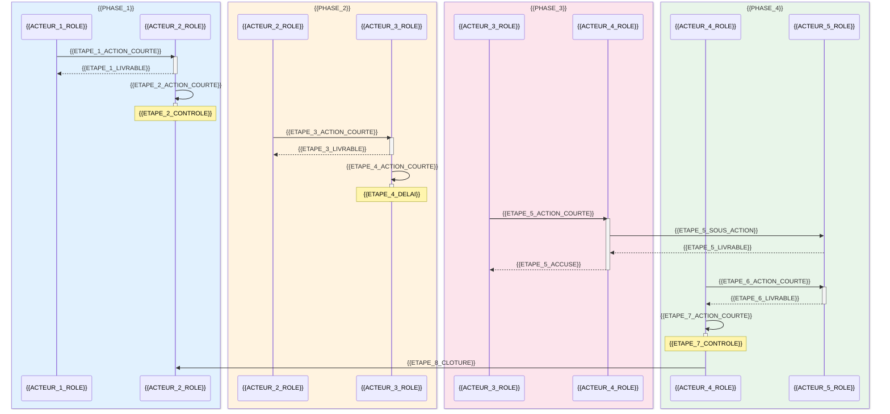

# {{TITRE}}

> **Référence** : `{{REFERENCE}}`
> **Niveau** : 💎 Ultra
> **Type RH** : {{TYPE_RH}}
> **Version** : {{VERSION}}
> **Date de création** : {{DATE_CREATION}}
> **Dernière mise à jour** : {{DERNIERE_MAJ}}
> **Statut** : {{STATUT}}
> **Valid DOX** : {{VALID_DOX}}
> **Score QG Global** : {{SCORE_QG_GLOBAL}}%

---

## 🃏 FLASH CARD — Résumé 30s

> **Objet** : {{OBJET_FLASH}}
> **Acteurs clés** : {{ACTEURS_FLASH}}
> **Déclencheur** : {{DECLENCHEUR}}
> **Délai pivot** : {{DELAI_PIVOT}} ({{DELAI_UNITE}})
> **Livrable principal** : {{LIVRABLE_PRINCIPAL}}
> **Risque critique** : 🔴 {{RISQUE_CRITIQUE}}
> **KPI principal** : {{KPI_PRINCIPAL}} | Cible : {{KPI_CIBLE}}
> **Score QG** : {{SCORE_QG}}%
> **Prochaine revue** : {{PROCHAINE_REVUE}}
> **Version historique** : {{VERSION_HISTORIQUE}}

---

## 📍 CRAIE — Localisation

| Axe | Valeur |
|-----|--------|
| **Contexte** | {{CONTEXTE}} |
| **Référentiel** | {{REFERENTIEL}} |
| **Acteurs** | {{ACTEURS_CRAIE}} |
| **Intitulé** | {{INTITULE_PROC}} |
| **Étapes** | {{ETAPES_CRAIE}} |

### Chaîne de localisation

```
Mission › {{MISSION}} › Processus › {{PROCESSUS}} › Service › {{SERVICE}}
```

**Filière RH** : {{FILIERE_RH}}

### Processus amont et aval

| Direction | Flux | Référence | Responsable | Procédure liée |
|-----------|------|-----------|-------------|----------------|
| **Amont** | {{AMONT_DESC}} | {{AMONT_REF}} | {{AMONT_RESP}} | {{AMONT_PROC}} |
| **Procédure** | {{PROC_DESC}} |
| **Aval** | {{AVAL_DESC}} | {{AVAL_REF}} | {{AVAL_RESP}} | {{AVAL_PROC}} |

---

## 🔄 Logigramme Mermaid

```mermaid
flowchart LR
    subgraph Amont
        A([{{AMONT_NOEUD}}])
    end
    subgraph Procedure [Procédure {{TITRE}}]
        B[{{ETAPE_1_NOEUD}}]
        C{ {{DECISION_1}} }
        D[{{ETAPE_2_NOEUD}}]
        E[{{ETAPE_CONTINGENCE_1}}]
        F[{{ETAPE_3_NOEUD}}]
        G{ {{DECISION_2}} }
        H[{{ETAPE_4_NOEUD}}]
        I[{{ETAPE_CONTINGENCE_2}}]
        J[{{ETAPE_5_NOEUD}}]
    end
    subgraph Aval
        K([{{AVAL_NOEUD}}])
    end

    A -->|{{AMONT_SORTIE}}| B
    B --> C
    C -->|{{CONDITION_OK}}| D
    C -->|{{CONDITION_KO}}| E
    E --> D
    D --> F
    F --> G
    G -->|{{CONDITION_2_OK}}| H
    G -->|{{CONDITION_2_KO}}| I
    I --> H
    H --> J
    J --> K

    style A fill:#e1f5fe,stroke:#0288d1,stroke-width:2px
    style B fill:#fff3e0,stroke:#f57c00
    style C fill:#fce4ec,stroke:#d32f2f,stroke-width:2px
    style D fill:#fff3e0,stroke:#f57c00
    style E fill:#f3e5f5,stroke:#7b1fa2
    style F fill:#fff3e0,stroke:#f57c00
    style G fill:#fce4ec,stroke:#d32f2f,stroke-width:2px
    style H fill:#fff3e0,stroke:#f57c00
    style I fill:#f3e5f5,stroke:#7b1fa2
    style J fill:#fff3e0,stroke:#f57c00
    style K fill:#e8f5e9,stroke:#388e3c,stroke-width:2px
```

---

## 🎬 Diagramme de séquence (phases)



### 🧩 Descriptif des étapes

| Étape | Phase | Action | Acteur | Livrable | Délai |
|:-----:|:-----:|--------|:------:|----------|:-----:|
| **1** | {{PHASE_1}} | {{ETAPE_1_ACTION_COURTE}} | {{ACTEUR_1_ROLE}} → {{ACTEUR_2_ROLE}} | {{ETAPE_1_LIVRABLE}} | {{ETAPE_1_DELAI}} |
| **2** | {{PHASE_1}} | {{ETAPE_2_ACTION_COURTE}} | {{ACTEUR_2_ROLE}} | {{ETAPE_2_LIVRABLE}} | {{ETAPE_2_DELAI}} |
| **3** | {{PHASE_2}} | {{ETAPE_3_ACTION_COURTE}} | {{ACTEUR_2_ROLE}} → {{ACTEUR_3_ROLE}} | {{ETAPE_3_LIVRABLE}} | {{ETAPE_3_DELAI}} |
| **4** | {{PHASE_2}} | {{ETAPE_4_ACTION_COURTE}} | {{ACTEUR_3_ROLE}} | {{ETAPE_4_LIVRABLE}} | {{ETAPE_4_DELAI}} |
| **5** | {{PHASE_3}} | {{ETAPE_5_ACTION_COURTE}} | {{ACTEUR_3_ROLE}} → {{ACTEUR_4_ROLE}} | {{ETAPE_5_LIVRABLE}} | {{ETAPE_5_DELAI}} |
| **6** | {{PHASE_4}} | {{ETAPE_6_ACTION_COURTE}} | {{ACTEUR_4_ROLE}} → {{ACTEUR_5_ROLE}} | {{ETAPE_6_LIVRABLE}} | {{ETAPE_6_DELAI}} |
| **7** | {{PHASE_4}} | {{ETAPE_7_ACTION_COURTE}} | {{ACTEUR_4_ROLE}} | {{ETAPE_7_LIVRABLE}} | {{ETAPE_7_DELAI}} |
| **8** | — | {{ETAPE_8_CLOTURE}} | {{ACTEUR_2_ROLE}} | — | — |

---

## 👥 RACI — Matrice des responsabilités

### Acteurs

| # | Rôle | Direction/Service | Rôle dans la procédure | Suppléance | Contact |
|---|------|-------------------|----------------------|------------|---------|
| 1 | {{ACTEUR_1_ROLE}} | {{ACTEUR_1_DIR}} | {{ACTEUR_1_DESC}} | {{ACTEUR_1_SUPP}} | {{ACTEUR_1_CONTACT}} |
| 2 | {{ACTEUR_2_ROLE}} | {{ACTEUR_2_DIR}} | {{ACTEUR_2_DESC}} | {{ACTEUR_2_SUPP}} | {{ACTEUR_2_CONTACT}} |
| 3 | {{ACTEUR_3_ROLE}} | {{ACTEUR_3_DIR}} | {{ACTEUR_3_DESC}} | {{ACTEUR_3_SUPP}} | {{ACTEUR_3_CONTACT}} |
| 4 | {{ACTEUR_4_ROLE}} | {{ACTEUR_4_DIR}} | {{ACTEUR_4_DESC}} | {{ACTEUR_4_SUPP}} | {{ACTEUR_4_CONTACT}} |
| 5 | {{ACTEUR_5_ROLE}} | {{ACTEUR_5_DIR}} | {{ACTEUR_5_DESC}} | {{ACTEUR_5_SUPP}} | {{ACTEUR_5_CONTACT}} |
| 6 | {{ACTEUR_6_ROLE}} | {{ACTEUR_6_DIR}} | {{ACTEUR_6_DESC}} | {{ACTEUR_6_SUPP}} | {{ACTEUR_6_CONTACT}} |
| 7 | {{ACTEUR_7_ROLE}} | {{ACTEUR_7_DIR}} | {{ACTEUR_7_DESC}} | {{ACTEUR_7_SUPP}} | {{ACTEUR_7_CONTACT}} |
| 8 | {{ACTEUR_8_ROLE}} | {{ACTEUR_8_DIR}} | {{ACTEUR_8_DESC}} | {{ACTEUR_8_SUPP}} | {{ACTEUR_8_CONTACT}} |
| 9 | {{ACTEUR_9_ROLE}} | {{ACTEUR_9_DIR}} | {{ACTEUR_9_DESC}} | {{ACTEUR_9_SUPP}} | {{ACTEUR_9_CONTACT}} |
| 10 | {{ACTEUR_10_ROLE}} | {{ACTEUR_10_DIR}} | {{ACTEUR_10_DESC}} | {{ACTEUR_10_SUPP}} | {{ACTEUR_10_CONTACT}} |

### Matrice RACI

| Phase / Activité | {{ACTEUR_1_ROLE}} | {{ACTEUR_2_ROLE}} | {{ACTEUR_3_ROLE}} | {{ACTEUR_4_ROLE}} | {{ACTEUR_5_ROLE}} | {{ACTEUR_6_ROLE}} | {{ACTEUR_7_ROLE}} | {{ACTEUR_8_ROLE}} | {{ACTEUR_9_ROLE}} | {{ACTEUR_10_ROLE}} |
|-----------------|:---:|:---:|:---:|:---:|:---:|:---:|:---:|:---:|:---:|:---:|
| {{PHASE_1}} | {{RACI_1_1}} | {{RACI_1_2}} | {{RACI_1_3}} | {{RACI_1_4}} | {{RACI_1_5}} | {{RACI_1_6}} | {{RACI_1_7}} | {{RACI_1_8}} | {{RACI_1_9}} | {{RACI_1_10}} |
| {{PHASE_2}} | {{RACI_2_1}} | {{RACI_2_2}} | {{RACI_2_3}} | {{RACI_2_4}} | {{RACI_2_5}} | {{RACI_2_6}} | {{RACI_2_7}} | {{RACI_2_8}} | {{RACI_2_9}} | {{RACI_2_10}} |
| {{PHASE_3}} | {{RACI_3_1}} | {{RACI_3_2}} | {{RACI_3_3}} | {{RACI_3_4}} | {{RACI_3_5}} | {{RACI_3_6}} | {{RACI_3_7}} | {{RACI_3_8}} | {{RACI_3_9}} | {{RACI_3_10}} |
| {{PHASE_4}} | {{RACI_4_1}} | {{RACI_4_2}} | {{RACI_4_3}} | {{RACI_4_4}} | {{RACI_4_5}} | {{RACI_4_6}} | {{RACI_4_7}} | {{RACI_4_8}} | {{RACI_4_9}} | {{RACI_4_10}} |
| {{PHASE_5}} | {{RACI_5_1}} | {{RACI_5_2}} | {{RACI_5_3}} | {{RACI_5_4}} | {{RACI_5_5}} | {{RACI_5_6}} | {{RACI_5_7}} | {{RACI_5_8}} | {{RACI_5_9}} | {{RACI_5_10}} |
| {{PHASE_6}} | {{RACI_6_1}} | {{RACI_6_2}} | {{RACI_6_3}} | {{RACI_6_4}} | {{RACI_6_5}} | {{RACI_6_6}} | {{RACI_6_7}} | {{RACI_6_8}} | {{RACI_6_9}} | {{RACI_6_10}} |

> **R** = Réalise · **A** = Approuve · **C** = Consulté · **I** = Informé · **S** = Support

---

## 📝 Étapes détaillées

### Étape 1 : {{ETAPE_1_TITRE}}

| Champ | Valeur |
|-------|--------|
| **Action** | {{ETAPE_1_ACTION}} |
| **Acteur** | {{ETAPE_1_ACTEUR}} |
| **RACI** | {{ETAPE_1_RACI}} |
| **Délai** | {{ETAPE_1_DELAI}} |
| **Livrable** | {{ETAPE_1_LIVRABLE}} |
| **Outil / Système** | {{ETAPE_1_OUTIL}} |
| **Condition de passage** | {{ETAPE_1_CONDITION}} |
| **Point de contrôle** | {{ETAPE_1_CONTROLE}} |
| **Risque associé** | {{ETAPE_1_RISQUE}} |
| **Test / Contrôle qualité** | {{ETAPE_1_TEST}} |

### Étape 2 : {{ETAPE_2_TITRE}}

| Champ | Valeur |
|-------|--------|
| **Action** | {{ETAPE_2_ACTION}} |
| **Acteur** | {{ETAPE_2_ACTEUR}} |
| **RACI** | {{ETAPE_2_RACI}} |
| **Délai** | {{ETAPE_2_DELAI}} |
| **Livrable** | {{ETAPE_2_LIVRABLE}} |
| **Outil / Système** | {{ETAPE_2_OUTIL}} |
| **Condition de passage** | {{ETAPE_2_CONDITION}} |
| **Point de contrôle** | {{ETAPE_2_CONTROLE}} |
| **Risque associé** | {{ETAPE_2_RISQUE}} |
| **Test / Contrôle qualité** | {{ETAPE_2_TEST}} |

### Étape 3 : {{ETAPE_3_TITRE}}

| Champ | Valeur |
|-------|--------|
| **Action** | {{ETAPE_3_ACTION}} |
| **Acteur** | {{ETAPE_3_ACTEUR}} |
| **RACI** | {{ETAPE_3_RACI}} |
| **Délai** | {{ETAPE_3_DELAI}} |
| **Livrable** | {{ETAPE_3_LIVRABLE}} |
| **Outil / Système** | {{ETAPE_3_OUTIL}} |
| **Condition de passage** | {{ETAPE_3_CONDITION}} |
| **Point de contrôle** | {{ETAPE_3_CONTROLE}} |
| **Risque associé** | {{ETAPE_3_RISQUE}} |
| **Test / Contrôle qualité** | {{ETAPE_3_TEST}} |

### Étape 4 : {{ETAPE_4_TITRE}}

| Champ | Valeur |
|-------|--------|
| **Action** | {{ETAPE_4_ACTION}} |
| **Acteur** | {{ETAPE_4_ACTEUR}} |
| **RACI** | {{ETAPE_4_RACI}} |
| **Délai** | {{ETAPE_4_DELAI}} |
| **Livrable** | {{ETAPE_4_LIVRABLE}} |
| **Outil / Système** | {{ETAPE_4_OUTIL}} |
| **Condition de passage** | {{ETAPE_4_CONDITION}} |
| **Point de contrôle** | {{ETAPE_4_CONTROLE}} |
| **Risque associé** | {{ETAPE_4_RISQUE}} |
| **Test / Contrôle qualité** | {{ETAPE_4_TEST}} |

### Étape 5 : {{ETAPE_5_TITRE}}

| Champ | Valeur |
|-------|--------|
| **Action** | {{ETAPE_5_ACTION}} |
| **Acteur** | {{ETAPE_5_ACTEUR}} |
| **RACI** | {{ETAPE_5_RACI}} |
| **Délai** | {{ETAPE_5_DELAI}} |
| **Livrable** | {{ETAPE_5_LIVRABLE}} |
| **Outil / Système** | {{ETAPE_5_OUTIL}} |
| **Condition de passage** | {{ETAPE_5_CONDITION}} |
| **Point de contrôle** | {{ETAPE_5_CONTROLE}} |
| **Risque associé** | {{ETAPE_5_RISQUE}} |
| **Test / Contrôle qualité** | {{ETAPE_5_TEST}} |

---

## ⚠️ Risques identifiés (liés SBRX)

| # | Code SBRX | Risque | Description | Cause | Impact | Proba | Criticité | Mitigation | Pilote | MPPC |
|---|-----------|--------|-------------|-------|--------|:-----:|:---------:|------------|--------|------|
| 1 | {{RISQUE_1_CODE}} | {{RISQUE_1_NOM}} | {{RISQUE_1_DESC}} | {{RISQUE_1_CAUSE}} | {{RISQUE_1_IMPACT}} | {{RISQUE_1_PROBA}} | {{RISQUE_1_CRIT}} | {{RISQUE_1_MITIG}} | {{RISQUE_1_PILOTE}} | {{RISQUE_1_MPPC}} |
| 2 | {{RISQUE_2_CODE}} | {{RISQUE_2_NOM}} | {{RISQUE_2_DESC}} | {{RISQUE_2_CAUSE}} | {{RISQUE_2_IMPACT}} | {{RISQUE_2_PROBA}} | {{RISQUE_2_CRIT}} | {{RISQUE_2_MITIG}} | {{RISQUE_2_PILOTE}} | {{RISQUE_2_MPPC}} |
| 3 | {{RISQUE_3_CODE}} | {{RISQUE_3_NOM}} | {{RISQUE_3_DESC}} | {{RISQUE_3_CAUSE}} | {{RISQUE_3_IMPACT}} | {{RISQUE_3_PROBA}} | {{RISQUE_3_CRIT}} | {{RISQUE_3_MITIG}} | {{RISQUE_3_PILOTE}} | {{RISQUE_3_MPPC}} |
| 4 | {{RISQUE_4_CODE}} | {{RISQUE_4_NOM}} | {{RISQUE_4_DESC}} | {{RISQUE_4_CAUSE}} | {{RISQUE_4_IMPACT}} | {{RISQUE_4_PROBA}} | {{RISQUE_4_CRIT}} | {{RISQUE_4_MITIG}} | {{RISQUE_4_PILOTE}} | {{RISQUE_4_MPPC}} |
| 5 | {{RISQUE_5_CODE}} | {{RISQUE_5_NOM}} | {{RISQUE_5_DESC}} | {{RISQUE_5_CAUSE}} | {{RISQUE_5_IMPACT}} | {{RISQUE_5_PROBA}} | {{RISQUE_5_CRIT}} | {{RISQUE_5_MITIG}} | {{RISQUE_5_PILOTE}} | {{RISQUE_5_MPPC}} |
| 6 | {{RISQUE_6_CODE}} | {{RISQUE_6_NOM}} | {{RISQUE_6_DESC}} | {{RISQUE_6_CAUSE}} | {{RISQUE_6_IMPACT}} | {{RISQUE_6_PROBA}} | {{RISQUE_6_CRIT}} | {{RISQUE_6_MITIG}} | {{RISQUE_6_PILOTE}} | {{RISQUE_6_MPPC}} |
| 7 | {{RISQUE_7_CODE}} | {{RISQUE_7_NOM}} | {{RISQUE_7_DESC}} | {{RISQUE_7_CAUSE}} | {{RISQUE_7_IMPACT}} | {{RISQUE_7_PROBA}} | {{RISQUE_7_CRIT}} | {{RISQUE_7_MITIG}} | {{RISQUE_7_PILOTE}} | {{RISQUE_7_MPPC}} |
| 8 | {{RISQUE_8_CODE}} | {{RISQUE_8_NOM}} | {{RISQUE_8_DESC}} | {{RISQUE_8_CAUSE}} | {{RISQUE_8_IMPACT}} | {{RISQUE_8_PROBA}} | {{RISQUE_8_CRIT}} | {{RISQUE_8_MITIG}} | {{RISQUE_8_PILOTE}} | {{RISQUE_8_MPPC}} |

---

## 🔴 Points de vigilance critiques

| # | Point de vigilance | Risque associé | Niveau | Action requise | Échéance |
|---|-------------------|----------------|:------:|----------------|:--------:|
| 🔴 | {{VIGILANCE_1}} | {{VIGILANCE_1_RISQUE}} | {{VIGILANCE_1_NIVEAU}} | {{VIGILANCE_1_ACTION}} | {{VIGILANCE_1_ECHEANCE}} |
| 🔴 | {{VIGILANCE_2}} | {{VIGILANCE_2_RISQUE}} | {{VIGILANCE_2_NIVEAU}} | {{VIGILANCE_2_ACTION}} | {{VIGILANCE_2_ECHEANCE}} |
| 🔴 | {{VIGILANCE_3}} | {{VIGILANCE_3_RISQUE}} | {{VIGILANCE_3_NIVEAU}} | {{VIGILANCE_3_ACTION}} | {{VIGILANCE_3_ECHEANCE}} |

---

## 🧪 Tests et contrôles

| # | Test / Contrôle | Étapes concernées | Fréquence | Responsable | Critères d'acceptation |
|---|----------------|:-----------------:|:---------:|-------------|------------------------|
| 1 | {{TEST_1}} | {{TEST_1_ETAPES}} | {{TEST_1_FREQ}} | {{TEST_1_RESP}} | {{TEST_1_CRITERES}} |
| 2 | {{TEST_2}} | {{TEST_2_ETAPES}} | {{TEST_2_FREQ}} | {{TEST_2_RESP}} | {{TEST_2_CRITERES}} |
| 3 | {{TEST_3}} | {{TEST_3_ETAPES}} | {{TEST_3_FREQ}} | {{TEST_3_RESP}} | {{TEST_3_CRITERES}} |
| 4 | {{TEST_4}} | {{TEST_4_ETAPES}} | {{TEST_4_FREQ}} | {{TEST_4_RESP}} | {{TEST_4_CRITERES}} |

---

## 📄 Documents support (liés GED)

| Document | Référence | Version | Émetteur | Type | Emplacement GED |
|----------|-----------|:-------:|----------|:----:|-----------------|
| {{DOC_SUPPORT_1}} | {{DOC_SUPPORT_1_REF}} | {{DOC_SUPPORT_1_VERS}} | {{DOC_SUPPORT_1_EMET}} | {{DOC_SUPPORT_1_TYPE}} | {{DOC_SUPPORT_1_GED}} |
| {{DOC_SUPPORT_2}} | {{DOC_SUPPORT_2_REF}} | {{DOC_SUPPORT_2_VERS}} | {{DOC_SUPPORT_2_EMET}} | {{DOC_SUPPORT_2_TYPE}} | {{DOC_SUPPORT_2_GED}} |
| {{DOC_SUPPORT_3}} | {{DOC_SUPPORT_3_REF}} | {{DOC_SUPPORT_3_VERS}} | {{DOC_SUPPORT_3_EMET}} | {{DOC_SUPPORT_3_TYPE}} | {{DOC_SUPPORT_3_GED}} |
| {{DOC_SUPPORT_4}} | {{DOC_SUPPORT_4_REF}} | {{DOC_SUPPORT_4_VERS}} | {{DOC_SUPPORT_4_EMET}} | {{DOC_SUPPORT_4_TYPE}} | {{DOC_SUPPORT_4_GED}} |
| {{DOC_SUPPORT_5}} | {{DOC_SUPPORT_5_REF}} | {{DOC_SUPPORT_5_VERS}} | {{DOC_SUPPORT_5_EMET}} | {{DOC_SUPPORT_5_TYPE}} | {{DOC_SUPPORT_5_GED}} |
| {{DOC_SUPPORT_6}} | {{DOC_SUPPORT_6_REF}} | {{DOC_SUPPORT_6_VERS}} | {{DOC_SUPPORT_6_EMET}} | {{DOC_SUPPORT_6_TYPE}} | {{DOC_SUPPORT_6_GED}} |

## 📋 Documents d'enregistrement

| Document | Référence | Supports | Durée conservation | Responsable | Emplacement GED |
|----------|-----------|----------|:------------------:|-------------|-----------------|
| {{DOC_ENREG_1}} | {{DOC_ENREG_1_REF}} | {{DOC_ENREG_1_SUPP}} | {{DOC_ENREG_1_DUREE}} | {{DOC_ENREG_1_RESP}} | {{DOC_ENREG_1_GED}} |
| {{DOC_ENREG_2}} | {{DOC_ENREG_2_REF}} | {{DOC_ENREG_2_SUPP}} | {{DOC_ENREG_2_DUREE}} | {{DOC_ENREG_2_RESP}} | {{DOC_ENREG_2_GED}} |
| {{DOC_ENREG_3}} | {{DOC_ENREG_3_REF}} | {{DOC_ENREG_3_SUPP}} | {{DOC_ENREG_3_DUREE}} | {{DOC_ENREG_3_RESP}} | {{DOC_ENREG_3_GED}} |
| {{DOC_ENREG_4}} | {{DOC_ENREG_4_REF}} | {{DOC_ENREG_4_SUPP}} | {{DOC_ENREG_4_DUREE}} | {{DOC_ENREG_4_RESP}} | {{DOC_ENREG_4_GED}} |
| {{DOC_ENREG_5}} | {{DOC_ENREG_5_REF}} | {{DOC_ENREG_5_SUPP}} | {{DOC_ENREG_5_DUREE}} | {{DOC_ENREG_5_RESP}} | {{DOC_ENREG_5_GED}} |

---

## 📊 Indicateurs de performance (KPI)

| # | Indicateur | Cible | Seuil alerte | Fréquence | Formule | Responsable | Source donnée |
|---|------------|:-----:|:------------:|:---------:|---------|-------------|:------------:|
| 1 | {{KPI_1_NOM}} | {{KPI_1_CIBLE}} | {{KPI_1_ALERTE}} | {{KPI_1_FREQ}} | {{KPI_1_FORMULE}} | {{KPI_1_RESP}} | {{KPI_1_SOURCE}} |
| 2 | {{KPI_2_NOM}} | {{KPI_2_CIBLE}} | {{KPI_2_ALERTE}} | {{KPI_2_FREQ}} | {{KPI_2_FORMULE}} | {{KPI_2_RESP}} | {{KPI_2_SOURCE}} |
| 3 | {{KPI_3_NOM}} | {{KPI_3_CIBLE}} | {{KPI_3_ALERTE}} | {{KPI_3_FREQ}} | {{KPI_3_FORMULE}} | {{KPI_3_RESP}} | {{KPI_3_SOURCE}} |
| 4 | {{KPI_4_NOM}} | {{KPI_4_CIBLE}} | {{KPI_4_ALERTE}} | {{KPI_4_FREQ}} | {{KPI_4_FORMULE}} | {{KPI_4_RESP}} | {{KPI_4_SOURCE}} |
| 5 | {{KPI_5_NOM}} | {{KPI_5_CIBLE}} | {{KPI_5_ALERTE}} | {{KPI_5_FREQ}} | {{KPI_5_FORMULE}} | {{KPI_5_RESP}} | {{KPI_5_SOURCE}} |

### Tableau de bord

| KPI | Valeur | Cible | Tendance | Statut | Action alerte |
|-----|:------:|:-----:|:--------:|:------:|:------------:|
| {{KPI_1_NOM}} | {{KPI_1_VALEUR}} | {{KPI_1_CIBLE}} | {{KPI_1_TENDANCE}} | {{KPI_1_STATUT}} | {{KPI_1_ACTION}} |
| {{KPI_2_NOM}} | {{KPI_2_VALEUR}} | {{KPI_2_CIBLE}} | {{KPI_2_TENDANCE}} | {{KPI_2_STATUT}} | {{KPI_2_ACTION}} |
| {{KPI_3_NOM}} | {{KPI_3_VALEUR}} | {{KPI_3_CIBLE}} | {{KPI_3_TENDANCE}} | {{KPI_3_STATUT}} | {{KPI_3_ACTION}} |
| {{KPI_4_NOM}} | {{KPI_4_VALEUR}} | {{KPI_4_CIBLE}} | {{KPI_4_TENDANCE}} | {{KPI_4_STATUT}} | {{KPI_4_ACTION}} |
| {{KPI_5_NOM}} | {{KPI_5_VALEUR}} | {{KPI_5_CIBLE}} | {{KPI_5_TENDANCE}} | {{KPI_5_STATUT}} | {{KPI_5_ACTION}} |

---

## 🏗️ Architecture DOX v8 DRY — Modules modulaires

| Module | Code | Description | Présent | Sections associées |
|--------|:----:|-------------|:-------:|--------------------|
| **00 HUB** | HUB | Hub central de la procédure | 🟢 | FLASH CARD, métadonnées, références |
| **01 CADRAGE** | CAD | Cadrage et localisation | 🟢 | CRAIE, périmètre, contexte |
| **02 ACTEURS** | ACT | Acteurs et responsabilités | 🟢 | RACI, acteurs, suppléances |
| **03 FLUX** | FLX | Flux et logigramme | 🟢 | Mermaid, étapes, décisions |
| **04 REGLES** | REG | Règles de gestion | 🟢 | Étapes détaillées, conditions |
| **05 RISQUES** | RSQ | Risques et contrôles | 🟢 | Risques SBRX, vigilance, tests |
| **06 DOCUMENTS** | DOC | Documents et enregistrements | 🟢 | GED, supports, enregistrements |
| **07 QG** | QGCL | Quality Gate et pilotage | 🟢 | Scorecard, QG checklist, KPI |

---

## ✅ Quality Gate Checklist (G1-G21)

### G1-G7B : Structurels

| # | Quality Gate | Poids | Statut | Commentaire |
|---|-------------|:-----:|:------:|-------------|
| G1 | Titre et référence présents (EVP-xxx, PRH-xxx) | 3 | {{QG_G1}} | {{QG_G1_CMT}} |
| G2 | FLASH CARD complète | 5 | {{QG_G2}} | {{QG_G2_CMT}} |
| G3 | Localisation CRAIE explicite | 4 | {{QG_G3}} | {{QG_G3_CMT}} |
| G4 | Logigramme Mermaid complet | 5 | {{QG_G4}} | {{QG_G4_CMT}} |
| G5 | RACI complet (min 4 acteurs, min 3 phases) | 4 | {{QG_G5}} | {{QG_G5_CMT}} |
| G6 | Étapes détaillées complètes | 5 | {{QG_G6}} | {{QG_G6_CMT}} |
| G7 | Risques identifiés (min 3 documentés) | 5 | {{QG_G7}} | {{QG_G7_CMT}} |
| G7B | Documents support et enregistrement | 3 | {{QG_G7B}} | {{QG_G7B_CMT}} |

### G8-G11 : Package / Modularité

| # | Quality Gate | Poids | Statut | Commentaire |
|---|-------------|:-----:|:------:|-------------|
| G8 | Synthèse de modularité présente | 3 | {{QG_G8}} | {{QG_G8_CMT}} |
| G9 | Tableau comparatif des niveaux | 3 | {{QG_G9}} | {{QG_G9_CMT}} |
| G10 | Couverture cumulative validée | 2 | {{QG_G10}} | {{QG_G10_CMT}} |
| G11 | Scorecard de niveau présente | 4 | {{QG_G11}} | {{QG_G11_CMT}} |

### G12-G21 : Core Close

| # | Quality Gate | Poids | Statut | Commentaire |
|---|-------------|:-----:|:------:|-------------|
| G12 | Définition réutilisable des niveaux | 3 | {{QG_G12}} | {{QG_G12_CMT}} |
| G13 | Tableau critères/sous-critères | 3 | {{QG_G13}} | {{QG_G13_CMT}} |
| G14 | Dernière revue renseignée | 2 | {{QG_G14}} | {{QG_G14_CMT}} |
| G15 | Périodicité définie | 2 | {{QG_G15}} | {{QG_G15_CMT}} |
| G16 | Prochaine revue cohérente | 2 | {{QG_G16}} | {{QG_G16_CMT}} |
| G18 | Statut révision calculé | 2 | {{QG_G18}} | {{QG_G18_CMT}} |
| G19 | Non-régression vérifiée | 4 | {{QG_G19}} | {{QG_G19_CMT}} |
| G20 | Version historique tracée | 2 | {{QG_G20}} | {{QG_G20_CMT}} |
| G21 | QG Global 🟢 OK | 5 | {{QG_G21}} | {{QG_G21_CMT}} |

**Score QG** : {{SCORE_QG_OBTENU}} / {{SCORE_QG_MAX}} (**{{SCORE_QG_POURCENT}}%**) — Seuil Ultra : ≥ 85%

---

## 🎚️ Scorecard DOX v6.0

### Critères d'évaluation

| # | Critère | Poids | Max | Score | Commentaire |
|---|---------|:-----:|:---:|:-----:|-------------|
| 1 | Complétude des sections | 20 | 20 | {{SCORE_1}} | {{SCORE_1_CMT}} |
| 2 | Qualité du FLASH CARD | 10 | 10 | {{SCORE_2}} | {{SCORE_2_CMT}} |
| 3 | Logigramme et flux | 10 | 10 | {{SCORE_3}} | {{SCORE_3_CMT}} |
| 4 | RACI et responsabilités | 10 | 10 | {{SCORE_4}} | {{SCORE_4_CMT}} |
| 5 | Étapes et livrables | 15 | 15 | {{SCORE_5}} | {{SCORE_5_CMT}} |
| 6 | Risques et mitigations | 10 | 10 | {{SCORE_6}} | {{SCORE_6_CMT}} |
| 7 | Documents et traçabilité | 10 | 10 | {{SCORE_7}} | {{SCORE_7_CMT}} |
| 8 | KPI et tableau de bord | 10 | 10 | {{SCORE_8}} | {{SCORE_8_CMT}} |
| 9 | Cycle de vie et revue | 5 | 5 | {{SCORE_9}} | {{SCORE_9_CMT}} |

| Total | Pourcentage | Trophée |
|:-----:|:-----------:|:-------:|
| **{{SCORE_TOTAL}} / {{SCORE_MAX}}** | **{{SCORE_POURCENTAGE}}%** | **{{TROPHEE}}** |

### Sous-critères détaillés

| Critère | Sous-critères | Pondération |
|---------|---------------|:-----------:|
| Complétude | FLASH CARD, CRAIE, Mermaid, RACI, Étapes, Risques, Documents, KPI | 20 |
| Qualité | Clarté, précision, exhaustivité des descriptions | 10 |
| Flux | Logigramme valide, décisions, contingences, amont/aval | 10 |
| RACI | Acteurs complets, phases couvertes, R/A/C/I/S corrects | 10 |
| Étapes | Action détaillée, délai réaliste, livrable défini, test associé | 15 |
| Risques | Code SBRX, impact, proba, criticité, mitigation, pilote, MPPC | 10 |
| Documents | Références GED, versions, types, durées conservation | 10 |
| KPI | Formule, cible, alerte, source donnée, tendance, action | 10 |
| Cycle vie | Dernière revue, périodicité, prochaine revue, statut, historique | 5 |

---

## 🔄 Cycle de vie verrouillé

| Champ | Valeur |
|-------|--------|
| **Dernière revue procédure** | {{DERNIERE_REVUE}} |
| **Reviseur** | {{REVISEUR}} |
| **Périodicité revue** | {{PERIODICITE}} |
| **Prochaine revue calculée** | {{PROCHAINE_REVUE_CALC}} |
| **Prochaine revue prévue** | {{PROCHAINE_REVUE_PREVUE}} |
| **Statut révision calculé** | {{STATUT_REVISION}} |
| **Statut révision périodique** | {{STATUT_REVISION_PERIO}} |
| **Version actuelle** | {{VERSION_ACTUELLE}} |
| **Version précédente** | {{VERSION_PRECEDENTE}} |
| **Date de création** | {{DATE_CREATION}} |
| **Date d'effet** | {{DATE_EFFET}} |

---

## 🔄 Non-régression vérifiée

### Comparaison avec version précédente ({{VERSION_PRECEDENTE}})

| Section | Statut | Commentaire |
|---------|:------:|-------------|
| FLASH CARD | {{NR_FLASH}} | {{NR_FLASH_CMT}} |
| CRAIE Localisation | {{NR_CRAIE}} | {{NR_CRAIE_CMT}} |
| Logigramme Mermaid | {{NR_MERMAID}} | {{NR_MERMAID_CMT}} |
| RACI | {{NR_RACI}} | {{NR_RACI_CMT}} |
| Étapes détaillées | {{NR_ETAPES}} | {{NR_ETAPES_CMT}} |
| Risques | {{NR_RISQUES}} | {{NR_RISQUES_CMT}} |
| Documents | {{NR_DOCUMENTS}} | {{NR_DOCUMENTS_CMT}} |
| KPI | {{NR_KPI}} | {{NR_KPI_CMT}} |
| Cycle de vie | {{NR_CYCLE}} | {{NR_CYCLE_CMT}} |

> **Règle** : Aucune section supprimée, aucun risque retiré sans justification. ✅ **{{NR_GLOBAL}}**

---

## 📜 Version historique tracée

| Version | Date | Auteur | Modifications | Validation |
|:-------:|:----:|--------|--------------|:----------:|
| {{VERSION_ACTUELLE}} | {{VERSION_ACTUELLE_DATE}} | {{VERSION_ACTUELLE_AUTEUR}} | {{VERSION_ACTUELLE_MODIF}} | {{VERSION_ACTUELLE_VALID}} |
| {{VERSION_PRECEDENTE}} | {{VERSION_PRECEDENTE_DATE}} | {{VERSION_PRECEDENTE_AUTEUR}} | {{VERSION_PRECEDENTE_MODIF}} | {{VERSION_PRECEDENTE_VALID}} |

| {{VERSION_ANTERIEURE}} | {{VERSION_ANTERIEURE_DATE}} | {{VERSION_ANTERIEURE_AUTEUR}} | {{VERSION_ANTERIEURE_MODIF}} | {{VERSION_ANTERIEURE_VALID}} |


---

## 📊 Synthèse de modularité

| Module DOX | Niveau min | Sections | Poids QG | Statut |
|:----------:|:----------:|:--------:|:--------:|:------:|
| 00 HUB | Bronze | 3 | 8 | 🟢 |
| 01 CADRAGE | Bronze | 2 | 4 | 🟢 |
| 02 ACTEURS | Argent | 1 | 4 | 🟢 |
| 03 FLUX | Argent | 3 | 10 | 🟢 |
| 04 REGLES | Argent | 1 | 5 | 🟢 |
| 05 RISQUES | Argent | 1 | 5 | 🟢 |
| 06 DOCUMENTS | Argent | 2 | 3 | 🟢 |
| 07 QG | Platine | 5 | 20 | 🟢 |

---

## 🏗️ Gouvernance et déploiement

| Aspect | Valeur |
|--------|--------|
| **Rédacteur** | {{REDACTEUR}} |
| **Vérificateur** | {{VERIFICATEUR}} |
| **Approbateur** | {{APPROBATEUR}} |
| **Diffusion** | {{DIFFUSION}} |
| **Formation nécessaire** | {{FORMATION}} |
| **Plan de communication** | {{PLAN_COMM}} |
| **Date de déploiement** | {{DATE_DEPLOIEMENT}} |
| **Environnement cible** | {{ENVIRONNEMENT_CIBLE}} |
| **Durée de validité** | {{DUREE_VALIDITE}} |

---

## 🔗 Références normatives

| Texte | Référence | Date | Articles | Version |
|-------|-----------|:----:|:--------:|:-------:|
| Texte fondateur | {{TEXTE_FONDATEUR}} | {{TEXTE_DATE}} | {{TEXTE_ARTICLES}} | {{TEXTE_VERSION}} |
| Convention collective | {{CONVENTION_COLLECTIVE}} | {{CONVENTION_DATE}} | {{CONVENTION_ARTICLES}} | {{CONVENTION_VERSION}} |
| Accord d'entreprise | {{ACCORD_ENTREPRISE}} | {{ACCORD_DATE}} | {{ACCORD_ARTICLES}} | {{ACCORD_VERSION}} |
| Décision unilatérale | {{DECISION_UNILATERALE}} | {{DECISION_DATE}} | {{DECISION_ARTICLES}} | {{DECISION_VERSION}} |
| Exigence GC | {{EXIGENCE_GC}} | {{EXIGENCE_GC_REF}} | {{EXIGENCE_GC_ARTICLES}} | {{EXIGENCE_GC_VERSION}} |
| Procédure liée | {{PROCEDURE_LIEE}} | {{PROCEDURE_DATE}} | {{PROCEDURE_REF}} | {{PROCEDURE_VERSION}} |

---

## ✅ Checklist Ultra

- [ ] FLASH CARD complète avec version historique et score QG
- [ ] Localisation CRAIE avec responsables et procédures liées
- [ ] Logigramme Mermaid avec sous-graphes (amont, procédure, aval)
- [ ] RACI complet (min 10 acteurs) avec suppléances et contacts
- [ ] Étapes détaillées avec test/contrôle qualité par étape
- [ ] Risques SBRX (min 8) avec MPPC et pilote
- [ ] Points de vigilance critiques (🔴) documentés
- [ ] Tests et contrôles avec critères d'acceptation
- [ ] Documents support GED (min 6) + enregistrement (min 5)
- [ ] KPI (min 5) avec formule, tendance, action alerte, source donnée
- [ ] Architecture DOX v8 DRY (00 HUB → 07 QG)
- [ ] Quality Gate Checklist G1-G21 complète
- [ ] Scorecard DOX avec sous-critères et pondérations
- [ ] Cycle de vie verrouillé (dernière revue, périodicité, prochaine, statut)
- [ ] Non-régression vérifiée (comparaison version précédente)
- [ ] Version historique tracée (min 2 versions)
- [ ] Synthèse de modularité complète

---

> **Généré par Hermes Agent — PROC v1.0**  
> **DOX v6.0 — Niveau Ultra**  
> **Modèle inspiré de la CGSS 118 ULTRA**  
> **Prochaine évolution suggérée** : `/proc upgrade --niveau mythique`
